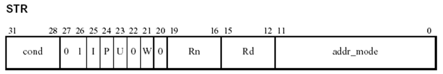
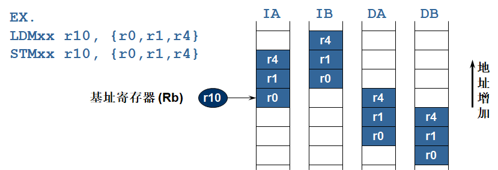

# ARM体系结构与编程

## 第0章 RISC处理器体系结构概述

### 计算机语言发展简史


- **机器语言**：依赖于机器的低级语言，书写格式为**二进制代码**。
  - **优点**：执行速度快，效率高。
  - **缺点**：表达的意义不直观，编写、阅读、调试较困难。  
- **汇编语言**
  - 是一种符号语言，与机器语言一一对应；使用**助记符**表示相应的操作，并遵循一定的语法规则。
  - 与机器语言有类似的优、缺点，但比机器语言更易于为人们所理解。
  - **特点**
    - **面向机器的低级语言**，通常是为特定的计算机或计算机系列专门设计的。(ISA体系结构，面向特定的处理器)
    - 保持了机器语言的优点，具有**直接和简洁**的特点。
    - **可有效地访问、控制计算机的各种硬件设备**，如磁盘、存储器、CPU、I/O端口等。
    - **目标代码简短，占用内存少，执行速度快**，是高效的程序设计语言。
    - 经常与高级语言配合使用（**混合编程**），应用十分广泛。
  - **应用**
    - 70%以上的**系统软件**是用汇编语言编写的。
    - 某些**快速处理、位处理、访问硬件设备**等高效程序是用汇编语言编写的。
    - 某些**高级绘图程序、视频游戏程序、图像解压缩程序**是用汇编语言编写的。
- **高级语言**：面向人的语言，有多种类型。
  - **优点**：便于阅读，易学易用，不涉及硬件，具有通用性。
  - **缺点**：目标代码冗长，占用内存多，从而执行时间长，效率不高，不能对某些硬件进行操作。

### RISC处理器体系结构概述

- ISA(Instruction Set Architecture, 指令集体系结构)分类
  - **堆栈型(Stack)**：操作数在栈顶，运算操作不用指定操作数
  - **累加器型(Accumulator)**：一个操作数总在累加器中，结果也写回累加器
  - **寄存器型(Register)**，每个操作数都由指令指定
    - **Register-Register型**，又称为**Load-Store型**，所有运算操作的操作数都在寄存器中
    - **Register-Memory型**
    - **Memory-Memory型**

| stack   | accumulator | Register  (memory-memory) | Register  (register-memory) | Register  (load-store) |
| ------- | ----------- | ------------------------- | --------------------------- | ---------------------- |
| push  A | load  A     | add  R1,A,B               | load  R1,A                  | load  R1,A             |
| push  B | add  B      | store  R1,C               | add  R1,B                   | load  R2,B             |
| add     | store  C    |                           | store  R1,C                 | add  R3,R1,R2          |
| pop  C  |             |                           |                             | store  R3,C            |

- 早期的计算机多用**堆栈和累加器型指令**
  - 出于**降低硬件复杂度**的考虑
  - 现在已经不用（Intel有点例外）
- 80年代后的机器主要是**寄存器型**
  - 访问寄存器比访问存储器**快**
  - **便于编译器使用和优化**(操作单一，寄存器 vs. 内存)
  - 寄存器可以用来存放变量，**减少访存次数**
- 处理器是一个**执行存储器中指令的有限状态机**，采用存储程序数字计算机的原理。
- 存储程序数字计算机把指令和数据存放在同一个存储器系统中，指令和数据可以放在一起或分开存放。
  - 冯诺依曼结构(指令和数据放在一起)
    - 
    - 冯.诺依曼型计算机的逻辑结构的三层含义
      - 计算机应包含**运算器、控制器、存储器、输入设备和输出设备**五大基本部件；
      - 计算机内部采用**二进制形式**表示指令和数据；
      - 事先将编好的程序和始数据**放入存储器**中，计算机工作的时候能够**自动高速地从存储器中提取指令并执行**。
    - 
  - 哈佛结构(指令和数据分开存放)


- **处理器体系结构**
  
  - **复杂指令集**计算机CISC（Complex Instruction Set Computer）增加指令的复杂度，一条指令在多个时钟周期内完成。
    - **特点**
      - 指令格式不固定，**指令可长可短，操作数可多可少**； 
      - 寻址方式复杂多样，操作数可来自寄存器，也可来自存储器；
      - 采用微程序控制，执行每条指令均需完成一个微指令序列；
      - CPI(Cycle Per Instruction, 执行一条指令所需的时钟数) > ５，指令越复杂，CPI越大。
    - **缺点**
      - 指令集虽大，但**指令使用频度不均衡**；二八定律：20%的指令的使用时间占80%的运行时间；常用指令数仅占指令集总数的10-20%。
      - 微程序控制器制约了速度提高，因为存放微码的存储器速度比CPU慢5-10倍；**CPI很大**；
      - CISC**不利于先进指令级并行（ILP）技术**的采用；
      - 编译器**代码优化困难**。
    
  - **精简指令集**计算机RISC（Reduced Instruction Set Computer）的思想起源于1980年斯坦福大学的一项处理器研究项目。RISC的指令是在单个时钟周期内完成的。
    - **贡献**
      - **RISC统一了计算机的体系结构**，在此前的计算机体系结构是五花八门的（累加器结构，栈结构，寄存器-内存结构等）
      - **提高了性能**，在80年代中期，CPU的MIPS数由80年代初的2-3MIPS提高到200-300MIPS.
      - **Architecture与Compiler紧密相关**（如静、动态调度，ILP)
      - **流水线技术**的应用
    - 思想和特点
      - 二八定律
      - 精简指令集（reduced instruction set）
    - 典型的RISC处理器的结构：**MIPS**，**ARM**
    - 流水线技术
    - **基本设计思想**
      - 减小CPI: 
        - CPUtime=Instr_Count * CPI * Clock_cycle
      - 精简指令集:保留最基本的，去掉复杂的，使用频度不高的指令
      - 采用**Load/Store结构**，有助于大大减少指令格式，统一了存储器访问方式
      - 采用**硬接线控制**代替微程序控制
    - **特点**
      - 寻址方式少，指令格式少且规整，指令长度统一(32bit)，便于提高流水线效率。(见MIPS指令格式)
      - **Load/store指令**结构
      - **大寄存器文件**（32个32位寄存器）
      - CPI接近于1，大多数指令单周期完成
      - **硬接线控制器**
      - 有助于编译优化代码
    
  - 比较
    - CISC  复杂指令集计算机
      - 指令多，**功能复杂，线路复杂**
      - 指令长度不一，**编程简单，控制复杂**；
      - **寻址方式多**，复杂；
      - 每条指令的执行周期数**CPI在1～20**；
    - RISC  精简指令集计算机
      - **定长指令，条数少**，多级流水线；
      - 指令简化令机器结构简单，**译码简单统一、优化**；
      - **寻址方式少**，简单；
      - **特定指令访问内存**，如：Load,Store；
    - 每条指令的执行周期数**CPI在1～2**；
    
  - **MIPS指令格式**
  
    - R型指令
  
    | op     | rs            | rt            | rd         | shamt              | funct  |
    | ------ | ------------- | ------------- | ---------- | ------------------ | ------ |
    | 6位    | 5位           | 5位           | 5位        | 5位                | 6位    |
    | 操作码 | 操作数寄存器1 | 操作数寄存器2 | 目的寄存器 | 位移量（之后介绍） | 功能码 |
  
    - I型指令
  
    | op     | rs            | rt            | constant or adress |
    | ------ | ------------- | ------------- | ------------------ |
    | 6位    | 5位           | 5位           | 16位               |
    | 操作码 | 操作数寄存器1 | 操作数寄存器2 | 常数或者地址       |
    
    - J型指令
    
    | op     | target |
    | ------ | ------ |
    | 6位    | 26位   |
    | 操作码 | 立即数 |
    
  - **典型的RISC处理器：MIPS**
  
    - 五级流水
      - 
    - 
  
- 体系结构发展历程

  - 简单->复杂->极其复杂->简单->复杂->极其复杂
  - **大规模集成电路VLSI技术**的发展促进了处理器体系结构的发展。

- **流水线技术**

  - **流水线**是实现多条指令**重叠执行**的技术，是加快CPU执行速度的关键技术。

  - **术语**

    - 流水级（pipe stage):流水线由多个流水级组成，通常一条指令由n级流水级完成。每个流水级完成指令的部分任务。
    - 吞吐量（throughput):单位时间内流出流水线的指令数。
    - **机器周期**（machine cycle): 不同流水线完成指令功能不等，所需时间有长有短，因此设计流水线的关键是合理划分指令功能，使每一流水级完成指令功能的时间大致相等。
      - 机器周期由最长流水级的时间决定，通常等于时钟周期。

  - 理想流水线的加速因子（Speedup) = **非流水线机器指令的平均执行时间 / 流水线机器指令的平均执行时间** = **非流水线机器指令的平均执行时间 / 非流水线机器指令的平均执行时间/流水级数** = 流水级数

  - eg. 典型RISC体系结构计算机，RISC指令的流水线实现分五步（即5个时钟周期）完成

    1. **取指令周期（IF）**

       ​	IR <- Mem[PC]

       ​    NPC <- PC + 4

    2. **译码/读寄存器周期（ID）**

    ​           A <- Reg[IR 6..10]

    ​           B <- Reg[IR11..15]

    ​           Imm <- ( (IR16)16## IR16..31)

    3. **执行/有效地址计算（EX）**

       ​	Load/Store

       ​        ALUoutput <- A+Imm

       ​	R-R ALU

    ​    	  	 ALUoutput <- A func B

    ​		   R-I ALU

    ​      		 ALUoutput <- A op Imm

    ​		   Branch

    ​      		 ALUoutput <- NPC + Imm;

    ​         	  Cond <- A op 0

    4. **存储器访问/转移完成（MEM）**

       ​	Load/Store： 
       ​        LMD <- Mem[ALUoutput] 
       ​        Mem[ALUoutput] <- B
        	Branch
       ​         if  (Cond)  then  PC <- ALUoutput
       ​                           else   PC <- NPC

    5. **写回周期（WB）**

    ​	R-R ALU

    ​        Regs[IR16..20] <- ALUoutput

    ​	R-I ALU

    ​       Regs[IR11..15] <- ALUoutput

    ​	Load

    ​       Regs[IR11..15] <- LMD

  - **示意图**
    - 
    - 在两个相邻节拍间增加一暂存器（锁存器）,用来保留指令的状态(及数据),共有IF/ID,ID/EX, EX/MEM, MEM/WB四个.
  - 数据通路图
    
    - 

- RISC与DSP处理器的比较

  - | RISC处理器                                 | DSP处理器                                                    |
    | ------------------------------------------ | ------------------------------------------------------------ |
    | 简单指令集                                 | 复杂指令集                                                   |
    | Load/store体系结构                         | 内存寻址方式                                                 |
    | 大的通用寄存器文件                         | 特殊用途寄存器                                               |
    | 高级语言支持                               | 汇编语言支持                                                 |
    | 通用用途                                   | 信号处理                                                     |
    | 缓存（cache）机制                          | 片上RAM                                                      |
    | 单数据通道                                 | 多数据通道                                                   |
    | 利用编译器产生汇编代码，目前有较好的编译器 | 目前没有较好的编译器，为了提高程序执行效率，代码关键部分采用手工书写 |

  

## 第1章 ARM体系结构概述

### ARM 微处理器简介

- 成立于1990年11月
  - 前身为 Acorn计算机公司
  - **ARM** (Advance RISC Machine)
- 主要**设计**ARM系列RISC处理器内核
- 授权ARM内核给生产和销售半导体的合作伙伴
  - ARM 公司不生产芯片
  - IP(Intelligence Property)
- 另外也**提供基于ARM架构的开发设计技术**
  - 软件工具，评估板，调试工具，应用软件
  - 总线架构，外围设备单元，等等

### ARM微处理器的应用领域及特点 

- ARM微处理器的**应用领域**
  - **工业控制**领域 ：高端微控制器 
  - **无线通讯**领域 ：无线通讯设备 
  - **网络应用** ：宽带技术、语音及视频处理 
  - **消费类电子产品** ：数字音频播放器、数字机顶盒和游戏机 
  - **成像和安全产品** ：数码相机、打印机及32位SIM智能卡 
- 

#### ARM嵌入式处理器的片上系统

- 基于ARM嵌入式处理器的片上系统解决方案可应用于**企业应用、汽车系统，家庭网络和无线技术等**市场领域。
- ARM CortexTM系列提供了一个标准的体系结构来满足以上各种技术的不同性能要求，基于ARM架构有3个分工明确的系列：
  - **A系列**面向**复杂的尖端应用程序**，用于运行开放式的复杂操作系统;
  - **R系列**针对**实时系统**;
  - **M系列**专为**低成本控制和微控制器应用**开发。
- Cortex-M3是基于ARM架构的处理器，是专门为了在微控制器等对**功耗和成本**敏感的应用领域实现高系统性能而设计的，它简化了可编程的复杂性，使ARM架构成为各种应用方案的良好选择。

#### ARM微处理器的特点

- **体积小、低功耗、低成本、高性能**；
- 支持**Thumb**（16位）/**ARM**（32位）双指令集，能很好的兼容8位/16位器件；
- **大量使用寄存器**，指令执行速度更快；
- 大多数数据操作都在寄存器中完成；
- 寻址方式灵活简单，执行效率高；
- 指令长度固定。

#### ARM7 微处理器系列

- 3 级流水线---0.9MIPS/MHz
- **冯.诺依曼架构**:只有数据存储器接口，同时用来取指令和数据访问。
- CPI(Clock-Cycle Per Instruction) 约为1.9 
- ARM7没有MMU,ARM720T是MMU的

#### ARM9微处理器系列

- 5级整数流水线，指令执行效率更高。
- 提供1.1MIPS/MHz的**哈佛结构**：独立的指令和数据存储器接口，可同时取指和读写数据。
- 实现了一个周期完成loads指令和stores指令
- 引入了独立的存储器和写回流水线，分别用来访问存储器和将结果写回寄存器。
- 支持32位ARM指令集和16位Thumb指令集。
- 支持32位的高速AMBA总线接口。
- 全性能的MMU，支持Windows CE、Linux、Palm OS等多种主流嵌入式操作系统。
- MPU支持实时操作系统。
- 支持数据Cache和指令Cache，具有更高的指令和数据处理能力。

#### ARM10微处理器系列

- v5TE架构
- CPI 约为 1.3
- 6 级流水线
- 静态分支预测
- 32kB 指令cache和32kB数据cache
- 支持“Hit under miss”
- 非阻塞的执行单元
- 每周期64 位的 LDM / STM操作
- Embedded ICE逻辑 - RT-II
- 支持新的 VFPv1 结构

#### ARM体系的特别技术

- 在同一条数据处理指令中包含**算术逻辑处理单元处理和移位处理**。
- 使用**地址自动增加（减少）来优化程序中循环处理**。
- **load/store指令**可以**批量传输数据**，从而提高数据传输的效率。
- 所有指令都可以**条件执行**。

#### 指令流水线

- PC所指的指令是正在取的指令，而不是正在执行的指令。（多级流水）


## 第2章 ARM微处理器的编程模型


- 字、半字、字节
  - 字（Word）：在ARM体系结构中，**字的长度为32位**，而**在8位/16位处理器体系结构中，字的长度一般为16位**。
  - 半字（Half-Word）：在ARM体系结构中，**半字的长度为16位**，与8位/16位处理器体系结构中字的长度一致。
  - 字节（Byte）：在ARM体系结构和8位/16位处理器体系结构中，**字节的长度均为8位。**

### 2.1 ARM微处理器的工作状态

- 从编程的角度看，ARM微处理器的工作状态一般有两种，并可在两种状态之间切换： 
  - 第一种为**ARM状态**，此时处理器执行**32位**的字对齐的ARM指令；
  - 第二种为**Thumb状态**，此时处理器执行**16位**的半字对齐的Thumb指令。

- **处理器工作状态的转变并不影响处理器的工作模式和相应寄存器中的内容。**

- **状态切换方法**
  - **BX指令**
    - 进入Thumb状态：当操作数寄存器的状态位（位0）为1时，可以采用执行BX指令的方法，使微处理器从ARM状态切换到Thumb状态。
    - 进入ARM状态：当操作数寄存器的状态位为0时，执行BX指令时可以使微处理器从Thumb状态切换到ARM状态。
  - 

### 2.2 ARM体系结构的存储器格式

- ARM体系结构将存储器看作是**从零地址开始的字节的线性组合**。
- ARM体系结构所支持的最大寻址空间为**4GB**（2^32字节）。

- ARM体系结构可以用两种方法存储字数据，称之为**大端格式和小端格式**

### 2.3 指令长度及数据类型

- ARM微处理器的指令长度可以是**32位（在ARM状态下）**，也可以为**16位（在Thumb状态下）**。
- ARM微处理器中支持三种数据类型：
  - 字节（8位）
  - 半字（16位）(需要2字节对齐)
  - 字（32位）(需要4字节对齐)

### 2.4 处理器模式

- ARM微处理器支持7种**运行模式**，分别为：
  - **用户模式(usr)**：ARM处理器**正常的程序执行状态**
  - **快速中断模式(fiq)**：用于**高速数据传输或通道处理**
  - **外部中断模式(irq)**：用于**通用的中断处理**
  - **管理模式（svc）**：操作系统使用的**保护模式**（复位或软中断）
  - **数据访问终止模式(abt)**：当**数据或指令预取终止时**进入该模式，可用于虚拟存储及存储保护。
  - **系统模式(sys)**：运行**具有特权的操作系统任务**。
  - **未定义指令中止模式(und)**：当**未定义的指令**执行时进入该模式，可用于支持硬件协处理器的软件仿真。

- ARM微处理器的运行模式可以通过**软件**改变，也可以通过**外部中断或异常处理**改变。

- 当处理器运行在**用户模式下**时，**某些被保护的系统资源是不能被访问的**。

- 除用户模式以外，其余的所有6种模式称之为非用户模式，或**特权模式**（Privileged Modes）;其中除去用户模式和系统模式以外的5种又称为**异常模式**（Exception Modes）），常用于处理中断或异常，以及需要访问受保护的系统资源等情况。

### 2.5  寄存器组织

#### 2.5.1 ARM状态下的寄存器组织

- ARM微处理器共有**37个32位寄存器，其中31个为通用寄存器，6个为状态寄存器(1个CPSR, 5个SPSR)。**
-  通用寄存器包括R0～R15，可以分为三类：
  - **未分组**寄存器R0～R7（**在所有的运行模式下，未分组寄存器都指向同一个物理寄存器**）
  - **分组**寄存器R8～R14（**每一次所访问的物理寄存器与处理器当前的运行模式有关**）
  - **程序计数器**PC(R15)
- 在任何时候，通用寄存器R0～R14、程序计数器PC、一个或两个状态寄存器都是**可访问的**。

- 

##### 堆栈指针SP(R13)、子程序连接寄存器LR(R14)

- 对于R13、R14来说，每个寄存器对应6个不同的物理寄存器;
- 采用以下的记号来区分不同的物理寄存器：
  - ```R13_<mode>```
  - ```R14_<mode>```
    	其中，mode为以下几种模式之一：usr、fiq、irq、svc、abt、und。

- 寄存器R13在ARM指令中常用作**堆栈指针SP**，R14也称作**子程序连接寄存器**（Subroutine Link Register）或连接寄存器**LR**。

##### 程序计数器PC(R15)

- 寄存器R15用作**程序计数器（PC）**。在ARM状态下，位[1:0]为0，位[31:2]用于保存PC；在Thumb状态下，位[0]为0，位[31:1]用于保存PC；

- 由于ARM体系结构采用了**多级流水线技术**，对于ARM指令集而言，PC总是指向**当前指令的下两条指令的地址**，即PC的值为当前指令的地址值加8个字节。
- 当处理器执行在**ARM状态**:
  - 所有指令 **32 bits** 宽
  - 所有指令必须 **word 对齐**
  - **pc值由bits [31:2]决定**, bits [1:0] 未定义 (所以指令不能halfword / byte对齐).
- 当处理器执行在**Thumb状态**:
  - 所有指令 **16 bits** 宽
  - 所有指令必须 **halfword 对齐**
  - **pc值由bits [31:1]决定**, bits [0] 未定义 (所以指令不能 byte对齐). 

##### 当前程序状态寄存器

- **CPSR**(Current Program Status Register，当前程序状态寄存器)，CPSR可在任何运行模式下被访问，它包括条件标志位、中断禁止位、当前处理器模式标志位，以及其他一些相关的控制和状态位。
- **每一种异常模式下又都有一个专用的物理状态寄存器，称为SPSR**（Saved  Program Status Register，备份的程序状态寄存器），当异常发生时，SPSR用于保存CPSR的当前值，从异常退出时则可由SPSR来恢复CPSR。
- **用户模式和系统模式不属于异常模式，没有SPSR。**

#### 2.5.2 Thumb状态下的寄存器组织

- **Thumb状态下的寄存器集是ARM状态下寄存器集的一个子集**，程序可以直接访问8个通用寄存器（R0～R7）、程序计数器（PC）、堆栈指针（SP）、连接寄存器（LR）和CPSR。
- **在每一种特权模式下都有一组SP、LR和SPSR**。下图表明Thumb状态下的寄存器组织。

- Thumb状态下的寄存器组织与ARM状态下的寄存器组织的关系
  - 
- **在Thumb状态下，高位寄存器R8～R15并不是标准寄存器集的一部分**，但可使用汇编语言程序有限制的访问这些寄存器，将其用作**快速的暂存器**。
  - MOV指令；
  - CMP和ADD指令；

### 2.5.3 程序状态寄存器

- ARM体系结构包含一个**当前程序状态寄存器（CPSR）**和**五个备份的程序状态寄存器（SPSRs）**。
- 进行**异常处理**，其功能包括：
  - **保存ALU中的当前操作信息**
  - **控制允许和禁止中断**
  - **设置处理器的运行模式**

- 
- **Q 位**
  - 仅ARM 5TE/J架构支持
  - 指示增强型DSP指令是否溢出

- **J 位**
  - 仅ARM 5TE/J架构支持
  - J = 1:  处理器处于Jazelle状态

#### 条件码标志

- **在ARM状态下，绝大多数的指令都是有条件执行的；在Thumb状态下，仅有分支指令是有条件执行的。**
- 条件位
  - N = 1-结果为负，0-结果为正或0
  - Z = 1-结果为0，0-结果不为0
  - C =1-进位，0-借位
  - V =1-结果溢出，0结果没溢出

#### 控制位

- PSR的低8位（包括I、F、T和M[4：0]）称为控制位，当发生异常时这些位可以被改变。如果处理器运行特权模式，这些位也可以由程序修改。
- 控制位
  - **中断禁止位**
    - I  = 1: 禁止  IRQ.
    - F = 1: 禁止  FIQ.
  - **T 位**
    - 仅ARM  xT架构支持
    - T = 0: 处理器处于 ARM 状态
    - T = 1: 处理器处于 Thumb 状态

#### 运行模式位

- **Mode位(处理器模式位)**
  - 0b10000	User
  - 0b10001	FIQ
  - 0b10010	IRQ
  - 0b10011	Supervisor
  - 0b10111	Abort
  - 0b11011	Undefined
  - 0b11111	System

| M[4：0] | 处理器模式 | 可访问的寄存器                                  |
| ------- | ---------- | ----------------------------------------------- |
| 0b10000 | 用户模式   | PC，CPSR,R0-R14                                 |
| 0b10001 | FIQ模式    | PC，CPSR,  SPSR_fiq，R14_fiq-R8_fiq,  R7～R0    |
| 0b10010 | IRQ模式    | PC，CPSR,  SPSR_irq，R14_irq,R13_irq,R12～R0    |
| 0b10011 | 管理模式   | PC，CPSR,  SPSR_svc，R14_svc,R13_svc,,R12～R0,  |
| 0b10111 | 中止模式   | PC，CPSR,  SPSR_abt，R14_abt,R13_abt,  R12～R0, |
| 0b11011 | 未定义模式 | PC，CPSR,  SPSR_und，R14_und,R13_und,  R12～R0, |
| 0b11111 | 系统模式   | PC，CPSR,  R14～R0  （ARM  v4及以上版本）       |

### 2.6  异常（Exceptions） 

- 当正常的程序执行流程发生暂时的停止时，称之为**异常**，处理器将进入异常模式，例如处理一个外部的中断请求。
- **在处理异常之前，当前处理器的状态必须保留，这样当异常处理完成之后，当前程序可以继续执行。**

#### 2.6.1  ARM体系结构所支持的异常类型 

| 异常类型            | 具体含义                                                     |
| ------------------- | ------------------------------------------------------------ |
| 复位                | 当处理器的复位电平有效时，产生复位异常，程序跳转到复位异常处理程序处执行。 |
| 未定义指令          | 当ARM处理器或协处理器遇到不能处理的指令时，产生未定义指令异常。可使用该异常机制进行软件仿真。 |
| 软件中断            | 该异常由执行SWI指令产生，可用于用户模式下的程序调用特权操作指令。可使用该异常机制实现系统功能调用。 |
| 指令预取中止        | 若处理器预取指令的地址不存在，或该地址不允许当前指令访问，存储器会向处理器发出中止信号，但当预取的指令被执行时，才会产生指令预取中止异常。 |
| 数据中止            | 若处理器数据访问指令的地址不存在，或该地址不允许当前指令访问时，产生数据中止异常。 |
| IRQ（外部中断请求） | 当处理器的外部中断请求引脚有效，且CPSR中的I位为0时，产生IRQ异常。系统的外设可通过该异常请求中断服务。 |
| FIQ（快速中断请求） | 当处理器的快速中断请求引脚有效，且CPSR中的F位为0时，产生FIQ异常。 |

#### 2.6.2 对异常的响应

1. **将下一条指令的地址存入相应连接寄存器LR**，以便程序在处理异常返回时能从正确的位置重新开始执行。
2. **将CPSR复制到相应的SPSR中**。
3. **根据异常类型，强制设置CPSR的运行模式位**。
4. **强制PC从相关的异常向量地址取下一条指令执行，从而跳转到相应的异常处理程序处。**

- **注意点**
  - 如果异常发生时，处理器处于Thumb状态，则当异常向量地址加载入PC时，**处理器自动切换到ARM状态。**


#### 2.6.3 从异常返回

- 异常处理完毕之后，ARM微处理器会执行以下几步操作从异常返回： 
  1. 将SPSR**复制回CPSR**中。
  2. 若在进入异常处理时设置了**中断禁止位，要在此清除**。
  3. **将连接寄存器LR的值减去相应的偏移量后送到PC中**。(因为流水线导致PC存的不是当前执行指令的地址因此需要修正)


#### 2.6.4 各类异常的具体描述

- FIQ（Fast Interrupt Request）
  - FIQ异常是为了支持数据传输或者通道处理而设计的。在ARM状态下，系统有足够的私有寄存器，从而可以避免对寄存器保存的需求，并减小了系统上下文切换的开销。
- IRQ（Interrupt Request）
  - IRQ异常属于正常的中断请求，可通过对处理器的nIRQ引脚输入低电平产生，IRQ的优先级低于FIQ，当程序执行进入FIQ异常时，IRQ可能被屏蔽。
- ABORT（中止）
  - 产生中止异常意味着**对存储器的访问失败**。ARM微处理器在存储器访问周期内检查是否发生中止异常。
  - 中止异常包括两种类型：
    - 指令预取中止：发生在指令预取时。
    - 数据中止：发生在数据访问时。

- Software Interruupt(软件中断)
  - 软件中断指令（SWI）用于进入管理模式，常用于请求执行特定的管理功能。软件中断处理程序执行以下指令从SWI模式返回，无论是在ARM状态还是Thumb状态
    - ```MOV PC , R14_svc```

- Undefined Instruction(未定义指令)
  - 当ARM处理器遇到不能处理的指令时，会产生未定义指令异常。**采用这种机制，可以通过软件仿真扩展ARM或Thumb指令集。**

#### 2.6.5 异常进入/退出小节


#### 2.6.6 异常向量（Exception Vectors） 

| 地 址       | 异 常            | 进入模式       |
| ----------- | ---------------- | -------------- |
| 0x0000,0000 | 复位             | 管理模式       |
| 0x0000,0004 | 未定义           | 指令未定义模式 |
| 0x0000,0008 | 软件中断         | 管理模式       |
| 0x0000,000C | 中止（预取指令） | 中止模式       |
| 0x0000,0010 | 中止（数据）     | 中止模式       |
| 0x0000,0014 | 保留             | 保留           |
| 0x0000,0018 | IRQ              | IRQ            |
| 0x0000,001C | FIQ              | FIQ            |

#### 2.6.7  异常优先级（Exception Priorities）

| 优先级    | 异 常           |
| --------- | --------------- |
| 1（最高） | 复位            |
| 2         | 数据中止        |
| 3         | FIQ             |
| 4         | IRQ             |
| 5         | 预取指令中止    |
| 6（最低） | 未定义指令、SWI |

#### 2.6.8 应用程序中的异常处理

- 在应用程序的设计中，首先要进行异常处理，采用的方式是在异常向量表中的特定位置放置一条跳转指令，跳转到异常处理程序。


## 第3章 ARM微处理器的指令系统

### 3.1  ARM微处理器的指令集概述

#### 3.1.1 ARM微处理器的指令的分类与格式

- ARM微处理器的指令集是**加载/存储型**的，也即指令集仅能处理寄存器中的数据，而且处理结果都要放回寄存器中，而对系统存储器的访问则需要通过专门的加载/存储指令来完成。
- ARM微处理器的指令集可以分为：
  - 跳转指令
  - 数据处理指令
  - 加载/存储指令
  - 程序状态寄存器（PSR）处理指令
  - 协处理器指令
  - 异常产生指令

##### ARM指令编码格式


- Cond
  - 指令执行的条件编码
- Opcode
  - 指令操作符编码
- S
  - 决定指令的操作是否影响CPSR的值
- Rd
  - 操作目标寄存器编码
- Rn
  - 包含第一操作数的寄存器编码
- Shifter_operand
  - 表示第二操作数

#### 3.1.2 指令的条件域

| 条件码 | 助记符后缀 | 标 志 | 含 义              |
| ------ | ---------- | ----- | ------------------ |
| 0000   | EQ         | Z置位 | 相等               |
| 0001   | NE         | Z清零 | 不相等             |
| 0010   | CS         | C置位 | 无符号数大于或等于 |
| 0011   | CC         | C清零 | 无符号数小于       |
| 0100   | MI         | N置位 | 负数               |
| 0101   | PL         | N清零 | 正数或零           |
| 0110   | VS         | V置位 | 溢出               |
| 0111   | VC         | V清零 | 未溢出             |
| 1000   | HI         | C置位Z清零          | 无符号数大于       |
| 1001   | LS         | C清零Z置位          | 无符号数小于或等于 |
| 1010   | GE         | N等于V              | 带符号数大于或等于 |
| 1011   | LT         | N不等于V            | 带符号数小于       |
| 1100   | GT         | Z清零且（N等于V）   | 带符号数大于       |
| 1101   | LE         | Z置位或（N不等于V） | 带符号数小于或等于 |
| 1110   | AL         | 忽略                | 无条件执行         |
| 1111   | NV         |                     | 该指令从不执行     |

### 3.2 ARM指令的寻址方式

所谓**寻址方式**就是处理器根据指令中给出的地址信息来寻找物理地址的方式。目前ARM指令系统支持如下几种常见的寻址方式。

#### 3.2.1 立即数寻址

```asm
ADD R0，R0，＃0x3f 
```

- 立即数
  - 8位数表示精度，4位数表示右循环位移位数，数据必须要能用八位数表示，位移必须是2的倍数；

#### 3.2.2 寄存器寻址

寄存器寻址就是利用寄存器中的数值作为操作数，这种寻址方式是各类微处理器经常采用的一种方式，也是一种执行效率较高的寻址方式。

```asm
ADD R0，R1，R2
```

#### 3.2.3  寄存器间接寻址

```asm
LDR  R0，[R1] 
```

##### 事先更新寻址（pre-index addressing）

```asm
LDR R0, [R1, #4]!
```


##### 事后更新寻址（pre-index addressing）

```asm
LDR R0, [R1], #4
```


##### 数据移动寻址方式（data movement addressing modes）


##### 内存寻址方式（memory addressing modes）


#### 3.2.4 基址变址寻址

基址变址寻址就是将寄存器（该寄存器一般称作基址寄存器）的内容与指令中给出的地址偏移量相加，从而得到一个操作数的有效地址。变址寻址方式常用于访问某基地址附近的地址单元。

#### 3.2.5 多寄存器寻址

采用多寄存器寻址方式，一条指令可以完成多个寄存器值的传送。

#### 3.2.6 堆栈寻址

堆栈是一种数据结构，按先进后出（First In Last Out，FILO）的方式工作，使用一个称作堆栈指针的专用寄存器指示当前的操作位置，堆栈指针总是指向栈顶。

- 当堆栈指针指向最后压入堆栈的数据时，称为满堆栈（Full Stack），而当堆栈指针指向下一个将要放入数据的空位置时，称为空堆栈（Empty Stack）。
- 同时，根据堆栈的生成方式，又可以分为递增堆栈（Ascending  Stack）和递减堆栈（Decending Stack），当堆栈由低地址向高地址生成时，称为递增堆栈，当堆栈由高地址向低地址生成时，称为递减堆栈。
- ARM微处理器支持这四种类型的堆栈工作方式:
  - 满递增堆栈 (FA)：堆栈指针指向最后压入的数据，且由低地址向高地址生成。
  - 满递减堆栈(FD) ：堆栈指针指向最后压入的数据，且由高地址向低地址生成。
  - 空递增堆栈(EA) ：堆栈指针指向下一个将要放入数据的空位置，且由低地址向高地址生成。
  - 空递减堆栈(ED) ：堆栈指针指向下一个将要放入数据的空位置，且由高地址向低地址生成。

#### 3.2.7 块拷贝寻址

多寄存器传送指令用于将一块数据从存储器的某一位置拷贝到另一位置。 

- IA (increment after) 	事后递增方式
- IB (increment before) 	事先递增方式
- DA (decrement after) 	事后递减方式
- DB (decrement before) 	事先递减方式

#### 3.2.8  相对寻址

相对寻址以程序计数器PC的当前值为基地址，指令中的地址标号作为偏移量，将两者相加之后得到操作数的有效地址。

跳转指令BL采用了相对寻址方式

### 3.3 ARM指令集

ARM指令集的六大类指令进行详细的描述

- 跳转指令
- 数据处理指令
- Load/store指令
- 程序状态寄存器传输指令
- 协处理器指令
- 异常中断产生指令 

ARM指令具有以下特点：

- ARM指令集含有十分多的未定义指令；
- ARM指令代码域**最高4位[31:28]是条件码域**；
- ARM指令一般把**位[27:20]作为指令码域**；
- **位[19:0]包含立即数、寄存器和偏移量等信息**；
- ARM指令集为寄存器寻址安排**4位代码，4位可寻址16个寄存器**；
- 大多数情况下，目标寄存器Rd的寄存器编号存放在[15:12]位域；
- 位[20]是**条件标志S存放位**。

ARM指令代码一般可以分为5个域：

- **条件码域[31:28]** ，4位条件码共有16种组合；
- **指令代码域[27:20]**，除指令编码外、还包含几个很重要的指令特征位
- 和可选后缀的编码；
- **地址基址Rn域[19:16]**，4位可编码R0-R15共16个寄存器；
- **目标或源寄存器Rd域[15:12]**，4位可编码R0-R15共16个寄存器；
- **地址偏移或操作寄存器、操作数域**[11:0]。

##### 指令可选后缀－ S后缀

- 使用S后缀时，指令执行后程序状态寄存器的条件标志位将刷新；如：ADDS R3,R5,R8
- 不使用S后缀时，指令执行后程序状态寄存器的条件标志位将不发生变化。如：ADD R3,R5,R8

##### 指令可选后缀－ ！后缀

- 在指令的地址表达式中**含有！后缀**时，指令执行后，基址寄存器中的地址将发生变化，变化的结果如下：
  - 基址寄存器中的地址值（指令执行后）＝指令执行前的值＋地址偏移量
- 如果指令**不含！后缀**，则地址值不会发生变化。

##### 指令可选后缀－ B后缀/ H后缀

- B后缀的含义：
  - 指令所涉及的数据是一字节，不是一字或半字。如：LDRB R0, [R1,#4]
- H后缀的含义：
  - 指令所涉及的数据是二字节，不是一字。如：LDRH R0, [R1,#4]

##### 指令可选后缀－ T后缀

- T后缀的含义：
  - 指令在特权模式下对存储器的访问，**将被存储器看成是用户模式的访问。**
- T后缀的限制：
  - 一般只用在字传送和无符号字节传送中；
  - 在用户模式下不可选用，选用是没有意义的；
  - **不能与事先更新寻址一起使用。**

##### 指令可选后缀－ 条件后缀

- 条件后缀的定义：
  - 如果满足后缀条件，则执行本条指令；否则不执行本条指令。
- 条件后缀只是影响指令的是否执行，不影响指令的内容。
- 条件后缀的说明：
  - 条件后缀的含义为满足则执行，不满足则不执行；
  - 被测试条件位有Z、C、N和V；
  - 条件后缀共有15种，其编码称条件码，为4位代码；
  - 在指令代码中，条件码排列在最高4位[31:28]；
  - 在汇编语言中，条件码助记符紧接在指令助记符后面；
  - 无条件后缀AL应该省略不用。
- 条件后缀和S后缀的关系：
  - 如果既选条件后缀也选S后缀，则书写中“S”排列在后面；
  - 条件后缀是要测试条件标志位，而S后缀是要刷新条件标志位；
  - 条件后缀要测试的是指令执行前的标志位，而S后缀是依据指令
  - 执行的结果改变条件标志。

#### 3.3.1 跳转指令


- 使用专门的跳转指令。
  - B     跳转指令
  - BL  带返回的跳转指令
  - BLX 带返回和状态切换的跳转指令(ARM7不支持)
  - BX  带状态切换的跳转指令
- 直接向程序计数器PC写入跳转地址值。
  - MOV   LR，PC

#### 3.3.2 数据处理指令

数据处理指令可分为数据传送指令、算术逻辑运算指令和比较指令等。

- **数据传送指令**用于在寄存器和第二个操作数之间进行数据的传输。
- **算术逻辑运算指令**完成常用的算术与逻辑的运算，该类指令不但将运算结果保存在目的寄存器中，同时更新CPSR中的相应条件标志位。
- **比较指令**不保存运算结果，只更新CPSR中相应的条件标志位。

- 包括：
  - 算术指令：	ADD	ADC	SUB	SBC	RSB	RSC
  - 逻辑指令：	AND	ORR	EOR	BIC
  - 比较指令：	CMP	CMN	TST	TEQ
  - 数据搬移：	MOV	MVN


- 语法：

  	<操作>{<cond>}{S} Rd, Rn, Operand2


#### 3.3.3  乘法指令与乘加指令

ARM微处理器支持的乘法指令与乘加指令共有6条，可分为运算结果为32位和运算结果为64位两类，与前面的数据处理指令不同:

- 指令中的所有操作数、目的寄存器**必须为通用寄存器**，不能对操作数使用立即数或被移位的寄存器;
- 同时，**目的寄存器和操作数1必须是不同的寄存器**。 

- 乘法指令与乘加指令共有以下6条：
  - MUL     32位乘法指令
  - MLA     32位乘加指令
  - SMULL   64位有符号数乘法指令
  - SMLAL   64位有符号数乘加指令
  - UMULL   64位无符号数乘法指令
  - UMLAL   64位无符号数乘加指令

#### 3.3.4  程序状态寄存器访问指令

- ARM微处理器支持程序状态寄存器访问指令，用于在程序状态寄存器和通用寄存器之间传送数据，程序状态寄存器访问指令包括以下两条：
  - MRS **程序状态寄存器到通用寄存器**的数据传送指令
  - MSR **通用寄存器到程序状态寄存器**的数据传送指令


#### 3.3.5  加载/存储指令

- ARM微处理器支持加载/存储指令用于在寄存器和存储器之间传送数据，加载指令用于将存储器中的数据传送到寄存器，存储指令则完成相反的操作。
- 常用的加载存储指令如下
  - LDR     字数据加载指令
  - LDRB    字节数据加载指令
  - LDRH    半字数据加载指令
  - STR     字数据存储指令
  - STRB    字节数据存储指令
  - STRH    半字数据存储指令
- 
- 

#### 3.3.6  批量数据加载/存储指令

- ARM微处理器所支持批量数据加载/存储指令可以一次在一片连续的存储器单元和多个寄存器之间传送数据，批量加载指令用于将一片连续的存储器中的数据传送到多个寄存器，批量数据存储指令则完成相反的操作。
- 常用的加载存储指令如下：
  - LDM     批量数据加载指令
  - STM     批量数据存储指令
- LDM（或STM）指令用于从由基址寄存器所指示的一片连续存储器到寄存器列表所指示的多个寄存器之间传送数据，该指令的常见用途是将多个寄存器的内容入栈或出栈。其中，{类型}为以下几种情况：
  - IA     每次传送后地址加1；
  - IB     每次传送前地址加1；
  - DA   每次传送后地址减1；
  - DB   每次传送前地址减1；
  - FD   满递减堆栈；
  - ED   空递减堆栈；
  - FA   满递增堆栈；
  - EA   空递增堆栈；
- {！}为可选后缀，若选用该后缀，则**当数据传送完毕之后，将最后的地址写入基址寄存器**，否则基址寄存器的内容不改变。
- {∧}为可选后缀，当指令为LDM且寄存器列表中包含R15，选用该后缀时表示：**除了正常的数据传送之外，还将SPSR复制到CPSR。**同时，该后缀还表示传入或传出的是用户模式下的寄存器，而不是当前模式下的寄存器。

- LDM / STM 操作
  - 
- 

- ARM堆栈操作通过块传送指令来完成:
  - STMFD	(Push)	块存储- Full Descending stack [STMDB]
  - LDMFD	(Pop)	块装载- Full Descending stack [LDMIA]
- **可选项“ ! ”将导致LDM / STM 指令去自动更新基址寄存器**
  - 后缀为IA, IB时，加上4 乘以用于传送的寄存器的数目的值
  - 后缀为DA, DB时，减去4乘以用于传送的寄存器的数目的值

#### 3.3.7  数据交换指令

- ARM微处理器所支持数据交换指令能在存储器和寄存器之间交换数据。数据交换指令有如下两条：
  - SWP      字数据交换指令
    - SWP{条件} 目的寄存器，源寄存器1，[源寄存器2]
    - 当源寄存器1和目的寄存器为同一个寄存器时，指令交换该寄存器和存储器的内容。
  - SWPB    字节数据交换指令

#### 3.3.8  移位指令（操作）

- ARM微处理器内嵌的桶型移位器（Barrel Shifter），支持数据的各种移位操作。
- **移位操作在ARM指令集中不作为单独的指令使用，它只能作为指令格式中是一个字段，在汇编语言中表示为指令中的选项。**

- 移位操作包括如下6种类型，ASL和LSL是等价的，可以自由互换：
  - LSL  逻辑左移
  - LSR  逻辑右移
  - ASL  算术左移
  - ASR  算术右移
  - ROR  循环右移
  - RRX  带扩展的循环右移

####    3.3.9  协处理器指令

- 协处理器数据处理指令
  - CDP：初始化协处理器数据处理操作
- 协处理器寄存器传送指令
  - MRC： 从 ARM 寄存器移到协处理器寄存器
  - MCR：从协处理器寄存器移到ARM 寄存器
- 协处理器存储器传送指令
  - LDC：从存储器装载到协处理器寄存器
  - STC：从协处理器寄存器存储到存储器

#### 3.3.10 异常产生指令

- ARM微处理器所支持的异常指令有如下两条：
  - SWI     软件中断指令
  - BKPT   断点中断指令


## 第4章 ARM程序设计基础-伪指令

伪指令在源程序中的作用是为完成汇编程序作各种准备工作的，这些伪指令仅在汇编过程中起作用，一旦汇编结束，伪指令的使命就完成。

在ARM的汇编程序中，有如下几种伪指令：

- 符号定义伪指令
- 数据定义伪指令
- 汇编控制伪指令
- 宏指令
- 其他伪指令

### 4.1 ARM汇编器所支持的伪指令 

#### 4.1.1 符号定义（Symbol Definition）伪指令

符号定义伪指令用于定义ARM汇编程序中的变量、对变量赋值以及定义寄存器的别名等操作。常见的符号定义伪指令有如下几种

- 用于定义全局变量的GBLA、GBLL和GBLS。
- 用于定义局部变量的LCLA、LCLL和LCLS。
- 用于对变量赋值的SETA、SETL、SETS。
- 为通用寄存器列表定义名称的RLIST。

#### 4.1.2 数据定义（Data Definition）伪指令

数据定义伪指令一般用于为特定的数据分配存储单元，同时可完成已分配存储单元的初始化。常见的数据定义伪指令有如下几种：

- DCB 用于分配一片连续的字节存储单元并用指定的数据初始化。
- DCW（DCWU） 用于分配一片连续的半字存储单元并用指定的数据初始化。
- DCD（DCDU） 用于分配一片连续的字存储单元并用指定的数据初始化。
- DCFD（DCFDU） 用于为双精度的浮点数分配一片连续的字存储单元并用指定的数据初始化。
- DCFS（DCFSU） 用于为单精度的浮点数分配一片连续的字存储单元并用指定的数据初始化。
- DCQ（DCQU） 用于分配一片以8字节为单位的连续的存储单元并用指定的数据初始化。
- SPACE 用于分配一片连续的存储单元
- MAP 用于定义一个结构化的内存表首地址
- FIELD 用于定义一个结构化的内存表的数据域

#### 4.1.3 汇编控制（Assembly Control）伪指令

汇编控制伪指令用于控制汇编程序的执行流程，常用的汇编控制伪指令包括以下几条:

- IF、ELSE、ENDIF
- WHILE、WEND
- MACRO、MEND
- MEXIT

#### 4.1.4  其他常用的伪指令

- AREA
  - AREA伪指令用于定义一个代码段或数据段。
- ALIGN
  - ALIGN伪指令可通过添加填充字节的方式，使当前位置满足一定的对其方式。
- CODE16、CODE32
  - CODE16伪指令通知编译器，其后的指令序列为16位的Thumb指令；CODE32伪指令通知编译器，其后的指令序列为32位的ARM指令。
- ENTRY
  - ENTRY伪指令用于指定汇编程序的入口点。
- END
  - END伪指令用于通知编译器已经到了源程序的结尾。
- EQU
  - EQU伪指令用于为程序中的常量、标号等定义一个等效的字符名称，类似于C语言中的＃define。
- EXPORT（或GLOBAL）
  - EXPORT伪指令用于在程序中声明一个全局的标号，该标号可在其他的文件中引用。
- IMPORT
  - IMPORT伪指令用于通知编译器要使用的标号在其他的源文件中定义，但要在当前源文件中引用，而且无论当前源文件是否引用该标号，该标号均会被加入到当前源文件的符号表中。
- EXTERN
  - EXTERN伪指令用于通知编译器要使用的标号在其他的源文件中定义，但要在当前源文件中引用，如果当前源文件实际并未引用该标号，该标号就不会被加入到当前源文件的符号表中。
- GET（或INCLUDE）
  - GET伪指令用于将一个源文件包含到当前的源文件中，并将被包含的源文件在当前位置进行汇编处理。
- INCBIN
  - INCBIN伪指令用于将一个目标文件或数据文件包含到当前的源文件中，被包含的文件不作任何变动的存放在当前文件中，编译器从其后开始继续处理。
- RN
  - RN伪指令用于给一个寄存器定义一个别名。采用这种方式可以方便程序员记忆该寄存器的功能。其中，名称为给寄存器定义的别名，表达式为寄存器的编码。
- ROUT
  - ROUT伪指令用于给一个局部变量定义作用范围。

#### 4.1.5 几条特殊的伪指令

- ADR (小范围的地址读取伪指令)
  - 在汇编编译器处理源程序时，ADR伪指令被编译器替换成一条合适的指令。通常编译器用一条ADD指令或SUB指令来实现该ADR伪指令的功能。
- ADRL(中等范围的地址读取伪指令)
  - 将基于PC或基于寄存器的地址值读取到寄存器中。
- LDR(大范围的地址读取伪指令)
  - ​	LDR {cond} 寄存器，=[表达式|标号]
- NOP(空操作伪指令)
  - NOP伪指令将被替换成ARM中的空操作，如MOV R0,R0

## 第5章 ATPCS

### 5.1 ATPCS概述

- ATPCS规定了一些ARM程序和Thumb程序中子程序间调用的基本规则，包括子程序调用过程中寄存器的使用规则，数据栈的使用规则，参数的传递规则。
  - 支持数据栈限制检查的ATPCS
  - 支持只读段位置无关（ROPI）的ATPCS
  - 支持可读写段位置无关（RWPI）的ATPCS
  - 支持ARM程序和Thumb程序混合使用的ATPCS
  - 处理浮点运算的ATPCS

### 5.2 基本 ATPCS

- 基本ATPCS规定了在子程序调用时的一些基本规则，支持
  - **各寄存器的使用规则**及其相应的名称
  - **数据栈的使用规则**
  - **参数传递的规则**

- 不支持
  - **ARM程序和Thumb程序相互调用**
  - **数据以及代码的位置无关的支持**
  - **子程序的可重入性**
  - **数据栈检查的支持**

#### 5.2.1 寄存器的使用规则

- 子程序间通过**寄存器r0－r3来传递参数**
- 在子程序中，使用**寄存器r4－r11来保存局部变量**
- **寄存器r12用作子程序间scratch寄存器，记作ip**
- **寄存器r13用作数据栈指针，记作sp**
- **寄存器r14用作连接寄存器，记作lr**
- **寄存器r15用作程序计数器，记作pc**


#### 5.2.2 数据栈使用规则

ATPCS规定数据栈为FD类型，并且对数据栈的操作是8字节对齐的。


#### 5.2.3 参数传递规则

- 子程序参数传递规则
  - 对于参数个数可变的子程序，当参数不超过4个时，可以使用寄存器r0－r3来传递参数
  - 当参数超过4个时，可以使用数据栈来传递参数
  - 在参数传递时，**将所有参数看作时存放在连续的内存字单元中的字数据**，然后，**依次将各字数据传送到寄存器r0、r1、r2、r3中**，如果参数多于4个，将剩余的字数据传送到数据栈中，入栈的顺序与参数顺序相反，即**最后一个字数据先入栈**。


#### 5.2.4 子程序结果返回规则

- **结果为一个32位的整数时，可以通过寄存器r0返回；**
- **结果为一个64位的整数时，可以通过寄存器r0和r1返回，依次类推；**
- 结果为一个浮点数时，可以通过浮点运算部件的寄存器f0、d0或者s0来返回；
- 结果为复合型的浮点数（如复数）时，可以通过寄存器f0－fN或者d0－dN来返回；
- 对于位数更多的结果，需要通过内存来传递。

### 5.3 几种特定的ATPCS

- 遵守**基本的ATPCS**，并具有以下的功能：
  - 支持**数据栈限制检查**的ATPCS
  - **支持只读段位置无关（ROPI）**的ATPCS
  - **支持可读写段位置无关（RWPI）**的ATPCS
  - **支持ARM程序和Thumb程序混合使用**的ATPCS
  - **处理浮点运算**的ATPCS

#### 5.3.1 支持数据栈限制检查的ATPCS

- 基本原理
  - 在进行数据栈的检查时，使用寄存器r10作为数据栈限制指针，这是寄存器r10记作sl，用户在 程序中不能控制该寄存器。

#### 5.3.2 支持只读段位置无关（ROPI）的ATPCS

- 应用场合
  - 程序在运行期间动态加载到内存中
  - 在不同的场合，与不同的程序组合后加载到内存中
  - 在运行期间映射到不同的地址

#### 5.3.3 支持可读写段位置无关（RWPI）的ATPCS

- 使用可读写段位置无关（RWPI）的ATPCS可以避免将程序放到特定的位置，这时寄存器r9通常用作静态基址寄存器，记作sb。

#### 5.3.4 支持ARM程序和Thumb程序混合使用的ATPCS

- 程序中存在ARM程序调用Thumb程序的情况
- 程序中存在Thumb程序调用ARM程序的情况
- 需要连接器来进行ARM状态和Thumb状态切换的情况
- 在下述情况下使用选项/nointerwork（默认）：
  - 程序中不包含Thumb程序
  - 用户自己进行ARM状态和Thumb状态切换

### 5.3.5 处理浮点运算的ATPCS

- 支持VFP体系和FPA体系两种不同的浮点硬件体系和指令集，这两种体系对应的代码不兼容。
- ADS的编译器和汇编器有浮点数相关的选项


## 复习

