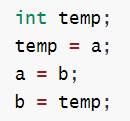
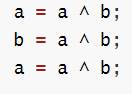
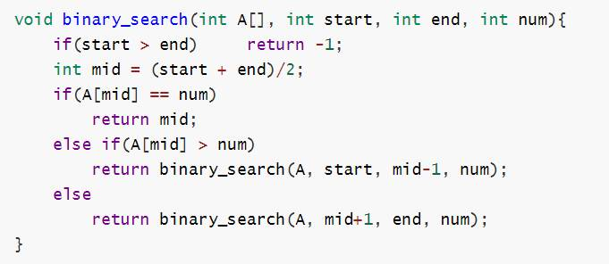
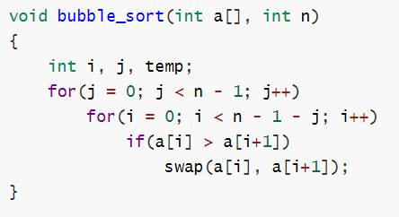
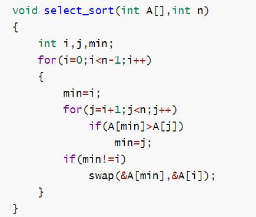

# C语言复习材料

## tips:

1. ```c
   #define EOF (-1)
   ```

2. ```c
   long == int
   ```

3. scanf函数返回成功读入的数据项数，读入数据时遇到了“文件结束”则返回EOF(-1);

4. gets()读入成功，返回与参数buffer相同的指针；读入过程中遇到EOF(End-of-File)或发生错误，返回NULL指针。所以在遇到返回值为NULL的情况，要用ferror或feof函数检查是发生错误还是遇到EOF;

5. switch是寻找入口后执行到底，需要分标签执行需要自带break;

6. 分配二维指针来做二维数组，除了需要给二维指针本身分配空间，还要给二维指针的每个元素分配一个空间;

7. 八进制和十六进制和十进制转换无需自己写，只要用一个scanf系列函数即可。（二进制也可以用一个sprintf来写，转换八进制和十六进制再自己写）

8. 由于浮点数误差，浮点型判断相等应该这样使用： (a-b) < 1e-7 则认为相等，精度一般1e-7就很准确了。（不懂为什么可以试试，0.2-0.1 == 0.3-0.2 是 False）

9. 字典序和字母序还是不一样的，字典序是ASCII排序，大写Z在小写a之前。

10. 递归有一种很常见的方法叫回溯法

11. 在原有线性表（eg.数组）的基础上难以实现的问题，可以尝试用动态内存分配分配新数组，释放原数组空间，并返回新数组。

12. fopen后要记的fclose，否则可能会出现未知读写意外。

13. freopen(“hello.csv”, “r”, *stdin*);将文件重定向到stdin后，scanf和printf相当于直接从hello.csv中读写，最后再fclose(stdin)。（除了做题目，平时不建议这样用，这样用之后，如果需要恢复输入缓冲区，会出现一些跨平台性的兼容性问题。）

14. 常数后缀：

    1. 整型：L/l（int, long）、LL/ll(long long)、u/U（unsigned）
    2. 浮点型：F/f(float)、LF/lf（double）、L/l（long double）

 

**优先级表：**

| **优先级** | **运算符**       | **名称或含义**            | **使用形式**              | **结合方向** | **说明**   |
| ---------- | ---------------- | ------------------------- | ------------------------- | ------------ | ---------- |
| 1          | []               | 数组下标                  | 数组名[常量表达式]        | 左到右       |            |
| ()         | 圆括号           | (表达式)   函数名(形参表) |                           |              |            |
| .          | 成员选择（对象） | 对象.成员名               |                           |              |            |
| ->         | 成员选择（指针） | 对象指针->成员名          |                           |              |            |
| 2          | -                | 负号运算符                | -表达式                   | 右到左       | 单目运算符 |
| (类型)     | 强制类型转换     | (数据类型)表达式          |                           |              |            |
| ++         | 自增运算符       | ++变量名   变量名++       | 单目运算符                |              |            |
| --         | 自减运算符       | --变量名   变量名--       | 单目运算符                |              |            |
| *          | 取值运算符       | *指针变量                 | 单目运算符                |              |            |
| &          | 取地址运算符     | &变量名                   | 单目运算符                |              |            |
| !          | 逻辑非运算符     | !表达式                   | 单目运算符                |              |            |
| ~          | 按位取反运算符   | ~表达式                   | 单目运算符                |              |            |
| sizeof     | 长度运算符       | sizeof(表达式)            |                           |              |            |
| 3          | /                | 除                        | 表达式 / 表达式           | 左到右       | 双目运算符 |
| *          | 乘               | 表达式*表达式             | 双目运算符                |              |            |
| %          | 余数（取模）     | 整型表达式%整型表达式     | 双目运算符                |              |            |
| 4          | +                | 加                        | 表达式+表达式             | 左到右       | 双目运算符 |
| -          | 减               | 表达式-表达式             | 双目运算符                |              |            |
| 5          | <<               | 左移                      | 变量<<表达式              | 左到右       | 双目运算符 |
| >>         | 右移             | 变量>>表达式              | 双目运算符                |              |            |
| 6          | >                | 大于                      | 表达式>表达式             | 左到右       | 双目运算符 |
| >=         | 大于等于         | 表达式>=表达式            | 双目运算符                |              |            |
| <          | 小于             | 表达式<表达式             | 双目运算符                |              |            |
| <=         | 小于等于         | 表达式<=表达式            | 双目运算符                |              |            |
| 7          | ==               | 等于                      | 表达式==表达式            | 左到右       | 双目运算符 |
| !=         | 不等于           | 表达式!= 表达式           | 双目运算符                |              |            |
| 8          | &                | 按位与                    | 表达式&表达式             | 左到右       | 双目运算符 |
| 9          | ^                | 按位异或                  | 表达式^表达式             | 左到右       | 双目运算符 |
| 10         | \|               | 按位或                    | 表达式\|表达式            | 左到右       | 双目运算符 |
| 11         | &&               | 逻辑与                    | 表达式&&表达式            | 左到右       | 双目运算符 |
| 12         | \|\|             | 逻辑或                    | 表达式\|\|表达式          | 左到右       | 双目运算符 |
| 13         | ?:               | 条件运算符                | 表达式1? 表达式2: 表达式3 | 右到左       | 三目运算符 |
| 14         | =                | 赋值运算符                | 变量=表达式               | 右到左       |            |
| /=         | 除后赋值         | 变量/=表达式              |                           |              |            |
| *=         | 乘后赋值         | 变量*=表达式              |                           |              |            |
| %=         | 取模后赋值       | 变量%=表达式              |                           |              |            |
| +=         | 加后赋值         | 变量+=表达式              |                           |              |            |
| -=         | 减后赋值         | 变量-=表达式              |                           |              |            |
| <<=        | 左移后赋值       | 变量<<=表达式             |                           |              |            |
| >>=        | 右移后赋值       | 变量>>=表达式             |                           |              |            |
| &=         | 按位与后赋值     | 变量&=表达式              |                           |              |            |
| ^=         | 按位异或后赋值   | 变量^=表达式              |                           |              |            |
| \|=        | 按位或后赋值     | 变量\|=表达式             |                           |              |            |
| 15         | ,                | 逗号运算符                | 表达式,表达式,…           | 左到右       |            |

 

格式化输入输出：

格式化输入：

1.类型和长度

|               | **specifiers**                                   |                                                  |               |                 |        |                                                  |      |
| ------------- | ------------------------------------------------ | ------------------------------------------------ | ------------- | --------------- | ------ | ------------------------------------------------ | ---- |
| ***length\*** | **d i**                                          | **u o x**                                        | **f e g a**   | **c s []  [^]** | **p**  | **n**                                            |      |
| *(none)*      | int*                                             | unsigned  int*                                   | float*        | char*           | void** | int*                                             |      |
| hh            | signed  char*                                    | unsigned  char*                                  |               |                 |        | signed  char*                                    |      |
| h             | short  int*                                      | unsigned  short int*                             |               |                 |        | short  int*                                      |      |
| l             | long  int*                                       | unsigned  long int*                              | double*       | wchar_t*        |        | long  int*                                       |      |
| ll            | long  long int*                                  | unsigned  long long int*                         |               |                 |        | long  long int*                                  |      |
| j             | [intmax_t](http://www.cplusplus.com/intmax_t)*   | [uintmax_t](http://www.cplusplus.com/uintmax_t)* |               |                 |        | [intmax_t](http://www.cplusplus.com/intmax_t)*   |      |
| z             | [size_t](http://www.cplusplus.com/size_t)*       | [size_t](http://www.cplusplus.com/size_t)*       |               |                 |        | [size_t](http://www.cplusplus.com/size_t)*       |      |
| t             | [ptrdiff_t](http://www.cplusplus.com/ptrdiff_t)* | [ptrdiff_t](http://www.cplusplus.com/ptrdiff_t)* |               |                 |        | [ptrdiff_t](http://www.cplusplus.com/ptrdiff_t)* |      |
| L             |                                                  |                                                  | long  double* |                 |        |                                                  |      |

(http://www.cplusplus.com/reference/)

简单理解使用：

| 标识符                    | 类型                                   |
| ------------------------- | -------------------------------------- |
| **%d, %ld**               | **short \*, int \***                   |
| **%lld**                  | **long long int \***                   |
| **%u, %lu**               | **unsigned short \*, unsigned int \*** |
| %llu                      | unsigned long  long *                  |
| **%o, %lo(****八进制)**   | **unsigned short \*, unsigned int \*** |
| %llo(八进制)              | unsigned long  long int *              |
| **%x, %lx(****十六进制)** | **unsigned short \*, unsigned int \*** |
| %llx(十六进制)            | unsigned long  long int *              |
| %c                        | char *(字符型)                         |
| %s                        | char *(字符串)                         |
| %f                        | float*                                 |
| %lf                       | double*                                |
| **%Lf**                   | **long double\***                      |

2.宽度

用十进制整数指定输入的宽度（即字符数）。

eg1.scanf("%5d",&a);

输入12345678只把12345赋予变量a，其余部分被截去。

eg2.scanf("%4d%4d",&a,&b);

输入12345678将把1234赋予a，而把5678赋予b。

3.读入结尾不会自动吸收空格、换行符等。

格式化输出：

1.类型和长度

|               | **specifiers**                                  |                                                 |                       |                                           |            |         |                                                    |
| ------------- | ----------------------------------------------- | ----------------------------------------------- | --------------------- | ----------------------------------------- | ---------- | ------- | -------------------------------------------------- |
| ***length\*** | `**d i**`                                       | `**u o x X**`                                   | `**f F e E g G a A**` | `**c**`                                   | `**s**`    | `**p**` | `**n**`                                            |
| *(none)*      | `int`                                           | `unsigned int`                                  | `double`              | `int`                                     | `char*`    | `void*` | `int*`                                             |
| `hh`          | `signed char`                                   | `unsigned char`                                 |                       |                                           |            |         | `signed char*`                                     |
| `h`           | `short int`                                     | `unsigned short int`                            |                       |                                           |            |         | `short int*`                                       |
| `l`           | `long int`                                      | `unsigned long int`                             |                       | [wint_t](http://www.cplusplus.com/wint_t) | `wchar_t*` |         | `long int*`                                        |
| `ll`          | `long long int`                                 | `unsigned long long int`                        |                       |                                           |            |         | `long long int*`                                   |
| `j`           | [intmax_t](http://www.cplusplus.com/intmax_t)   | [uintmax_t](http://www.cplusplus.com/uintmax_t) |                       |                                           |            |         | [intmax_t](http://www.cplusplus.com/intmax_t)`*`   |
| `z`           | [size_t](http://www.cplusplus.com/size_t)       | [size_t](http://www.cplusplus.com/size_t)       |                       |                                           |            |         | [size_t](http://www.cplusplus.com/size_t)`*`       |
| `t`           | [ptrdiff_t](http://www.cplusplus.com/ptrdiff_t) | [ptrdiff_t](http://www.cplusplus.com/ptrdiff_t) |                       |                                           |            |         | [ptrdiff_t](http://www.cplusplus.com/ptrdiff_t)`*` |
| `L`           |                                                 |                                                 | `long double`         |                                           |            |         |                                                    |

 (http://www.cplusplus.com/reference/)

简单理解使用：

| 标识符                    | 类型                                   |
| ------------------------- | -------------------------------------- |
| **%d, %ld**               | **short \*, int \***                   |
| **%lld**                  | **long long int \***                   |
| **%u, %lu**               | **unsigned short \*, unsigned int \*** |
| %llu                      | unsigned long  long *                  |
| **%o, %lo(****八进制)**   | **unsigned short \*, unsigned int \*** |
| %llo(八进制)              | unsigned long  long int *              |
| **%x, %lx(****十六进制)** | **unsigned short \*, unsigned int \*** |
| %llx(十六进制)            | unsigned long  long int *              |
| %c                        | char *(字符型)                         |
| %s                        | char *(字符串)                         |
| **%f**                    | **double\***                           |
| **%Lf**                   | **long double\***                      |

2.对齐宽度

%10d右对齐，左边空白补空格，%-10d左对齐，右边空白补空格。

%010d右对齐，左边空白补0。

 

**几个简单的思想：**

**swap(****交换)：**

**(1)**  

**(2)**  

**二分查找**

使用二分查找的前提：数据是经过排序的。

递归实现：

tip: 非递归也能实现，但是没有递归直观。

 

**冒泡排序**



**类比思想：**

如果比较是>，则，若是结构体中的一组数据(eg. age)进行比较，该组数据相同的大小，对应的结构体将会按照读入顺序排序。

如果比较是>=，则，若是结构体中的一组数据(eg. age)进行比较，该组数据相同的大小，对应的结构体将会按照读入顺序逆向排序。

**选择排序**



**类比思想：**

可以通过初始化一些不参与排序的数据为排序数据范围外的数据，例如全是正数则设-1位不参与排序的数据，然后在排序的时候跳过-1，这些数据的位置就不会发生改变。

**方向控制(eg.贪吃蛇)**

**x****轴正方向向右，y轴正方向向下，**

**int dx[4] = {0, 1, 0, -1};   //****依次是，上右下左**

**int dy[4] = {-1, 0, 1, 0};**

**x += dx[1];  //****即实现了向右**

**y += dy[1];**

 

 

**常用函数库：**

**stdio.h**

 

FILE *fopen(const char *filename, const char *mode)

| **模式** | **描述**                                                     |
| -------- | ------------------------------------------------------------ |
| "r"      | 打开一个用于读取的文件。该文件必须存在。                     |
| "w"      | 创建一个用于写入的空文件。如果文件名称与已存在的文件相同，则会删除已有文件的内容，文件被视为一个新的空文件。 |
| "a"      | 追加到一个文件。写操作向文件末尾追加数据。如果文件不存在，则创建文件。 |
| "r+"     | 打开一个用于更新的文件，可读取也可写入。该文件必须存在。     |
| "w+"     | 创建一个用于读写的空文件。                                   |
| "a+"     | 打开一个用于读取和追加的文件。                               |

 

 

| 1    | [int   fclose(FILE *stream)](http://www.runoob.com/cprogramming/c-function-fclose.html)   关闭流 stream。刷新所有的缓冲区。 |
| ---- | ------------------------------------------------------------ |
| 3    | [int   feof(FILE *stream)](http://www.runoob.com/cprogramming/c-function-feof.html)   测试给定流 stream 的文件结束标识符。 |
| 9    | [FILE   *freopen(const char *filename, const char *mode, FILE *stream)](http://www.runoob.com/cprogramming/c-function-freopen.html)   把一个新的文件名 filename 与给定的打开的流  stream 关联，同时关闭流中的旧文件。 |
| 21   | [int   fprintf(FILE *stream, const char *format, ...)](http://www.runoob.com/cprogramming/c-function-fprintf.html)   发送格式化输出到流 stream 中。 |
| 22   | [int   printf(const char *format, ...)](http://www.runoob.com/cprogramming/c-function-printf.html)   发送格式化输出到标准输出 stdout。 |
| 23   | [int   sprintf(char *str, const char *format, ...)](http://www.runoob.com/cprogramming/c-function-sprintf.html)   发送格式化输出到字符串。 |
| 27   | [int   fscanf(FILE *stream, const char *format, ...)](http://www.runoob.com/cprogramming/c-function-fscanf.html)   从流 stream 读取格式化输入。 |
| 28   | [int   scanf(const char *format, ...)](http://www.runoob.com/cprogramming/c-function-scanf.html)   从标准输入 stdin 读取格式化输入。 |
| 29   | [int   sscanf(const char *str, const char *format, ...)](http://www.runoob.com/cprogramming/c-function-sscanf.html)   从字符串读取格式化输入。 |
| 30   | [int   fgetc(FILE *stream)](http://www.runoob.com/cprogramming/c-function-fgetc.html)   从指定的流 stream 获取下一个字符（一个无符号字符），并把位置标识符往前移动。 |
| 31   | [char   *fgets(char *str, int n, FILE *stream)](http://www.runoob.com/cprogramming/c-function-fgets.html)   从指定的流 stream 读取一行，并把它(含换行符)存储在 str 所指向的字符串内。当读取 **(n-1)** 个字符时，或者读取到换行符时，或者到达文件末尾时，它会停止，具体视情况而定。 |
| 32   | [int   fputc(int char, FILE *stream)](http://www.runoob.com/cprogramming/c-function-fputc.html)   把参数 char 指定的字符（一个无符号字符）写入到指定的流  stream 中，并把位置标识符往前移动。 |
| 33   | [int   fputs(const char *str, FILE *stream)](http://www.runoob.com/cprogramming/c-function-fputs.html)   把字符串写入到指定的流 stream 中，但不包括空字符。 |
| 34   | [int   getc(FILE *stream)](http://www.runoob.com/cprogramming/c-function-getc.html)   从指定的流 stream 获取下一个字符（一个无符号字符），并把位置标识符往前移动。 |
| 35   | [int   putc(int char, FILE *stream)](http://www.runoob.com/cprogramming/c-function-putc.html)   把参数 char 指定的字符（一个无符号字符）写入到指定的流  stream 中，并把位置标识符往前移动。 |
| 36   | [int   getchar(void)](http://www.runoob.com/cprogramming/c-function-getchar.html)   从标准输入 stdin 获取一个字符（一个无符号字符）。 |
| 37   | [int   putchar(int char)](http://www.runoob.com/cprogramming/c-function-putchar.html)   把参数 char 指定的字符（一个无符号字符）写入到标准输出 stdout  中。 |
| 38   | [char   *gets(char *str)](http://www.runoob.com/cprogramming/c-function-gets.html)   从标准输入 stdin 读取一行，并把它(不含换行)存储在 str 所指向的字符串中。当读取到换行符时，或者到达文件末尾时，它会停止，具体视情况而定。 |
| 39   | [int   puts(const char *str)](http://www.runoob.com/cprogramming/c-function-puts.html)   把一个字符串写入到标准输出 stdout，直到空字符，但不包括空字符。换行符会被追加到输出中。 |

 

**string.h**

| 5    | [void *memset(void *str, int   c, size_t n)](http://www.runoob.com/cprogramming/c-function-memset.html)   复制字符 c（一个无符号字符）到参数 *str* 所指向的字符串的前 n 个字符。 |
| ---- | ------------------------------------------------------------ |
| 6    | [char *strcat(char *dest, const   char *src)](http://www.runoob.com/cprogramming/c-function-strcat.html)   把 src 所指向的字符串追加到 dest 所指向的字符串的结尾。 |
| 7    | [char *strncat(char *dest, const   char *src, size_t n)](http://www.runoob.com/cprogramming/c-function-strncat.html)   把 src 所指向的字符串追加到 dest 所指向的字符串的结尾，直到 n 字符长度为止。 |
| 9    | [int strcmp(const char *str1,   const char *str2)](http://www.runoob.com/cprogramming/c-function-strcmp.html)   把 str1 所指向的字符串和 str2 所指向的字符串进行比较。 |
| 10   | [int strncmp(const char *str1,   const char *str2, size_t n)](http://www.runoob.com/cprogramming/c-function-strncmp.html)   把 str1 和 str2 进行比较，最多比较前 n 个字节。 |
| 12   | [char *strcpy(char *dest, const   char *src)](http://www.runoob.com/cprogramming/c-function-strcpy.html)   把 src 所指向的字符串复制到 dest。 |
| 13   | [char *strncpy(char *dest, const   char *src, size_t n)](http://www.runoob.com/cprogramming/c-function-strncpy.html)   把 src 所指向的字符串复制到 dest，最多复制 n 个字符。 |
| 16   | [size_t strlen(const   char *str)](http://www.runoob.com/cprogramming/c-function-strlen.html)   计算字符串 str 的长度，直到空结束字符，但不包括空结束字符。  typedef int size_t; |

 

**ctype.h**

| **序号** | **函数 & 描述**                                              |
| -------- | ------------------------------------------------------------ |
| 1        | [int   isalnum(int c)](http://www.runoob.com/cprogramming/c-function-isalnum.html)   该函数检查所传的字符是否是字母和数字。 |
| 2        | [int   isalpha(int c)](http://www.runoob.com/cprogramming/c-function-isalpha.html)   该函数检查所传的字符是否是字母。 |
| 3        | [int   iscntrl(int c)](http://www.runoob.com/cprogramming/c-function-iscntrl.html)   该函数检查所传的字符是否是控制字符。 |
| 4        | [int   isdigit(int c)](http://www.runoob.com/cprogramming/c-function-isdigit.html)   该函数检查所传的字符是否是十进制数字。 |
| 5        | [int   isgraph(int c)](http://www.runoob.com/cprogramming/c-function-isgraph.html)   该函数检查所传的字符是否有图形表示法。 |
| 6        | [int   islower(int c)](http://www.runoob.com/cprogramming/c-function-islower.html)   该函数检查所传的字符是否是小写字母。 |
| 7        | [int   isprint(int c)](http://www.runoob.com/cprogramming/c-function-isprint.html)   该函数检查所传的字符是否是可打印的。 |
| 8        | [int   ispunct(int c)](http://www.runoob.com/cprogramming/c-function-ispunct.html)   该函数检查所传的字符是否是标点符号字符。 |
| 9        | [int   isspace(int c)](http://www.runoob.com/cprogramming/c-function-isspace.html)   该函数检查所传的字符是否是空白字符。 |
| 10       | [int   isupper(int c)](http://www.runoob.com/cprogramming/c-function-isupper.html)   该函数检查所传的字符是否是大写字母。 |
| 11       | [int   isxdigit(int c)](http://www.runoob.com/cprogramming/c-function-isxdigit.html)   该函数检查所传的字符是否是十六进制数字。 |

 

**math.h**

| 19   | [**double** fabs(**double** x)](http://www.runoob.com/cprogramming/c-function-fabs.html)   返回  x 的绝对值。 |
| ---- | ------------------------------------------------------------ |
|      | [**int** abs(**int** x)](http://www.runoob.com/cprogramming/c-function-fabs.html)   返回  x 的绝对值。 |
| 20   | [**double** floor(**double** x)](http://www.runoob.com/cprogramming/c-function-floor.html)   返回小于或等于 x 的最大的整数值。 |
| 18   | [**double** ceil(**double** x)](http://www.runoob.com/cprogramming/c-function-ceil.html)   返回大于或等于 x 的最小的整数值。 |
| 16   | [**double** pow(**double** x, **double** y)](http://www.runoob.com/cprogramming/c-function-pow.html)   返回  x 的 y 次幂。 |
| 17   | [**double** sqrt(**double** x)](http://www.runoob.com/cprogramming/c-function-sqrt.html)   返回  x 的平方根。 |
| 13   | [double log(double x)](http://www.runoob.com/cprogramming/c-function-log.html)   返回  x 的自然对数（基数为 e 的对数）。 |
| 14   | [double log10(double x)](http://www.runoob.com/cprogramming/c-function-log10.html)   返回  x 的常用对数（基数为 10 的对数）。 |

 

 

**stdlib.h**

**下列6个函数均可以由sscanf或sprintf代替，无需记忆：**

| 1    | [double   atof(const char *str)](http://www.runoob.com/cprogramming/c-function-atof.html)   把参数 *str* 所指向的字符串转换为一个浮点数（类型为 double 型）。 |
| ---- | ------------------------------------------------------------ |
| 2    | [int   atoi(const char *str)](http://www.runoob.com/cprogramming/c-function-atoi.html)   把参数 *str* 所指向的字符串转换为一个整数（类型为 int 型）。 |
| 3    | [long int   atol(const char *str)](http://www.runoob.com/cprogramming/c-function-atol.html)   把参数 *str* 所指向的字符串转换为一个长整数（类型为 long int 型）。 |
| 4    | [double   strtod(const char *str, char **endptr)](http://www.runoob.com/cprogramming/c-function-strtod.html)   把参数 *str* 所指向的字符串转换为一个浮点数（类型为 double 型）。 |
| 5    | [long int   strtol(const char *str, char **endptr, int base)](http://www.runoob.com/cprogramming/c-function-strtol.html)   把参数 *str* 所指向的字符串转换为一个长整数（类型为 long int 型）。 |
| 6    | [unsigned   long int strtoul(const char *str, char **endptr, int base)](http://www.runoob.com/cprogramming/c-function-strtoul.html)   把参数 *str* 所指向的字符串转换为一个无符号长整数（类型为 unsigned long int 型）。 |

 

**动态内存分配：**

| 7    | [void   *calloc(size_t nitems, size_t size)](http://www.runoob.com/cprogramming/c-function-calloc.html)   分配所需的内存空间，并全部初始化为0，并返回一个指向它的指针。 |
| ---- | ------------------------------------------------------------ |
| 8    | [void   free(void *ptr)](http://www.runoob.com/cprogramming/c-function-free.html)   释放之前调用 *calloc**、malloc* 或 *realloc* 所分配的内存空间。 |
| 9    | [void   *malloc(size_t size)](http://www.runoob.com/cprogramming/c-function-malloc.html)   分配所需的内存空间，不会全部初始化为0，并返回一个指向它的指针。 |
| 10   | [void   *realloc(void *ptr, size_t size)](http://www.runoob.com/cprogramming/c-function-realloc.html)   尝试重新调整之前调用 *malloc* 或 *calloc* 所分配的 ptr 所指向的内存块的大小，size大于原有大小时会保留原有数据，小于时只会保留size大小内的原有数据。 |

 

**limits.h**

这个头文件一般用来提高代码的可读性，作用不是很大，可以自己算出来，有空可以记一下。

| **宏**     | **值**      | **描述**                                                     |
| ---------- | ----------- | ------------------------------------------------------------ |
| CHAR_BIT   | 8           | 定义一个字节的比特数。                                       |
| SCHAR_MIN  | -128        | 定义一个有符号字符的最小值。                                 |
| SCHAR_MAX  | 127         | 定义一个有符号字符的最大值。                                 |
| UCHAR_MAX  | 255         | 定义一个无符号字符的最大值。                                 |
| CHAR_MIN   | 0           | 定义类型 char 的最小值，如果 char 表示负值，则它的值等于 SCHAR_MIN，否则等于 0。 |
| CHAR_MAX   | 127         | 定义类型 char 的最大值，如果 char 表示负值，则它的值等于 SCHAR_MAX，否则等于 UCHAR_MAX。 |
| MB_LEN_MAX | 1           | 定义多字节字符中的最大字节数。                               |
| SHRT_MIN   | -32768      | 定义一个短整型的最小值。                                     |
| SHRT_MAX   | +32767      | 定义一个短整型的最大值。                                     |
| USHRT_MAX  | 65535       | 定义一个无符号短整型的最大值。                               |
| INT_MIN    | -32768      | 定义一个整型的最小值。                                       |
| INT_MAX    | +32767      | 定义一个整型的最大值。                                       |
| UINT_MAX   | 65535       | 定义一个无符号整型的最大值。                                 |
| LONG_MIN   | -2147483648 | 定义一个长整型的最小值。                                     |
| LONG_MAX   | +2147483647 | 定义一个长整型的最大值。                                     |
| ULONG_MAX  | 4294967295  | 定义一个无符号长整型的最大值。                               |

 