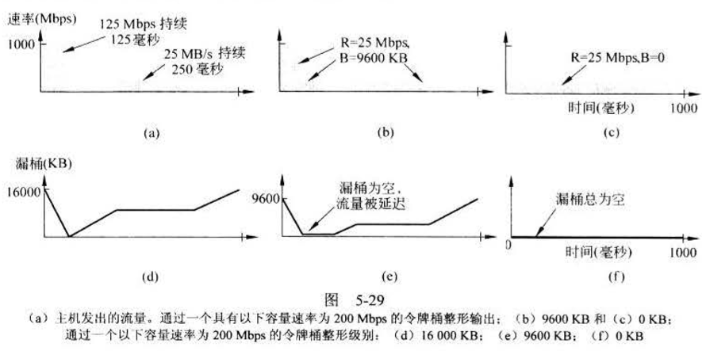

# 计算机网络

## Ch.1 引言

- 计算机网络和分布式系统
  - 计算机网络是一组通过单一技术相互链接的自主计算机集合；
  - 分布式系统是由一组独立计算机组成的一个关联系统，是建立在网络之上的软件系统。

### 计算机网络的应用

- 商业应用
  - 资源共享
  - 桌面共享
  - 电子商务
- 家庭应用
  - 即时消息
  - 远程学习
  - 普适计算
- 移动应用
  - 短消息
  - 智能手机
  - 全球定位系统（GPS）
  - 移动商务
  - 近场通信（NFC）
  - 传感器网络
  - 可穿戴式计算机
- 社会问题
  - 钓鱼
  - ……

### 网络硬件

- 传输技术
  - 广播式链路和点到点链路
    - 点到点链路：只有一个发送方和一个接收方，也称单播；
    - 广播室链路：
      - 广播：将一个数据包发送给所有目标机器的模式；
      - 组播：将一个数据包发送给一组机器的模式。
  - 网络互联：两个或多个网络的连接；

#### 个域网

- 个域网：允许设备围绕着一个人进行通信；
  - eg. 计算机通过无线网络与外围设备连接起来；
  - eg. 蓝牙；

#### 局域网

- 局域网：一种私有网络，被广泛用来连接个人计算机和消费类电子设备，使它们能够共享资源和交换信息；
  - 当局域网被用于公司时，他们就称为**企业网络**。
- 无线局域网和有线局域网
  - 无线局域网
    - 设备被称为接入点（AP）或无线路由器，负责中继无线计算机之间的数据包，还负责中继无线计算机和Internet之间的数据包。
    - IEEE 802.11，俗称WIFI
  - 有线局域网
    - 大多数使用铜线作为传输介质，也有一些使用光纤；
  - 比较
    - 有线局域网的所有性能都超过无线局域网；

#### 城域网

- 城域网：范围可覆盖一个城市；
  - eg. 有线电视网

#### 广域网

- 广域网：范围很大，能跨越很大的地理区域，通常是一个国家、地区或者一个大陆；
- 通信子网（子网）：一组路由器和通信线路的集合，主要负责将数据包从源主机移动到目标主机；
  - 除了主机的设备⼀同构成了子网，包括物理层，数据链路层，⽹络层三层的设备和线路；
- 传输线路：负责在机器之间**移动比特**，可以是铜线、光纤、无线链路；
- 交换元素（交换机）：负责**连接**两条或两条以上的传输线路，现在最常用的是**路由器**；
- 广域网和局域网的区别：
  - 广域网中，主机和子网由不同的人拥有和经营；
  - 路由器通常连接不同的网络技术。
    - 长途传输线路可能是SONET链路，局域网可能是以太网；
  - 子网连接对象不同
    - 广域网可以连接单个计算机，也可以连接整个局域网；
- 广域网类型：
  - 公司不租赁专用的传输线路，把自己的办事处直接连接到了Internet；
  - 子网由不同的公司负责运营。
    - Internet服务提供商（ISP）

#### 互联网络

- 一组相互连接的网络称为互联网络或互联网（internet）；
- Internet（首字母大写）是一个特殊的互联网络；
- 子网和它的主机结合在一起就形成了一个网络；

### 网络软件

#### 协议层次结构

- 层次栈：每一层都建立在其下一层的基础之上；

- 协议：通信双方就如何进行通信的一种约定；

- 对等体：不同机器上构成相应层次的实体称为对等体；

- 接口：定义了下层向上层提供哪些原语操作和服务；

- 网络体系结构：层和协议的集合；

- 协议栈：一个特定系统所使用的一组协议称为协议栈；

- 面向连接与无连接服务

  - 面向连接服务
    - 服务用户首先必须建立一个连接，然后使用该连接传输数据，最后释放该连接；
    - 当建立一个连接时，发送方、接收方和子网一起协商；
  - 无连接服务
    - 每个报文都携带了完整的目标地址，每个报文都由系统中的中间节点路由；
    - 报文在不同的上下文由不同的称呼，数据包、包、数据段等。
    - 存储-转发交换（store-and-forward switching） 和 直通式交换（cut-through switching）
      - 只能在收到全部内容之后再将该报文发送给下一个节点；
      - 报文还没有被全部接收完毕之前就将下一个节点传输；

- 服务质量

- 服务类型

  

  ##### 服务原语

  - 服务原语：
    - 用户进程通过原语访问服务；

  

  - 服务与协议的关系
    - 服务是指某一层向它上一层提供的一组原语；
    - 协议是一组规则，规定了同一层上对等实体之间所交换的数据包或者报文的格式和含义；

#### 参考模型

##### OSI参考模型

- OSI（开放系统互联）
- OSI基本原则：
  - OSI模型有7层。适用于这7层的基本原则简要概括如下:
    - 应该在**需要一个不同抽象体的**地方创建一层；
    - 每一层都应该执行一个**明确定义**的功能；
    - 每一层功能的选择应该向**定义国际标准化协议的目标**看齐；
    - 层与层边界的选择应该使**跨越接口的信息流最小**；
    - 层数应该足够多，**保证不同的功能不会被混杂在同层中**， 但同时层数又不能太多，以免体系结构变得过于庞大。

###### 物理层

- 物理层关注在一条通信信道上传输原始比特；

###### 数据链路层

- 数据链路层的主要任务是将一个原始的传输设备转变成一条没有漏检传输错误的线路；
- 如果服务是可靠的，则接收方必须确认正确收到的每一帧，即给发送方回发一个确认帧；

###### 网络层

- 网络层主要功能是控制子网的运行。

###### 传输层

- 传输层的基本功能是接收来自上一层的数据，在必要的时候把这些数据分割成较小的单元，然后把这些数据单元传递给网络层，并且确保这些数据单元正确的到达另一端；
- 是真正的端到端的层，自始至终将数据从源端携带导接收方。

###### 会话层

- 会话层允许不同机器上的用户建立会话；

###### 表示层

- 表示层关注的是所传递信息的语法和语义；

###### 应用层

- 应用层包含了用户通常需要的各种各样的协议；

##### TCP/IP参考模型

###### 链路层

- 以一个可运行在不同网络至上的无连接网络层为基础；

###### 互联网层

- 大致对应于OSI的网络层；
- 该层的任务是允许主机**将数据包注入到任何网络**，并且**让这些数据包独立地到达接收方**；

###### 传输层

- 定义了两个端到端的传输协议；
  - 传输控制协议（TCP）
    - 可靠的、面向连接的协议；
  - 用户数据报协议（UDP）
    - 不可靠的、无连接协议；

###### 应用层

- 应用层包含所有的高层协议。
  - 虚拟终端协议（TELNET）、文件传输协议（FTP，面向连接的、大文件的传输）、电子邮件协议（SMTP）、TFTP（无连接的、小文件传输）等。

##### OSI参考模型和TCP/IP参考模型的比较

- OSI模型的核心：
  - 服务
  - 接口
  - 协议
- OSI模型的协议比TCP/IP模型中的协议有更好的隐蔽性，更容易替换新协议；
- OSI模型更具有通用性，TCP/IP模型只是已有协议的一个描述；TCP/IP模型不适合任何其他的协议栈。
- OSI模型的网络层同时支持无连接和面向连接的通信，但是传输层只支持面向连接的通信；TCP/IP模型在网络层只支持无连接的通信，在传输层同时支持两种通信模式，可以给用户选择的机会。

##### OSI模型和协议的评判

- 糟糕的时机
- 糟糕的技术
  - OSI无论是模型还是协议都存在缺陷；
  - 会话层和表示层几乎是空的，而数据链路层和网络层又包含了太多内容；
  - 服务定义和协议极其复杂；
- 糟糕的实现
  - 实现庞大，效率也很低；
- 糟糕的政策
  - 政府的强制性对OSI无济于事；

##### TCP/IP模型的评判

- TCP/IP模型没有明确区分服务、接口和协议的概念；
- TCP/IP模型不通用，不适合用来描述TCP/IP之外的其他协议栈；
- 在分层协议的上下文中，链路层并不是通常意义的一层，它是一个位于网络层和数据链路层之间的接口；
- TCP/IP并没有区分物理层和数据链路层；

### 网络实例

#### 因特网

- ARPANET
  - 最早的因特网
- NSFNET
  - 第一个TCP/IP广域网

#### 第三代移动电话网络（3G)

#### 无线局域网：802.11

#### RFID和传感器网络

- 无线射频识别（RFID）

## Ch.2 物理层 

### 数据通信的理论基础

#### 傅里叶分析

#### 带宽有限的信号

- 带宽
  - 对电气工程师来说，带宽是以赫兹（Hz）来度量的；
  - 对计算机科学家来说，带宽表示一个信道的最大数据速率，以比特（bps）来计量。

#### 信道的最大数据速率

- 无噪声信道

  - $$
    最大数据速率 = 2B log_2V(比特/秒)
    $$

- 有噪声信道

  - $$
    最大数据速率 = B log_2(1 + S/N)(比特/秒)
    $$

  - $$
    10log_{10}S/N = k（分贝）
    $$

  - 10的信噪比为10分贝

### 引导性传输介质

#### 磁介质

- 将数据从一台机器传输到另一台机器的最常见办法是将数据写到磁带或其他可擦写介质上；
- 磁带具有优良的带宽特性，但延迟特性却很差

#### 双绞线

- 
- 最老但至今最常用；
- 最常见的应用是电话系统；
- 双绞线既可用于传输**模拟信号**，也可以用于传输**数字信号**，所获得的**带宽**取决于**导线的厚度**以及**传输距离的远近**。
- 链路分类
  - 全双工链路：双向同时使用；
  - 半双工链路：可以双向使用，但一次只能使用一个方向的链路；
  - 单工链路：只允许一个方向上的传输的链路；

#### 同轴电缆

- 
- 50Ω电缆
  - 一开始就被用于数字传输；
- 75Ω电缆
  - 用于模拟传输和有线电视传输；

#### 电力线

- 家庭网络使用电力线的困难在于电线是专门分发电源信号而设计的；
- 高速率数据通信所需的更高频率（MHz）在电线上会产生严重的衰减；

#### 光纤

- 当前实际带宽只能达到约100Gbps，之所以无法获得更高带宽的限制，在于我们无法将电气和光学信号之间的转化进行的更快；
- 多模光纤
  - 
  - 由于任何入射角度大于临界值的光束都会在内部反射，所以许多不同的光束以不同的角度来回反射着向前传播
- 单模光纤
  - 
  - 光纤的直径减小到只有几个光波波长大小的时候，则光纤就如同一个波导，光只能按直线传播而不会反射，广泛应用于长距离传输。
- 光缆
  - 
  - 玻璃芯的外面是一个玻璃覆盖层， 覆盖层的折射率比玻璃芯低。
  - 
- 光纤与铜线的比较
  - 光纤能处理更高的带宽；
  - 光纤具有相对较低的衰减率；
  - 光纤不受电源浪涌、电磁干扰或电源故障等影响的优点；
  - 光纤不受空气中腐蚀性化学物质侵蚀的影响；
  - 光纤细小且重量较轻；
  - 光纤不会漏光，且不易被接入，安全性很高；
  - 光纤要求较高的操作技能；
  - 光纤的成本远远高于电子接口的成本；

### 无线传输

#### 电磁频谱

- 真空中，所有的电磁波按同样的速度传播，跟它们的频率无关；
- 紫外线、X射线等频率更高的电磁波传输信息的效果可能更好，但是这种波很难产生和调制，其穿透建筑物的能力也不好，而且对身体有害，因此不用；
- 宽频使用方式
  - 
  - 跳频扩频
    - 发射器以每秒几百次的速率从一个频率跳到另一个频率；
    - eg. 常用于军事通信；
  - 直接序列扩频
    - 将数据信号展开到一个很宽的频段上，是一项能使很多信号共享同一频段的频谱效率方法，现已被广泛应用于商业领域；
    - 信号被赋予不同的码片，即码分多址（CMDA）
  - 超宽带通信
    - UWB发送一系列快速脉冲，脉冲随着通信信息而不断变化自己的位置，这种位置的快速变换导致信号被稀疏分布在一个很宽的频带上。

##### 无线电传输

- 特点
  - 无线电频率的波形很容易产生；
  - 可以传输**很长的距离**；
  - **全方向**传播；
  - 在低频部分，无线电波能够很好地穿透障碍物，随着离信号源越来越远，能量急剧下降；

##### 微波传输

- 特点
  - 几乎按**直线**传播；
  - 微波不能很好地穿透建筑物；

##### 红外传输

- 特点
  - 主要应用于短程通信；
  - 具有方向性、便宜并且易于制造；
  - 不能穿过固体物体；

##### 光通信

- 风和温度的变化可以扭曲激光束的形状；
- 激光束无法穿透雨水或大雾；

### 数字调制与多路复用

- **数字调制**：比特和模拟信号的转换过程称为数字调制
  - 基带传输：即信号的传输占有传输介质上从**零到最大值**之间的全部频率；
  - 通带传输：信号占据了以载波信号频率为中心的一段频带；
    - 无线和光纤信道最常用的调制方法；

#### 基带传输

- 不归零（NRZ）
- 不归零逆转（NRZI）
  - 存在问题：一长串的0会出问题。
    - 解决方法：4B/5B编码；
    - 
- 曼切斯特编码（Manchester）
  - 曼切斯特编码的主要缺点在于需要两倍于NRZ编码的带宽；（2倍的时钟信号）
- 带宽效率
  - 符号率/波特率
    - 信号的改变速率，一个符号可以携带多个比特；
  - 比特率
    - 比特率是符号率与每个符号的比特数的乘积；

#### 通带传输

- 幅移键控（ASK）
- 频移键控（FSK）
- 相移键控（PSK）
  - 二进制相移键控（BPSK）
  - 正交相移键控（QPSK）
- 正交调幅（QAM）

$$
每个符号可传输的比特数 = log_2(组合数)
$$

##### 频分复用（FDM）

- 用通带传输的优势使多个用户共享个信道；
- eg. 电话网，蜂窝电话，地面无线和卫星网络；
- 正交频分复用（OFDM）
  - 广泛用于802.11，有线电视网络，电力线网络和4G；

##### 时分复用（TDM）

- 每个用户周期性地获得整个带宽非常短的一个时间；
- eg. 电话网络，蜂窝网络；

##### 码分复用（CDM）/码分多址（CDMA）

- 扩展频谱通信的一种，把窄带信号扩展到一个很宽的频带上；
- 优点：抗干扰，允许来自不同用户的多个信号共享相同的频带；
- 所有的码片序列都应该精心挑选，两两正交；

### 公共电话交换网络（PSTN）

#### 电话系统结构

- 局部电话机有两根铜线直接连接到电话公司的端局（本地中心局）
- 电话系统主要组成部分
  - 本地回路（进入家庭和公司的模拟双绞线）
  - 中继线（连接交换局的数字光纤）
  - 交换局（电话呼叫在这里从一条中继线被接入到另一条中继线）

#### 本地回路：调制解调器、ADSL和光纤

- 电话调制解调器
  - 执行**数字比特流和模拟信号流之间转换**的设备称为调制解调器，调制解调器是调制器和解调器的缩写；
  - 网格编码调制（TCM）：高速调制解调器采用了一些额外的符号位进行差错检测
  - 使用56kbps调制解调器
    - 受限原因：尼奎斯特定理
      - 每个电话信道4kHz宽，因此重构信号所需的采样数应该是每秒8000次；
      - 美国每个样本值为8比特，其中1比特用于控制目的，所以56kbps；
      - 欧洲全部的8比特都供用户使用，因此他们能使用64kbps的调制解调器，但国际协议标准选择了56kbps。
- 数字用户线
  - 
  - 
  - 数字用户线路（XDSL，Digital Subscriber Line）
  - 非对称数字用户线（ADSL，Asymmetric DSL）
  - 本地回路的容量随着用户住宅和端局之间的距离的增大而快速下降；
  - ADSL中，信道0用于简单老式电话服务（POTS），信道1-5空闲，1条上行流控制，1条下行流控制，其他都用于用户数据；80%-90%的带宽分配给下行信道。
  - 网络接口设备（NID）
  - 数字用户线路接入复用器（DSLAM）
- 光纤到户
  - 已部署的铜制本地回路限制了ADSL和电话调制解调器的性能；
  - 改进结果：光纤到户；
  - 无源光网络（PON）
    - 

#### 中继器和多路复用

- 脉冲编码调制（PCM）
  - 用于4kHz电话信道带宽；
  - 编码解码器每秒采集8000个样值（125微秒/样值）
  - 若采样率较低，信息就会被丢失；若采样率较高，也得不到更多信息；

- 基于PCM的TDM
  - T1载波
    - 
    - 每125微秒产生193个比特，第1个比特是帧码，每个样值有8个比特（7个数据比特，1个比特用作信令）
    - 
- SONET/SDH（同步光网络）
  - 同步数字系列（SDH）
  - 波分多路复用
    - 

#### 交换

- 电路交换
  - 在发送数据之前需要建立一条端到端的路径；
  - 按距离和时间收费；
- 数据包交换
  - 对数据包的大小规定了严格的上限，确保没有任何用户可以长时间霸占任何传输线路，因此数据包交换可以处理交互式的网络通信；
  - **排队延迟**：数据包交换没有为传输数据预留带宽，数据包可能不得不等待一段时间才能转发。
  - 对家庭用户按月租费，对骨干网运营商按流量收费；

### 移动电话系统

- 移动电话/蜂窝电话

#### 1G

- 模拟语音信号；
- ’安装在高大建筑物上的大型发射器，并且只有一个/两个信道用于发送和接收；

#### 2G

- 数字语音信号；
- 将语音信号数字化处理和压缩带来了容量上的收益；
- 实行加密改进了安全性，防止了欺诈和窃听；
- 码分多址；

#### 3G

- 包含数字语音和数据

### 有线电视

#### 共用天线电视

- 早期阶段，有线电视称为**共有天线电视**；

#### 线缆上的Internet

- 混合光纤电缆（HFC）系统
- 用户数量越来越多，带宽的竞争就越激烈。
  - 解决方法：将长的电缆分解开，将每一段直接接到光纤节点上。

#### 频谱分配

- 频分多路复用
  - 可获得非对称的上行和下行带宽；
- 

#### 线缆调制解调器

- 一个接口连接计算机，一个接口连接有线电视网络；
- 线缆数据服务接口规范（DOCSIS）

#### ADSL与有线电视电缆

- 在骨干网上，两者都使用了光纤，但是在网络便于它们使用了不同的介质
  - 有线电视采用了同轴电缆，ADSL采用了 双绞线；
- ADSL新增加用户对原来的用户几乎没有影响；有线电视网络新增加用户会与原来的用户产生竞争；
- ADSL作为点到点的传输介质，本质上比电视电缆安全得多；

## 数据链路层

### 数据链路层的设计问题

- 功能
  - 向网络层提供一个定义良好的服务接口；
  - 处理传输错误；
  - 调节数据流，确保慢速的接收方不会被快速的发送方淹没。

#### 提供给网络层的服务

- 最主要的服务是将数据从源机器的网络层传输到目标机器的网络层；
  - 
- 三种服务
  - 无确认的无连接服务
    - 场合
      - 错误率很低的场合，差错恢复过程可以留给上层来完成；
      - 实时通信，数据迟到比数据受损更糟糕。
  - 有确认的无连接服务
    - 适用于不可靠的信道，如无线系统。
  - 有确认的有连接服务
    - 三个阶段
      - 建立连接，双方初始化；
      - 传递数据帧；
      - 释放连接，释放变量；

#### 成帧

- 数据链路层收到的比特流不能保证没有错误；
- 检测错误和纠正错误的工作正是数据链路层该做的；
- 成帧方法
  - 字节计数法
    - 利用头部一个字段来标识该帧的字符数；
  - 字节填充的标志字节法
    - 考虑到了出错之后重新同步的问题，用了一些特殊字节作为开始和结束；
    - 
    - eg. PPP协议
  - 比特填充的标志比特法
    - 考虑字节填充的缺点——只能使用8比特的字节；
    - 当发送方的数据链路层在数据中遇到连续五个1，它便自动在输出的比特流中填入一个比特0
  - 物理层编码违禁法

#### 差错控制

- 保证所有的帧都被传递到目标机器的网络层，并且保持正确的顺序。
- 方式：
  - 向发送方提供一些有关线路另一端状况的反馈信息，例如，确认帧和否定确认帧；引入计时器防止双方死锁。

#### 流量控制

- 基于**反馈**的流量控制
  - 接收方给发送方返回信息。
- 基于**速率**的流量控制
  - 内置的机制，能限制发送方传输数据的速率。

### 差错检测和纠正

#### 纠错码

- **海明码**

  - 海明距离

    - 两个码字中不相同的位的个数称为海明距离；
    
  	- 校验位r的计算公式：

        -   $$
        (m+r+1) \leq 2^r
            $$
    
  
- 二进制卷积码

- 里德所罗门码

- 低密度奇偶校验码

#### 检错码

- 奇偶检错码
- 校验和
  - 将校验和字段置为0，把每个16位相加
  - 不足16位用0补齐
  - 将溢出加到尾部
  - 取反
- 循环冗余校验（CRC）
  - 计算
    - 将数据转换成多项式
    - 左移r位
    - 模二除法，获得余数
    - 在数据尾部添加余数
  - 校验
    - 接收数据能够被G(x)整除

### 基本数据链路层协议

#### 乌托邦式的单工协议

- 假设
  - 数据只能单向传输；
  - 发送方和接收方的网络层总是处于准备就绪状态；
  - 数据处理的时间忽略不计；
  - 可用的缓存空间无限大；
  - 通信信道永远不会损坏帧或丢失帧；
- 

#### 无错信道的单工停-等协议

- 假设
  - 数据只能单向传输；
  - 发送方和接收方的网络层总是处于准备就绪状态；
  - 数据处理的时间忽略不计；
  - 通信信道永远不会损坏帧或丢失帧；
- 机制
  - 接收方将数据包传递给网络层之后给发送方返回一个小的**哑帧**

#### 有错信道的单工停-等协议

- 假设
  - 数据只能单向传输；
  - 发送方和接收方的网络层总是处于准备就绪状态；
  - 数据处理的时间忽略不计；
- 机制
  - 肯定确认重传（PAR）/自动重传请求（ARQ）

#### 提高传输效率的方法

- 全双工
- 捎带确认
- 批发数据

### 滑动窗口协议

#### 1位滑动窗口协议

- 滑动窗口最大值 MAX_SEQ = 1

- 通信双方初始值 seq = 0, ack = 1

- 特点

  - seq和ack 0/1交替

- 传输效率=k/(k+bR), k=数据帧长度，b=带宽，R等于RTT

- 提高信道利用率的方法

  - 增加滑动窗口的长度W

    - $$
      带宽-延迟积: B*D
      $$

    - $$
      W_{max} = 2 * BD + 1
      $$

#### 回退N帧协议

- 接收窗口为1，发送窗口W <= MAX_SEQ
- 适合**出错率较少**的高速信道
- 发送方
  - 正常发送
    - 对帧编号，待确认帧缓存
  - 收到确认
    - 释放确认帧所占缓冲区，滑动发送窗口
  - 差错帧超时时间到
    - 回退到超时帧(出错帧)，顺序重传最后被确认帧以后的缓冲区中缓存的帧
- 接收方
  - 收到每一个期望的正确帧
    - 上交网络层、回送确认
  - 收到出错帧或非期望帧
    - 丢弃，回送对接收的最后正确帧的确认
  - 收到重传帧(即为一个期望的正确帧)

#### 选择重传协议

- 发送窗口 Wsnd=(MAX_SEQ + 1) / 2，接收窗口Wrcv <= Wsnd 

- 适合出错率较高的环境
- 发送方
  - 正常发送
    - 对帧编号，待确认帧缓存
  - 收到确认
    - 释放确认帧所占缓存区，滑动发送窗口
  - 差错帧超时时间到
    - 重传缓存的最后被确认帧最后的那一帧
- 接收帧
  - 正常接收
    - 上交网络层、回送确认，滑动接收窗口
  - 缓存，回送对接收的最后正确帧的确认
  - 收到重传帧
    - 将缓存帧排序上交，回送确认，滑动接收窗口
- 加快的方法：否定确认

### 数据链路协议实例

SONET和ADSL链路都采用了点到点协议（PPP）

- 点到点协议（PPP）
  - 
  - 特性
    - 一种成帧方法——**字节填充法**
    - 一个链路控制协议——链路控制协议（LCP），用于**启动线路、测试线路、协商参数**。
    - 一种协商网络层选项的方式——网络控制协议（NCP）
- 高级数据链路控制协议（HDLC）
  - 特性
    - 面向比特，比特填充法
    - 提供了可靠的数据传输

#### SONET

#### 对称数字用户线

## 介质访问控制子层

### 信道分配问题

#### 静态信道分配

#### 动态信道分配的假设

- 流量独立
- 单信道
- 冲突可观察
- 时间连续或分槽
- 载波侦听或不听

### 多路访问协议

#### ALOHA

- 纯ALOHA和分槽ALOHA
  - 纯ALOHA
    - 当用户有数据需要发送时就传输；
    - 等待的时间必须是随机的，否则同样的帧会一次又一次地冲突；
    - 帧时：表示传输一个标准的、固定长度的帧所需要的时间（即帧的长度除以比特率）；
    - 每帧时产生新帧的平均数为N；
    - 负载G：每帧时的平均帧数（含新帧和重传的旧帧）；
    - 吞吐量S：负载G乘以成功传输的概率P0——S=G*P0；
    - **最好信道利用率为18.4%**
    - 
  - 分槽ALOHA
    - 将时间分为离散的间隔，这种时间间隔称为时间槽；
    - 最好信道利用率为36.8%

#### 载波侦听多路访问协议

- 1-持续CSMA
  - 持续监听信道，信道空闲就立即发送数据；如果发送冲突，等待随机一段时间，然后再从头开始上述过程。
- p-持续CSMA
  - 持续监听信道，信道空闲有p的概率发送数据，1-p的概率将此次发送推迟到下一个时间槽；如果发送冲突，等待随机一段时间，然后再从头开始上述过程。
- 非持续CSMA
  - 不持续监听信道，等待一段随机事件。
  - 算法利用率更高，但延迟也更大。
- 带冲突检测的CSMA（CSMA/CD)
  - **经典以太网**的基础
  - 发出数据后继续监听信道，一段时间内如果没有发生冲突，则表明传输成功。
  - 等待时间：两倍的信号传播时间，即RTT。
  - 类似于分槽ALOHA系统，时间槽宽度为RTT。
  - CSMA/CD传递大数据能够提高协议的性能。

#### 无冲突协议

- 位图协议
  - 在发送数据前先广播自己有发送数据愿望
- 令牌传递
- 二进制倒计数协议

#### 有限竞争协议

- 在低负载下采用竞争的做法提供较短的延迟，高负载下采用无冲突计数，获得良好的信道效率。

#### 无线局域网协议

- 无线局域网的冲突发生在**接收方**，而不是发送方。
- 隐藏终端问题
  - 由于竞争者离得太远而导致站无法检测到潜在的竞争者。
- 暴露终端问题
  - 听到有一个传输正在进行，从而错误的得出不能发送数据的结论。
- 策略
  - 发送方发送RTS帧，包含了随后要发送的数据帧的长度
  - 接收方发送CTS帧作为应答；
  - 发送方收到CTS帧后开始传输；
  - 一个站听到了RTS/CTS，接下来的数据传送过程中要一直保持沉默。

### 以太网

- 经典以太网
  - 曼切斯特编码
- 交换式以太网

#### 经典以太网的MAC子层协议

- 
- 目标地址全1表示广播；组播MAC地址的第8个比特为1；而单播MAC地址的第8个比特为0。
- 源地址全球统一，前三个字节是组织唯一标识符，由IEEE分配，指明了网络设备制造商。
- 以太网的长度必须由内部携带的数据确定。
- 以太网的长度必须由其内部携带的数据来确定。
- **以太网的有效帧必须至少64字节长**，从目标地址算起直到校验和；数据部分如果少于46字节，则使用填充字段来填充该帧；以太网的数据字段最多课包含1500个字节。
- 二进制指数后退的CSMA/CD算法
  - 随机等待的时间间隔呈指数增加，最大值为1023.
  - 能确保两种情况
    - 少量冲突时，延迟低；
    - 大量冲突时，保证在一个相对合理的实践间隔内解决冲突。

#### 以太网性能

- 电缆越长，竞争间隔也越长。
- 给定帧长度的情况下，增加网络带宽或距离会降低网络效率。

#### 交换式以太网

- 核心是交换机，只把帧输出到该帧想去的端口。
- 集线器中，所有站都位于同一个冲突域；交换机中，每个端口由自己独立的冲突域，因此冲突不可能发生。
- 由于两帧可能同时去往同一个端口，因此交换机必须有缓冲。
- 帧被发送到端口有利于安全。

#### 快速以太网

#### 千兆以太网

- 支持**全双工**模式和**半双工**模式。
- 半双工模式使用集线器，而不是交换机。使用了标准的CSMA/CD协议。
- 采用NRZ编码技术，比不编码需要的信号带宽多25%。

#### 万兆以太网

### 无线局域网

#### 802.11 体系结构和协议栈

- 接入点（AP）
- 有架构模式（有接入点）和自组织网络（无接入点）
  - 
  - 

#### 802.11 物理层

- 通常在2.4GHz和5GHz。
- 正交频分复用（OFDM）

#### 802.11 MAC子层协议

- 特征
  - 早期的后退有助于避免冲突；
  - 利用确认来推断是否发生冲突，因为冲突无法被检测出来。
  - 这种操作模式称为**分布式协调功能**（DCF）。
  - 点协调功能（PCF）。

#### 802.11 帧协议

### 数据链路层交换

- 网桥
  - 泛洪算法
    - 对于未知目的地址的入境帧，网桥将它输出到所有的端口，但它来的那个输入端口除外。
  - 后向学习算法
    - 记录接收到的帧的源地址。
  - 生成树算法
    - 避免形成环路
- 交换机
- 路由器

#### 中继器/集线器/网桥/交换机/路由器和网关

-  中继器是模拟设备，主要用来处理自己所连的线缆上的信号。在一个线缆上出现的信号被清理、放大，然后再被放到另一个线缆上。
- 集线器有许多输入线路，它将这些输入线路连接在一起。
- 网桥与集线器类似，不同的是网桥的每个端口被隔离成不同的冲突域，并且网桥是数据链路层设备。
- 交换机是现代网桥的另一个称呼。交换机可以指以太网交换机，也可以指一个完全不同类型的转发策略设备，例如电话交换机。

#### 虚拟局域网

- 使用理由
  - 安全性
  - 负载
  - 广播流量
- 网桥必须建立配置表；
- 实际使用VLAN字段的只是网桥和交换机。为了使用VLAN，网桥必须能感知VLAN；
- 

## 网络层

- 目的
  - 为了将数据包送到接收方，可能沿途要经过许多跳(hop)中间路由器。
- 网络层与数据链路层的**区别**
  - 这个功能与数据链路层的功能不同，数据链路层的目标只是将帧**从线路一边传送到另一边**；
  - 而网络层是处理**端到端**数据传输的最底层。

### 网络层的设计问题

#### *存储转发数据包交换

- 流程
  - 数据包**到达**路由器；
  - 路由器的数据链路层完成了对数据包的校验和的**验证**；
  - 将数据包**存储**到路由器上；
  - 将数据包沿着路径**转发**到下一个路由器，直至到达目标主机；

#### 提供给传输层的服务

- 目标
  - 向上提供的**服务**应该**独立于路由器技术**；
  - 应该向传输层**屏蔽路由器**的数量、类型和拓扑关系；
  - 传输层可用的**网络地址**应该有一个**统一编码方案**，甚至可以跨越LAN和WAN；
- 阵营
  - 以Internet社团为代表的阵营认为路由器的任务仅仅是传输数据包；
    - 网络服务应该是**无连接**的
    - 只需要原语SEND PACKAET 和 RECEIVE PACKET，以及少量其他的原语；
  - 以电话公司为代表的的阵营认为网络应该提供**可靠的、面向连接的服务**

#### 无连接服务的实现

- **无连接**服务
  - 所有的数据包都被独立地注入到网络中，并且**每个数据包独立路由，不需要提前建立任何设置**；
  - 数据报：无连接服务环境下的数据包；
  - 数据报网络：数据报对应的网络称为数据报网络；
- 面向连接服务
  - 虚电路（VC）：建立的一条**从源路由器到目标路由器之间的路径**；
  - 虚电路网络：虚电路对应的网络称为虚电路网络；
- 数据报网络
  - 

#### 面向连接服务的实现

- 
- eg. 多协议标签交换(MPLS, MultiProtocol Label Switching)
  - IP数据包被一个有20位连接标识或标签的MPLS头包裹着；

#### *虚电路与数据报网络的比较

- 
- 权衡
  - **建立时间**和**地址解析时间**
    - 虚电路网络
      - 需要一个**建立阶段**，这个阶段既花费时间也消耗资源；
      - 路由器只要使用电路号作为索引，再在表中查找数据包的去向。
    - 数据报网络
      - 不需要建立电路；
      - 路由器需要执行一个更为**复杂的查找过程**以便找到目标表项；
        - 原因：数据报网络所用的目标地址比虚电路网络中所用的电路号要长，因为数据报网络的网络地址具备全局意义；
  - 服务质量以及拥塞控制
    - 虚电路网络在建立连接时，资源可以提前预留，容易保证服务质量和避免拥塞；
    - 数据报网络避免拥塞困难；

### 路由算法

- 网络层的主要功能是**将数据包从源机器路由到目标机器**；
- 路由算法
  - 网络层软件的一部分，负责确定一个入境数据包应该被发送到哪一条输出线路上；
  - 数据报网络，路由器必须针对每一个到达的数据包重新选择路由；
  - 虚电路网络，只有建立新的虚电路时，才需要做路由决策，此后数据包只要沿着已经建立的路由向前传递即可；（会话路由）
- 路由器功能
  - 路由
    - 负责**生成和更新路由表**；
  - 转发
    - 在路由表中**查找**该数据包对应的**出境线路**；
- 路由算法
  - 非自适应算法/**静态路由算法**
    - **不会**根据当前测量或估计的流量和拓扑结构来调整路由策略；
  - 自适应算法/**动态路由算法**
    - **会**根据当前测量或估计的流量和拓扑结构来调整路由策略；

#### 优化原则

- 最优化原则/最优路径
  - **如果路由器J在路由器I到路由器K的最优路径上，那么从J到K的最优路径也必定遵循同样的路由；**
  - 直接结果
    - 汇集树：从所有的源到一个指定目标的最优路径的集合构成了一颗以目标节点为根的树，称为汇集树
    - 有向无环图：在汇集树的基础上，不单只有最优路径，还允许选择所有的路径

#### 最短路径算法

- 最短路径
  - 测量路径长度的变量
    - 跳数
    - 地理距离
    - 标准数据包的平均延迟
    - ……
  - Dijkstra算法
    - **找出网络中一个源节点到全部目标节点的最短路径；**
    - 要求
      - 距离必须是非负的；

#### *泛洪算法

- 泛洪
  - 将每一个入境数据包**发送到除了该数据包到达的那条线路意外的每条出境线路**；
  - 缺点
    - 泛洪法会产生**大量的重复数据包**；
      - 措施
        - 让路由器**跟踪**已经泛洪过的数据包，从而避免第二次发送它们；
          - 方式：让每个源路由器在接收到主机的数据包时填上一个序号，让每个路由器为每个源路由器准备一张表，记录已经观察到的来自源路由器的序号；
  - 用途
    - 确保数据包能被传送到网络中的每个节点；
    - 广播信息；
  - 优点
    - 泛洪法的**鲁棒性非常好**，很容易找到一条路径使得数据包到达目的地；

#### *距离矢量算法(DV)

- 原理
  - 每个路由表**维护**一张表，表中列出了当前已知的到每个目标的最佳距离，以及所使用的链路；
  - 邻居**交换**路由表；
  - **更新**路由表；
- 优点
  - 简单
- 缺点
  - **交换的信息太大**；
  - 路由信息传播慢，可能导致路径信息不一致；
  - **收敛慢，度量计数到无穷、路由环**；
  - **不适合大型的网络**；
- 应用
  - RIP协议
- 
- 无穷计算问题
  - 整个网络最佳路径的寻找过程称为收敛；
- DV算法对于好消息的反应非常迅速，而**对于坏消息的反应异常迟缓**；
  - 
  - 做法
    - 将无穷大设置为最长路径+1；
    - ...

#### *链路状态路由

- 内容
  - **发现**它的**邻居节点**，并了解其网络地址。
    - 只需在每一条点到点线路上发送一个特殊的HELLO数据包，线路另一端的路由应该返回一个应答返回全局唯一的标识符；
    - 把LAN建模成许多个点到点链路
  - **设置到每个邻居节点的距离**或者**成本度量值**。
    - 常用的选择是使成本与链路带宽成反比；
  - **构造**一个包含所有刚刚获知的**链路信息包**。
    - 
  - 将链路信息包**发送**给所有其他的路由器，并**接收**来自所有其他路由器的**信息包**。
    - 基本思路是使用泛洪法将链路状态数据包分发给所有路由器；
    - 为了控制泛洪规模，每个数据包都包含一个序号，序号随着每一个新数据包发出而逐一递增；
      - **序号绕回**问题
        - 解决方案：使用32位的序号，需要137年才可能绕回。
      - **数据损坏**问题
        - 解决方案：在每个数据包的序号之后包含一个**age**字段，每秒钟age-1，当年龄字段的值被减到1时，丢弃该信息。
  - **计算**出到每个其他路由器的**最短路径**。
    - 链路状态路由算法比距离矢量算法需要更多的**内存和计算**；
  - 变形eg. 
    - IS-IS：中间系统到中间系统链路状态协议；
    - OSPF：开放最短路径优先链路状态协议；
      - IS-IS可同时携带多个网络层协议的信息，OSPF不具备这个特性；

#### 层次路由

- 采用分层路由，路由器被划分成区域；
- 
- 特点
  - **节省**了路由表空间；
  - 增加了**路径长度**

#### 广播路由

- 广播：同时给全部目标地址发送一个数据包称为广播；

- 方法
  - 让源机器简单地给每一个目标单独发送一个数据包；
  - 多目标路由：每组数据包包含一组目标地址或者一个位图；
  - 逆向路径转发
    - 流程
      - 当一个广播数据包到达一个路由器时，路由器检查它到来的那条线路是否正是通常用来给广播源端发送数据包的那条线路；
      - 如果是，说明该广播数据包是沿着最佳路径转发过来的，而因此是到达当前路由器的第一份副本，则将数据包转发到除了盗来的那条线路之外的所有其他线路上；
      - 如果不是，则将该数据包当做一个可能的重复数据包而丢弃。
    - 优点
      - 有效且易于实现；
  - 逆向路径转发构成的生成树
    - 生成树是网络的一个子集，**包含所有的路由器，但是没有任何环路**；
    - 链路状态路由算法所有的路由器都知道完整的网络拓扑，因而可以计算出一棵生成树，距离矢量路由算法则不能。
    - 

#### 组播路由

- 将数据包发送给多个接收者，给组发送消息称为组播。
- 
- eg.
  - 距离矢量组播路由协议（DVMRP, Distance Vector Multicast Routing Protocol）
  - **基于核心树**的技术(core-based trees)
  - 协议独立组播(PIM, Protocol Independent Multicast)

#### 选播路由

- 

### *拥塞控制算法

- 拥塞
  - 网络中存在太多的数据包导致数据包被延迟和丢失，从而降低了传输性能，这种情况称为拥塞。
  - 负载(暂时)大于资源可以处理的能力
  - 
- 控制拥塞的有效方法
  - 减少传输层注入网络的负载，需要网络层和传输层共同努力协同工作；
- 拥塞控制和流量控制
  - 拥塞控制的任务是**确保网络能够承载所有到达的流量**，是一个全局性的问题；
  - 流量控制只与**特定的发送方和特定的接收方**之间的点到点流量有关，确保一个快速的发送方不会持续地以超过接收方接收能力的速率传输数据；

#### 拥塞控制的途径

- 有效方法

  - 增加资源
  - 降低负载

- 网络供给

  - 动态增加网络资源

  - 负载脱落
    - 选择性丢弃数据包

#### 流量感知路由

- 流量工程
  - 在路由协议外部通过慢慢改变它的输入来调整路由；
  - 将流量拆分到多个路径

#### 准入控制

- 在虚电路网络中，如果新的连接将导致拥塞，就应该拒绝这种新连接的建立；
- 准入控制还可以和流量感知路由相结合，在虚电路建立过程中，考虑绕开流量热点区域的路由。

#### 流量调节

- 传递反馈信息，要求源端抑制流量，或者减缓流量本身；

- 问题
  - 路由器必须确定何时快要接近拥塞
    - 解决方法：路由器连续监测正在使用的资源；
  - 路由器必须及时把反馈信息传递给造成拥塞的发送方
    - 拥塞是网络全局的一种体验，但缓解拥塞则需要网络的发送方采取行动。
- 措施
  - **显式拥塞通知**(ECN, Explicit Congestion Notification)
    - 除了生成额外的包发出拥塞警告外，路由器可以在它转发的任何数据包上打上标记发出信号，表明它正在经历着拥塞。
  - **逐跳后压**
    - 让抑制包在沿途的每一跳都发挥作用；
    - 优点：
      - 实际效果是在拥塞点的拥塞现象很快得到了缓解
      - 将拥塞消灭在萌芽状态，不会丢失任何数据包；
    - 缺点
      - 代价是上游路径需要消耗更多的缓冲区空间；

#### 负载脱落

- 来不及处理数据包而面临被这些数据包淹没的危险时，就将它们丢弃；
- 策略
  - **牛奶**策略：丢弃旧的数据包
  - **葡萄酒**策略：丢弃新的数据包
    - eg. 文件传输
  - 智能丢失策略：发送方合作
- 随机早期检验(RED, Random Early Detection)
  - 路由器维护一个运行队列长度的平均值。当某条链路上的平均队列长度超过某个阈值时，该链路就被认为即将拥塞，随机丢弃一部分数据包。

### 服务质量

- 简单解决方案：过度配置
  - 成本昂贵

#### 应用需求

- 
- 流(flow)：从源端发送到接收端的数据包流称为一个流。
  - 面向连接网络
    - 一个流或许是一个连接上的全部数据包；
  - 无连接网络
    - 一个流是一个进程发送到另一个进程的所有数据包；
- 抖动：延迟的变化或者数据包到达时间的变化称为抖动。

#### 流量整形

- 
- 漏桶算法
  - 桶满了就丢弃
- 令牌桶算法
  - 桶内有固定数量的令牌，如果桶内没有令牌，必须等待更多的令牌到达才能发送另一个数据包；

#### 包调度

#### 准入控制

#### 综合服务

#### 区分服务

### 网络互联

#### 网络如何不同

#### 何以连接网络

#### 隧道

#### 互联网路由

#### 数据包分段

### * Internet 的网络层

- 设计原则
  - 保证工作
  - 保持简单
  - 明确选择
  - 模块开发
  - 期望异构性
  - 避免静态选项和参数
  - 寻找好的而不是完美的设计
  - 严格发送，宽容接收
  - 考虑可拓展性
  - 考虑性能和成本

#### IPv4 协议

- 
- 版本：IP协议的版本号，IPv4和IPv6；
- 首部长度：IPv4的首部长度，以4字节为单位，实际头部长度为首部长度*4Byte；
- 区分服务（TOS）：用于表示数据报的优先级和服务质量；
- 总长度：标识整个IP数据报的总长度，包括报头和数据部分，**以字节为单位**；
- 标识：用于表示IP数据报的标识符
- 标志：
  - 最低位MF: More Fragment
  - 中间位DF: Don't Fragment
  - 最高位未使用
- 段偏移
  - 指出该分组在数据报中的相对位置，**以8字节为单位**；
- 生存期（TTL）
  - 用来标识IP数据报在网络中传输的有效期；
- 协议
  - 表明上层协议类型；
- 校验和
  - 用来检验IP数据报的报头部分；
- 源地址
  - 源端IP地址，32位；
- 目标地址
  - 目标端IP地址，32位；
- 选项
  - 可变长，0~40字节，如果不是4字节的倍数则需要填充字段填充0；
  - 

#### IP 地址

- 每个IP地址由高位的可变长网络和低位的主机两部分数据组成；
  - 同一网络上的所有主机，其地址的网络值是相同的；
- 点分十进制表示法
  - 四个字节中的每个写成十进制，取值范围从0~255；
- 前缀
  - 
  - 前缀长度仅从IP地址无法推断出来，路由协议必须把前缀携带给路由器
  - 表示方法
    - eg. `128.208.2.151/16`
  - 子网掩码
    - 前缀的每一位都用1表示，其余用0表示。
    - eg. `255.255.255.0`
  - 层次化的地址具有显著的优点和缺点
    - 优点
      - 路由器仅仅根据地址的网络部分即可转发数据包；
        - 原因：同一网络上的所有主机都在同一个方向；
    - 缺点
      - 一个主机的IP地址取决于它位于网络上的位置；
        - eg. 移动设备需要保持相同的IP地址；
      - 层次结构浪费了地址，除非精心管理地址空间；
- 子网
  - 网络地址的管理由**Internet域名和地址分配机构(ICANN, Internet Corporation for Assigned Names and Number)**的非营利性公司负责；
  - 子网划分
    - 
    - 在内部将一个网络块分为几个部分供多个内部网络使用，但对外部世界仍然像单个网络一样；
  - 子网
    - 分割一个大型网络得到的一系列结果网络；
- CIDR——无类域间路由(Classless Inter-Domain Routing)
  - 
  - 用于解决路由表爆炸的问题；
  - 路由聚合
    - 把多个小前缀的地址块合并成一个大前缀的地址块；
  - 超网
    - 路由聚合产生的较大前缀地址块；
- 分类和特殊寻址
  - 分类
    - 
  - 特殊IP地址
    - 
- NAT——网络地址转换（Network Address Translation）
  - 

#### IPv6 协议

- 目标
  - 即使地址空间的分配效率不高，也能支持几十亿台主机；
  - 降低路由表的大小；
  - 简化协议，使路由器更快速地处理数据包；
  - 提供更好的安全；
  - 更加关注服务类型，特别是针对实时数据；
  - 辅助指定范围内的组播；
  - 主机漫游时无需改变地址；
  - 允许协议向未来演进；
  - 允许新老协议共存多年；
- 改进
  - 提供更长的地址，128位，16字节；
  - 简化IP帧头，只有7个字段；
  - 更好地支持选项；
  - 安全性方面的改进；
- IPv6头
  - 
  - 区分服务 (Differentiated services, 最初称为流量类别）
    - 主要是区分数据包的服务类别，这些数据包具有不同的实时传递需求；
  - 流标签 (Flow label ) 
    - 为源端和接收方提供了一种建立伪连接的方式， 即源端和接收方把一组具有同样需求并希望得到网络同等对待的数据包打上标记；
  - 有效载荷长度 (Payload length) 
    - 指明了紧跟在帧头的 40 个字节头之后还有多少字节数；
  - 下一个头 (Next header) 
    - 额外的（可选） 扩展头；
- IPv6地址
  - 标记法
    - 16个字节被分成8组，每组4个16进制数字；
    - 组之间冒号隔开；
    - 组内可以省略前导0；
    - 多组0可以用一对冒号替代；
    - eg. `8000::123:4567:89AB:CDEF`
- 扩展头
  - 

#### Internet 控制协议

-  ICMP——Internet 控制消息协议(Internet Control Message Protocol)
  - 用途
    - 向数据包的源端报告有关事件；
    - 用来测试Internet；
  - 消息类型
    - 
- ARP——地址解析协议 (Address Resolution Protocol)
  - 
  - 功能
    - 将IP地址映射到数据链路层的地址；
- DHCP——动态主机配置协议(Dynamic Host Configuration Protocol)
  - 负责地址配置，动态分配IP地址；

#### OSPF——开放最短路径优先协议(Open Shortest Path First)

- IGP——内部网关协议/域内网络协议
- BGP——边界网关协议
  - 一种域间网关协议；
- 链路状态路由协议的一种；
- 是域内网关协议
- 特点
  - OSPF可以在大型网络中使用；
  - 无路由自环；
  - OSPF支持VLSM、CIDR等；
  - 使用带宽作为度量值(10^8 / BW)；
  - 收敛速度快；
  - 通过分区实现高效的网络管理；
- 术语
  - Router ID：32位，自治系统内唯一；
  - 协议号：89
  - TTL=1
- 分组类型
  - Hello
  - DD——数据库描述包；
  - LSR——链路状态请求；
  - LSU——链路状态更新；
  - LSAck——链路状态确认；
- 同步次数：n*(n-1)/2
  - n是路由器节点个数；
  - 优化方法：
    - 指定一台路由器，让所有的路由器与其交换，该指定的路由器叫做DR(Designated Router)；

## 传输层

### 传输服务

#### 提供给上层的服务

- 
- 服务
  - 传输层的最终目标是向它的用户提供高效的、可靠的和成本有效的数据传输服务，它的用户通常是应用层的进程。
- 传输实体：在传输层内，完成服务的硬件和I或软件称为传输实体 (transport entity)
- 传输层服务与网络层服务如此相似，为什么要设立两个独立的层？
  - 传输层的代码完全运行在用户的机器上，但是网络层代码主要运行在由运营商橾作的路由器上；
  - 用户对网络层没有真正的控制权，因为他们不拥有路由器，所以不能用更好的路由器或者在数据链路层上用更好的错误处理机制来解决服务太差的问题。唯一的可能是在网络层之上再加一层， 由该层来提高网络的服务质量。
  - 由于传输层的存在，使得传输服务有可能比网络服务更加可靠。

#### 传输服务原语

- 使用术语**段 (segment)** 来表示传输实体之间发送的消息；

- 

- 

- 使用这些简单原语建立和释放连接的状态图：

  

- 

#### Berkeley 套接字

### 传输协议的要素

#### 寻址

- 端口——传输服务访问点（TSAP，Transport Service Access Point)
  - 连接请求的进程定义相应的传输地址；
- IP地址—— 网络服务访问点 (NSAP, Network Service Access Point) 
- 
- 动态使用TSAP地址
  - 方案——端口映射

#### 多路复用

#### 崩溃恢复

- 服务器端可能发生 3 种事件： 发送 一个确认 (A) 、将数据写到输出进程 (W) 和崩溃 (C)； 

### 拥塞控制

#### 理想的带宽分配

- 

### Internet传输协议:UDP

#### UDP 概述

- Internet 协议集支持一个无连接的传输协议，该协议称为用户数据报协议 (UDP, User Datagram Protocol) 。
- UDP 传输的段 (segment) 由 8 字节的头和有效载荷字段构成。
- 帧头
  - 
  - 源端口：占16比特。作用与TCP数据段中的端口号字段相同，用来标识源端的应用进程。
  - 目标端口：占16比特。作用与TCP数据段中的端口号字段相同，用来标识目标端的应用进程。
  - 长度：占16比特。标明UDP头部和UDP数据的总长度字节。
  - 校验和：占16比特。用来对UDP头部和UDP数据进行校验。和TCP不同的是，对UDP来说，此字段是可选项，而TCP数据段中的校验和字段是必须有的。
- 应用
  - DNS——域名系统；

#### 远程过程调用

- 
- RPC 背后的思想足尽可能地使一个远程过程调用看起米像本地过程调用一样。在最简单的形式中，为了调用以个远程过程，客户程序必须绑定（链接）到以个小的库过程，这个库过程称为**客户存根 (client stub)**，它代表了客户地址空间中的服务器过程。 类似地，服务器需要绑定到一个称为**服务器存根 (server stub)** 的过程。

#### RTP——实时传输协议(Real-time Transport Protocol)

- 目前已经广泛应用于多媒体应用程序；

- 
- RTCP—实时传输控制协议(RTCP, Realtime Transport Control Protocol)
  - RTCP 能处理反馈、同步和用户桵口等估息， 但不传输任何媒休样值。

### Internet传输协议: TCP

#### TCP 概述

- 传输控制协议 (TCP, Transmission Control Protocol) 
  - 为了在不可靠的互联网络上提供可靠的端到端字节流而专门设计的一个札输协议。 
- 设计目的
  - TCP的设计目标是能够动态地适应互联网络的特性，而且具备面对各种故障时的健壮性；
    - 互联网络特性
      - 互联网络的不同部分可能有截然不同的拓扑结构、带宽、延迟、数据包大小和具他参数；

#### TCP 服务模型

- TCP 服务由发送端和接收端创建一种称为套接字 (socket) 的端点来获得；
- 端口
  - 每个套接字有一个套接字编号（地址），该编号由主机的 IP地址以及一个本地主机的 16 位数值组成的。 这个 16 位数值称为端 口 (port) 。
- 端口分类
  - 
  - 知名端口（Well-Known Ports）/保留端口
    - 0 ~ **1024**的端门号被保留，只能用作由**特权用户**（比如 UNIX 系统的 root) 启动的标准服务。这些端口称为知名端口 (well-known port)。
  -  **注册**端口（Registered Ports）
    - 1024 ~ **49151**，由**非特权用户**使用，但是应用程序可以选择自己的端口号。
  - 动态和/或私有端口（Dynamic and/or Private Ports）
    - 49152 ~ 65535。理论上，不应为服务分配这些端口。

#### TCP 段的头

- 
- 帧头
  - 源、目标**端口**：占2字节。
  - 序列号：占4字节。用来标识从TCP源端向TCP目标端发送的数据字节流，它表示在这个报文段中的第一个数据字节。
  - 确认号：占4字节。**只有ACK标志为1时，确认号字段才有效。**它包含目标端所期望收到源端的下一个数据字节。
  - 头部长度：占4比特。给出头部占32比特的数目。**没有任何选项字段的TCP头部长度为20字节**；最多可以有60字节的TCP头部。
  - 标志位（U、A、P、R、S、F）：占6比特。各比特的含义如下：
    - URG：**紧急**指针（urgent pointer）有效。
    - ACK：**确认**序号有效。
    - PSH：接收方应该**尽快**将这个报文段交给应用层。
    - RST：**重建**连接。
    - SYN：**发起**一个连接。
    - FIN：**释放**一个连接。
  - 窗口大小：占2字节。此字段用来进行流量控制。单位为字节数，这个值是本机期望一次接收的字节数。
  - TCP校验和：占2字节。对整个TCP报文段，即TCP头部和TCP数据进行校验和计算，并由目标端进行验证。
  - 紧急指针：占2字节。它是一个偏移量，和序号字段中的值相加表示紧急数据最后一个字节的序号。
  - 选项：必须是4字节的倍数。可能包括"窗口扩大因子"、"时间戳"等选项。

#### TCP 连接建立

- 三次握手
  - 
  - 
- 流程
  - 主机1请求连接
  - 主机2确认连接
  - 主机1再次确认连接

#### TCP 连接释放

- 
- 
- 两军对垒问题
  - **对称释放–对待连接**像两个双向连接，要求连接的两端都释放；
  - 解决方法
    - 如果一方发送了FIN数据段出去却在一个设定的时间没有收到应答
    - 释放连接另一方最终会注意到连接的对方已经不在了，超时后连接释放；
- 半开放连接（half-open）
  - 发送者将放弃发送且释放连接，但是另外一端不知道这些情况，仍然处于活跃的状态
  - 解决方法
    - 如果在一定的时间内，没有TPDUs 到达的话，连接自动释放；
    - 如果这样，传输实体在发送一个TPDU的时候必须启动定时器，定时器超期，将发动一个哑TPDU（dummy TPDU），以免被断掉；

#### TCP 连接管理模型

- 
- 

#### TCP 滑动窗口

- 
- 发送窗口由接收方确定；
- 窗口满了之后发出WIN=0，阻塞发送端；
- 窗口空了之后向发送端发出数据，请求发送方继续发送数据；
- 发送端优化(Nagle's algorithm)
  - 缓存数据，直到发出的字节得到确认再次发送；
- 傻瓜窗口综合征(silly window syndrome problem)
  - 接收方每次空出1个字节就发送请求，导致发送方每次也只能发送一个字节；
- 接收端优化(Clark's algorithm)
  - 等到接收方有了一定空间之后在发出请求；

#### TCP 计时器

- 重传定时器
  - 防止数据丢失；（注意控制大小）
- 持续定时器
  - 避免死锁发送；
    - eg. 滑动窗口中，接收端发送的更新窗口丢失，如果没有持续定时器，会发生死锁；
- 保活定时器
  - 检查连接是否存活；

#### TCP 拥塞控制

- 情形
  - 接收方容量不够
  - 网络拥塞
- 接收者窗口：反映了目前接收者的处理能力（容易获取）
- 拥塞窗口：大小反映了网络目前的容量（难以获取）
- 使得发送方发送的数据字节数是**接收者窗口**和**拥塞窗口**两个窗口中小的那个窗口数；
- 方案
  - 慢启动算法
    - 
    - 初始化拥塞窗口为1，发送数据接收确认未超时，则拥塞窗口*2，直到发送数据接收确认超时；
    - 阈值
      - 初始化为64k，当**超时发生时，阈值更新为拥塞窗口的一半**，同时将拥塞窗口设为最大的数据段的长度，重新开始慢启动过程；
    - 拥塞窗口**达到阈值前**，指数增长；拥塞窗口**达到阈值后**，线性增长；
    - **快速恢复**：重新慢启动时，拥塞窗口值可以设为阈值，直接开始线性增长；
    - 特点
      - 线性增长可以将窗口粒度变小，获得更准确的拥塞窗口值；
  - AIMD——加法增大乘法减小(Additive Increase Multiplicative Decrease)
    - 加性增，乘性减，或者叫做“和式增加，积式减少；

### TCP和UDP的比较

| 性能     | TCP    | UDP      |
| -------- | ------ | -------- |
| 可靠性   | √      | ×        |
| 传输延迟 | 不确定 | 网络延迟 |
| 拥塞控制 | √      | ×        |

- 应用
  - TCP
    - 可靠传输方式；
    - 可让应用程序简单化，程序员可以不必进行错误检查、修正等工作；
  - UDP
    - 降低对计算机资源的需求；
    - 应用程序本身已提供数据完整性的检查机制，无需依赖传输层的协议来保证；
    - 应用程序传输的并非关键性的数据；

