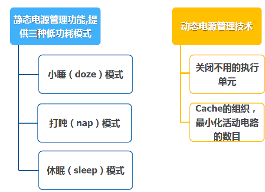
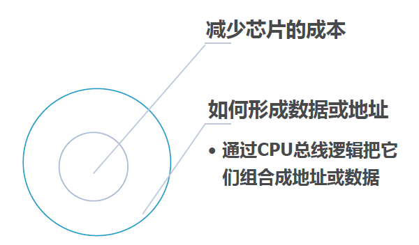

# 嵌入式系统设计

## 第一章 嵌入式系统

### 理解嵌入式系统

- 定义
  - 任何包括一个可编程计算机的设备, 但本身并不是一台通用计算机. 只有专用目的的, 具有可编程能力的设备, 才是嵌入式设备. 
- 嵌入式计算机的组成
  - CPU
  - Output--analog
  - Input--analog
  - Memory
- eg.
  - 移动设备
  - 打印机
  - 汽车电子
    - 引擎\ 刹车\ 底盘灯
  - 飞机
    - 引擎\ 飞行控制\ 导航
  - 数字电视
  - 家政服务
    - 扫地机器人

### 特点及所面临的挑战

- **特点**
  - 复杂的功能
  - 实时操作 ( 大多数时候都需要实时性, 有些情况下不需要实时性 )
    - 硬实时
      - 错过deadline会造成失败. 
    - 软实时
      - 错过deadline会导致性能的降低, 并没有影响整个系统. 
  - 用户界面
  - 多速率操作
    - 对各种变化的速率能够实现操作. 
  - 成本特点
- **非功能性需求**
  - 许多嵌入式系统受市场约束需要低的制造成本. 
    - 低内存\ 低处理器等.
  - 对于电池供电的设备低功耗也是很关键的. 
    - 大功耗将增加系统成本 ( 甚至对墙上插座供电也是如此 )
- **为什么**使用微处理器
  - 可选的其他解决方案
    - 现场可编程门电路(FPGAs), 定制逻辑等. 
  - 微处理器是**有效**的. 
    - 可以通过相同的逻辑完成不同的功能. 
  - 微处理器**简化产品系列的设计**. 
  - 微处理器比定制使用更多的逻辑电路, 但微处理器的执行更快
    - **原因**.
      - 流水技术. 
      - 强大的设计团队. 
      - CPU进行高度优化. 
  - **功耗**
    - 定制逻辑使用**低功耗**, 但微处理器提供**特性**来帮助控制功耗, **软件设计技术**减少功耗. 
    - **异构系统**: 通过定制逻辑 \ CPU和软件提供良好的功能. 
- 嵌入式系统的**设计平台**
  - 嵌入式计算系统
    - 硬件结构 + 相关软件
  - 许多平台都是多个微处理器的
  - eg. 
    - 移动设备的单芯片多处理器
    - 汽车电子的网络 + 多处理器
- 信息物理融合系统(CPS, 一类特殊的嵌入式系统)
  - 结合了**物理设备**, 并用计算来控制这些设备的系统
  - **计算与物理成分**融合
  - **连续过程与离散事件**交织
  - 系统**通信**和交互方式多变
- 嵌入式系统的**性能**
  - 在通用目的的计算机系统中, 性能通常指**平均情况**下. 
  - 在实时嵌入式中, 性能意味着满足时限. 
    - 错过时限就是坏的. 
    - 在时限前很早完成并没有什么帮助. 
  - 从不同抽象层次**分析**理解
    - CPU
    - 多处理器
    - 软件层面
      - 任务
      - 程序
    - 平台

- 面临的**挑战**
  - 需要多少硬件，如何选用硬件? 
  - 如何满足时限? 
    - 使用快速的硬件 ( 可能带来成本的增加 )
    - 优化软件 ( 可能带来功耗的增加 )
  - 如何减少功耗?
    - 关闭不必要的逻辑. 
    - 减少内存的访问.  ( 内存访问是功耗最大的部分 )
  - 能否正常工作? 
    - 规范正确吗? 
    - 实现满足规范吗?
    - 为实时特性如何**测试**? 
    - 如何测试真实的数据? 
  - 系统上如何工作? 
    - 可观察性\ 可控性? 
    - 受限的开发环境 ( 软\ 硬件开发工具 )

### 设计方法

- 
- 设计目标
  - 性能
    - 速度\ 时限
  - 功能和用户界面
  - 制造成本
  - 功耗
  - 其他性能(物理尺寸\ 重量等)

- 抽象层次
  - 需求
    - 用自然语言来描述用户想做什么
    - 通过几种方式
      - 直接与用户交流
      - 了解市场
      - 为用户提供带注释的原型系统
    - 功能和非功能性需求
      - 功能需求
        - 系统对所做工作的详细描述
      - 非功能性需求
        - 计算输出需要的时间; 
        - 大小\ 重量; 
        - 功耗;
        - 可靠性;
        - ...
    - 需求表
      - 
  - 规格说明
    - 对系统更精确的描述:
      - **不应隐含**具体的功能
      - **提供输入**并给结构设计过程
    - 包括**功能和非功能元素**
    - 通过**可执行或数学的形式**来描述
  - 体系结构
    - 什么主要的组件满足规格说明？
      - 硬件组件
        - **CPUs, 外设**等
      - 软件组件
        - 主要的**程序**和它们的**操作**
    - 考虑功能和非功能性的需求
  - 组件设计
    - 在开始写代码**之前**要构造系统架构.
    - 一些组件是**已经构造好的**.一些对已存在的设计进行**修改**.其它的得**从头设计**.
  - 系统集成
    - **把组件组成在一起.**
      - 在这个阶段会出现很多bugs.
      - Bugs的发现非常困难.
        - 调式工具少; 
        - 错误难修复. 

- 真正的设计方法
  - Top-down设计
    - 开始于最抽象的描述. 
    - 直到最细节. 
  - Bottom-up设计
    - 开始于小组件, 到大系统. 
- 在每层抽象中
  - 分析
    - 设计目前的设计状态下确定的特性. 
  - 精化
    - 增加细节的设计. 

- **eg. GPS移动地图的设计.**
  - 需求
    - 功能性
      - 针对高速上的用户, 显示道路和其他地标. 
    - 用户界面
      - 至少400 * 600像素屏幕, 三个控制按钮. 
    - 性能
      - 地图平滑移动, 显示在1秒中出现, 核查位置在15秒内出现. 
    - 成本
      - 500元 零售价. 
    - 物理尺寸/重量
      - 适合手掌
    - 功耗
      - 四节AA电池供电8小时左右
  - **需求表**
    - 
  -  **GPS规格说明**
    - 
  - 结构设计
    - GPS移动地图块图
      - 
    - GPS移动地图的硬件结构
      - 
  - GPS移动地图的软件结构
    - 

## 第二章 指令系统

### 体系结构：CPU+存储器

- **数据、指令**存储在**存储器**中；
- CPU从存储器中提取指令；
- CPU寄存器有：**程序计数器（PC）、指令计数器（IR），通用寄存器等**；
- 计算机系统包括**CPU和存储器**；
- 从存储器出发，分类为
  - 冯·诺依曼结构
    - 计算机系统包括CPU和存储器. 
    - 数据、指令存储在同一存储器中. 
    - CPU 寄存器有：程序计数器 (PC)、指令计数器 (IR), 通用寄存器等. 
    - CPU 从存储器中提取指令.
    - 
  - 哈弗体系结构
    - 
  - 区别
    - 哈弗结构**不能自修改代码**.
    - 哈弗结构允许**同时访问数据和指令**. 
    - 对于流数据，大多是采用**哈弗结构**: 
      - 可提供**更大的存储器带宽**; 
      - 数据在**准确时间到达**更为简单容易. 
      - 如DSP.
        - DSP特点：大量的数据流通过CPU，数据必须在一个**精确的时间间隔**内处理完成；
        - 两个存储器使用不同的端口可提供**更大的存储器带宽**；
      - 流数据：**连续并定期到达**的数据集合；
- 从指令集出发，分类为
  - CISC（复杂指令集）
    - **多寻址**模式; 
    - **多种类型**的指令. 
  - RISC（精简指令集）
    - **load/store;** 
    - 指令长度**固定**; 
    - **流水线**技术.

- 指令的特征
  - 固定和变长指令；
  - 寻址方式；
  - 操作数的数目；
  - 支持操作数的类型；
- **可编程模式**
  - 定义：**程序中可用的寄存器集合**；
    - 一些寄存器是不可视(如：IR).
- 体系结构的多种实现方式
  - 一种体系结构可能有多种实现方法
  - 成功的系统架构是通过**多种方式实现**的:
    -  不同的**时钟频率**; 
    - 不同的**总线宽度**; 
    - 不同的**高速缓存大小**;
    - 等等.

### 汇编语言

- 与机器指令通常是一对一的；
- 基本特征：
  - **每行写一条指令**；
  - 标签提供地址的内容(通常从一行的第一列开始)； 
  - 指令开始于**后续列**；
  - 一条指令到**一行的结束**；
  - **注释**以**分号**开始，到一行的结束；

### 伪指令

- 一些汇编指令不能直接对应于机器指令: 
  - 定义目前地址的指令 . 
  - 保存存储的指令 . 
  - 常数 .

### ARM

- ARM V7体系架构
  - 支持**Thumb-2**技术：单指令多数据；
  - ARMv7架构还采用了**NEON**技术；
  - ARMv7支持**JIT(Just In Time)**技术；
  - **DAC(Dynamic Adaptive Compilation)技术**的使用；
- Cortex-M4 系统架构
  - **低成本、小管脚数和低功耗**，并具有极高的运算能力和极强的中断响应能力
  - 采用**纯Thumb2**指令，具有32位高性能，ARM内核达到16位代码存储密度
  - ARMv7ME**哈佛架构**，**带分支预测**的**3级流水**
  - 可配置**1-240个中断源**，中断延迟最大12个，最小6个时钟周期
  - 1.25**DMIPS**/Mhz的性能和0.19mW/Mhz的功耗
  - 可选配的调试和跟踪模块
  - 
  - **程序状态寄存器PSR**
    - 
    -  xPSR-程序状态寄存器，32位 
      - APSR-**应用程序状态寄存器**，保持当前指令运算结果状态，
        - N-负数，Z-零，C-进位，V-溢出，Q-饱和 
      - IPSR-**中断状态寄存器**，保存当前中断向量号 
      - EPSR-**执行状态寄存器** 
        - T-Thumb状态，**恒为1**
        - ICI/IT 保存**被异常中断打断的指令流状态**，或者IT指令状态
    - **只能**用**MSR和MRS**指令访问
- M4汇编指令典型的语法格式如下： 
  - ```标号 <opcode>{<cond>}{s}<Rd>,<operand1>,< operand2> ```
    - ```<opcode>操作码，如ADD表示算术加法指令 ```
    - ```{<cond>}指令执行的条件域，如EQ，NE，LT，GT等```
    - ```{S}决定指令执行是否影响xPSR寄存器的值```
    - ```<Rd>目的寄存器```
    - ```<operand1>第一个操作数```
    - ```<operand2>第二个操作数```
  - 操作数可以是M4的**寄存器**，**立即数**或**另一个特定指令的参数**
- ARM 数据类型
  - 32位的字长. 
  - **字**可以被分成**4个字节**. 
  - ARM**地址**也是**32位长**. 
  - 每个地址指向**一个字节**. 
    - 地址开始于**4的整数倍**. 
  - 支持**小端和大端格式**. 
- ARM 状态位
  - 每个算术、逻辑或移位操作对PSR的影响
    - N（负数）
    - Z（零）
    - C（进位）
    - V（溢出）
    - Q（饱和）
- ARM 数据指令
  - 基本格式
    - ADD r0, r1, r2	r0 = r1 + r2
  - 立即数
    - ADD r0, r1, #2 	r0 = r1 + 2
- 数据操作的变化
  - 逻辑位移——零填充
  - 算术位移——符号位填充
- ARM 比较指令
  - 包括：
    - CMP：比较
    - CMN：比较求反
    - TST：按位测试
    - TEQ：按位求反测试
  - 这些指令只影响PSR的NZCV；
- ARM 移动指令
  - MOV r0, r1	把r1移动到r0；
- ARM跳转指令
  - BL foo
    - 跳转到foo，并将PC（r15）复制到r14中；
  - 从子程序返回
    - MOV r15, r14
      - 把r14复制到PC寄存器；
- ARM load/store 指令
  - 寻址模式
    - 寄存器间接寻址
      - LDR	r0, [r1]
    - 带偏移的间接寻址
      - LDR	r0, [r1, -r2]
    - 带偏移的间接寻址
      - LDR	r0, [r1, #4]
- ARM ADR伪指令
  - 不能直接对应到一条指令上.
  - 通过完成算术计算产生值影响到 PC. 
  - ADR伪指令计算地址产生指令：
    - ADR r1,FOO
      - FOO所在地址放到r1中
- ARM 控制流
  - 操作可通过测试PSR，条件执行
  - 分支操作


## 第三章 CPU

### 输入/输出机制

- I/O设备

  - 模拟元件或非电子元件
  - 数字逻辑——与CPU相关
  - I/O设备与CPU的接口——一组寄存器
  - I/O设备的寄存器
    - 数据寄存器
      - I/O与CPU交互的数据
      - 存储I/O设备读写的数据
    - 状态寄存器
      - 提供设备运行的状态、信息；
      - 两种方式
        - **只读**方式，由设备完成对这些寄存器的操作，CPU只能读取他
        - **可读、可写**方式，不仅设备可对这些寄存器操作，CPU也可以进行读、写操作
    - eg. 8251 UART（串行通讯的基本设备）
      - 参数
        - 波特率；
        - 每个字符的位数；
        - 是否有奇偶校验(parity/ no parity)；
        - 奇、偶校验(even/odd parity)；
        - 结束位的长度(1, 1.5, 2位)；

- I/O编程

  - 两种方法支持I/O编程

    - 特殊的I/O指令

      - eg. Intel x86提供in,out指令

    - 内存映射I/O

      - 大多数CPUs应用内存映射I/O

      - 支持I/O指令的CPU并不排除内存映射I/O

      - 操作

        - 为每一个I/O设备的寄存器提供地址；
        - 程序使用CPU读写指令来与设备通讯；
        - 定义设备寄存器的地址；
        - 读/写代码；

      - 高级语言peek和poke函数

        - 读操作

          - ```C
            int peek(char* location){
            	return *location;
            }
            ```

        - 写操作

          - ```c
            void poke(char * location, char newval){
                (*location) = newval;
            }
            ```

- I/O访问的方式

  - 忙等I/O方式
    - 轮询（polling）
      - 通过CPU反复读I/O设备状态寄存器来询问设备是否准备好；
  - I/O中断方式
    - 忙等I/O效率非常低；
      - I/O设备的速度远远小于CPU的速度；
      - 除了测试，CPU不能做其他任何事情；
    - CPU的很多操作是可以与I/O事件并行执行的
      - 计算操作；
      - 控制其他I/O设备；
    - 中断机制
      - 可以改变CPU控制流顺序；
      - 强制CPU执行一段特定代码——中断处理子例程
    - 中断的**操作流程**
      - 由I/O设备决定什么时候中断，发出中断请求；
      - CPU响应中断——可能无法立即响应
        - 一旦响应，将程序计数器指向设备中断处理子例程；
      - 前台程序：无中断情况下CPU运行的程序；
    - 中断的**物理连接**
      - CPU和设备通过**CPU总线**连接；
      - CPU和设备通过**握手协议**进行通讯；
        - **设备**发出**中断请求**；
        - **CPU**准备处理I/O设备请求时，CPU发出**中断响应**；
    - 中断**行为**
      - 基于调用中断子例程的形式
        - 保护现场——中断强制下一条指令调用中断服务子例程；
        - 执行中断子例程；
        - 恢复现场——返回前台程序。
      - 方式
        - 基于I/O中断ISR
        - 基于队列I/O中断ISR（buffer）
    - 调试中断代码
      - 忘记改变寄存器的内容
        - 前台程序会展示一些非常奇怪的错误；
        - 错误很难重现——它依赖于中断；
      - 如何发现中断
        - 在开始执行每条指令之前检查中断请求信号是否有中断请求；
        - 一旦出现中断，PC将指向中断服务子例程；
        - 注意：要保护和恢复现场；
    - 中断优先级和中断向量——通过两种机制来完成对于多个外设的中断的处理
      - 中断优先级(**priorities**)：确定哪种中断首先获得CPU；
        - 屏蔽（masking）
          - 发生中断的优先级比正在中断的优先级**低**，CPU将**不响应**该优先级低的中断。
        - 不可屏蔽中断（Non-maskable interrupt(NMI, 不可屏蔽中断)）
          - 最高优先级，永不屏蔽（电源故障）
      - 中断向量(**vectors**)：允许获得中断服务的设备获得服务——通过中断服务子例程；
        - 中断向量表——不同的设备有不同的中断服务子例程；
      - 大多数CPU这两种方式都支持；
    - 中断开销
      - 中断服务子例程执行的时间；
      - 中断机制的开销；
      - 寄存器存储/恢复；
      - 流水相关补偿；
      - cache相关补偿；
    - 异常（Exception）
      - **内部检测**到的错误：
        - 0做除数；
        - 未定义指令；
        - 非法的内存访问；
        - ……
      - 与指令是同步的，但它是**不可预料**的；
      - **通常是内部产生的；**
      - 有多种异常，处理的方法与中断类似，有**优先级和向量表**；
    - 陷阱（Trap）
      - 又叫软中断（software interrupt）
        - 由指令产生的异常，然后进入管态；
      - ARM 通过 SWI 指令进入软中断；
    - 协处理器（Co-processor)
      - 增加一些**功能单元**，通过指令来调用
        - **浮点单元**通过协处理器完成的；
        - 在无协处理器时，出现协处理器指令，则作为**异常**处理；
      - ARM允许有16个协处理器；
        - 浮点数处理是用协处理器编号为1和2的

### 高速缓存


- Cache操作

  - Cache类型
    - **指令**caches
    - **数据**caches
    - 指令caches + 数据caches
  - 主存被**映射**到cache中；
  - 主存的读取时间是**不确定的**；
- 术语

  - 高速缓存命中(Cache hit)——要访问的位置就在cache中；
  - 高速缓存未命中（Cache miss）——要访问的位置不在cache中；
  - 工作集（Working set）——在一段时间内CPU访问的一小段存储单元；
- 未命中的类型

  - 强制性未命中（Compulsory / Cold）
    - 存储单元第一次被访问；
  - 容量未命中（Capacity）
    - 工作集过大；
  - 冲突未命中（Conflict）
    - 多个存储地址映射到同一个cache单元；
- 内存的性能
- 一级cache
  - ```h = cache 命中率```；
  
  - ```t(cache) = cache 访问时间```；
    - 几个纳秒；
  
  - ```t(main) = 内存的访问时间```；
    - 制造商提供的通常50-75ns；
  
  - 平均内存访问时间
  
    - ``` t(av) = h*t(cache) + (1-h)*t(main) ```
- 多级cache
    - ```h1 = L1 cache 命中率```；
    - ```h2 = L2 cache 命中率```；
    - ```t(L1) 和 t(L2) cache1 和 cache2 访问时间```；
    - 平均内存访问时间
    
      - ``` t(av) = h1*t(L1) + (h2 - h1)*t(L2) + (1-h2)*t(main) ```
    - 注：L1中的数据一定在L2中，因此在L2中找到的概率为(h2 - h1)
  - 替换策略（placement policy）
    - 选择哪个cache单元的内容被淘汰，腾出空间存储新内存单元的内容
    - 两种策略
      - 随机替换
      - 最近最少使用（Least-Recently Used(LRU))
- Cache的**组织**
    - 全相联（Fully-associative）
        - 任何位置的内存都可以存储到**cache的任何位置**（几乎从没有实现）；
    - 直接映射（Direct-mapped）
        - 每个存储单元被**精确的映射到cache的某个单元**上；
    - n-路组相联（N way set-associative)
        - 每一个存储单元被**映射到n组中的某个单元**；
- Cache的**优点**
    - 经常访问的内容保留在高速缓存中；
    - Cache能够一次导入多个字，它是以块为单位进行导入、导出。
        - 第一次访问后，顺序访问的速度快。
- 直接映射Cache
    - 
- 写操作
    - 通写(Write-through)
        - 每次写操作都同时改变高速缓存和相应的内存单元的数据；
    - 回写(Write-back)
        - 只有当cache中的内容要被移出时，才将数据写到内存中；

- 直接映射Cache
  - 许多地址映射到相同的cache块中，冲突很容易产生；
  - Cache: n个块，每个块存储一个数据；
  - 内存地址与cache对应：
    - 
- 组相联Cache
  - 直接映射Cache的集合

### 存储管理和地址转换

- 存储管理单元—（MMU，Memory management units）
  - MMU地址转换
    - 
- 内存管理任务
  - 在执行过程中允许将程序移到内存中
  - 允许使用**虚拟内存**:
    - 内存中的内容可以保存在辅助存储器中
    - 在执行过程中可以根据需要返回到内存中
  - **缺页异常**：CPU请求的地址不在内存中
    - 异常处理程序将所需的单元从辅助存储器读到内存中
- 地址转换
  - 需要**寄存器/表**完成任意逻辑地址映射到物理地址
  - 两种方式:
    - 段式：支持**较大，大小可变**的内存区域
    - 页式：支持**较小，大小相等**的内存区域
  - 段式与页式的组合：**段页式(x86)**
- 段地址转换
  - 段基地址在MMU的一个分段寄存器中
  - 
- 页地址转换
  - 分页转换需要更多的MMU状态，页表地址通过基址寄存器
  - 
- 页表组织
  - 
- 高速缓存页转换
  - **页表保存在内存中**，地址转换需要访问内存;
  - TLB(Translation Look aside Buffer):通过**高速缓存**完成地址转换
    - 小的Cache.
- **分段和分页的扩展**
  - **分段和分页的扩展对虚拟内存是非常有用的**
    - 用一位表示当前逻辑段或逻辑页**是否在物理内存中**
    - 用一位表示当前段或页**是否被改写**
    - 使用权限为表示某些段或页在用户态**可读但不可写**
- **ARM内存管理**
  - 内存区域的类型：
    - 段: 1 Mb 的内存段;
    - 大页: 64 kb;
    - 小页: 4 kb.
  - 一个地址要么是**段映射**，要么是**页映射**
  - 两级模式转换
  - 

### CPU的性能和功耗

- CPU的性能

  - **高速缓存（cache）**

    - 性能分析
      - Caches的引入使得执行时间非确定了
        - 依赖于**执行的顺序**
      - Cache未命中损失: 由于cache未命中而**需要花费的额外时间**
      - 未命中的原因：**强制性未命中,容量未命中,冲突未命中**
    - CPU功耗
      - 在某些情况下，CPU的功耗与其运行时间同等重要；
      - **功率和能量**
        - **功耗**是能量消耗和功率消耗的简称
        - **热量**的产生取决于功率
        - **电池的寿命**取决于能量的消耗
    - CMOS的功耗
      - **CMOS**：几乎所有的数字系统都有的
    - 影响CMOS功耗的因素
      - **电压降**(Voltage drops): 功耗与V2成正比；
      - **切换**(Toggling): 切换越多, 功耗越多；
      - **泄漏**(Leakage): 消除漏电的唯一方法**切断电源**；
    - CPU节能的方法
      - CPU在**低电压**下使用；
      - 在**低时钟频率**下使用；
      - 内部**禁止**当前执行功能不需要的**功能单元**；
      - **允许部分CPU部件完全与电源断开**，以消除泄漏电流；
    - 电源管理的特征
      - **静态**电源管理特征
        - 由**用户**调用，不依赖与CPU的活动
      - **动态**电源管理特征
        - **基于CPU活动**来对功耗进行控制
    - 应用：PowerPC 603 节能模式
      - 
    - 节电模式的进入和退出
      - **进入或退出**节电模式的**消耗**
      - 确定进入**是否值得**
      - 用**能量状态机**建立**CPU能量模型**
    - 应用: StrongARM SA-1100 节能模式
      - 
      - 能量状态机
        - 
    - 

  - **CPU的流水线（CPU pipeline）**

    

    - 流水线结构

      

    - 性能的测量

      - Latency: (延时) **一条指令**流出流水线所花费的时间。
      - Throughput: （吞吐量）**单位时间内执行指令的数目**
      - 建立时间：流水线开始工作，须**经过一定时间才能达到最大吞吐量**，这就是建立时间。
      - **流水线**增加其**吞吐量**，但并没有减少其延时

    - 阻滞（Pipeline stalls）

      - 阻滞增加了延时，减少了吞吐量;
      - 若某一步没有按照相同的时间完成，流水线就阻滞.

    - ARM 多周期的load指令

    

    - 控制阻滞
      - 分支通常引入阻滞（分支补偿）
        - 直到条件计算完后才知道执行那条指令
    - ARM pipelined branch

    

  - **周期时间(Cycle time)**


### eg. ARM Cortex M4

- 特权模式、异常和陷阱
  - 

## 第四章 计算平台

- 硬件平台和软件平台共同构成计算平台

### 平台的软件组件

- 层次图：描述系统不同软件组件之间的关系；
- 硬件开发商提供一系列基本的软件平台组件；
- 层次图 eg.
  - 

### 硬件组件

- CPU；
- RAM；
- ROM；
- 计时器；
- 高速总线；
- 低速总线；
- I/O设备；

### 计算平台的硬件架构


### 多种总线的目的

- 低速总线相对于高速总线**简单成本低**，同时低速设备连接到高速总线不能提高性能；
- 将设备分配到不同总线，可以**减少负载，提高总线的利用率**。

### 数据传输


#### 例子：PIC16F882系统结构


- Flash（闪存）只能由CPU访问

#### 例子：IntelStrongARM SA-1100 


### CPU总线

- CPU与存储器、设备通讯的机制——共享通讯介质
- 总线是:
  - 一束电线；
  - 通讯协议
    - 协议通常通过**状态机**来说明；
    - **异步逻辑行为**；
- 微处理器的总线
  - 
  - **总线包括：数据、地址、时钟和控制信号；**
  - CPU是**总线总控器**，启动所有传输；
  - DMA允许其它设备成为总线控制器，传输数据无CPU参与；

### 四周期握手协议—最常见的总线协议

1. 设备1提出请求；
2. 设备2响应该请求；
3. 一旦数据传送完成，设备2发出接收完数据的信号；
4. 设备1结束请求；


#### 时序图

- 时序图：表示总线上信号如何随时间变化;
- 

#### 读操作的等待状态

- 总线连接到速度比它慢的设备上;

- 

#### 突发传输（Burst Transfer）

- 传输数据序列;
- 增加一根线路：Burst，低电平有效.
- 

#### 非连接传输（分离式传输）

- 请求和响应是分开的;
  - 第一个操作是请求传输;
  - 然后总线可以做其它操作;
  - 等数据准备好后，传输随后开始;

### 总线读的状态图


### 小数据束总线



### 多路复用


### 直接存储器访问（Direct memory access: DMA）

- 标准总线操作，数据的读与写需CPU参与，有些则无需CPU的参与，如DMA；
- **DMA 无需CPU的加入**，完成数据的传输
  - CPU 设置传输；
  - DMA 直接完成设备与主存的读写操作；
- 需要一个DMA控制单元；
- 

### 总线主控器（Bus mastership）

- 总线主控器是能够启动自己总线传输的设备；
- **缺省时，CPU是总线主控器**，并初始化传输；
- DMA可以成为总线主控器来完成传输（需要CPU授权）
  - DMA 成为总线主控器时，CPU不能使用总线；
- 通过四周期握手协议DMA获得总线主控器
  - 总线请求（Bus request）；
  - 总线授权（Bus grant）

### DMA操作

- CPU 设置DMA寄存器，如开始地址，要读写的长度；
- DMA 状态寄存器允许CPU操作DMA控制器；
- 一旦DMA成为总线主控制器，它就自动传输
  - 可以连续传输直到传输完成；
  - 也可以**使用几个总线周期**；
- 

### 系统总线配置

- 多条总线允许并行
  - 慢的设备连到一个总线上
  - 快的设备连到另一个总线上
- 通过桥（bridge）将它们连接起来
- 

#### 桥的状态图


#### 例：ARM AMBA总线

- 为单芯片系统创建独立的总线规格说明；

- 有两类总线

  - AHB 高性能总线；
  - APB 低速总线；

- AHB 支持流水线技术、突发传输、分离事件和多总线主控制器；

- 连接到APB上的所有设备都是隶属设备.

- 


### 存储设备

- 二维阵列，行地址和列地址；
- 在给定大小的存储设备，也会有一些版本；
- 存储控制器屏蔽CPU；
- CPU无需知道不同存储器的详细时序；


### I/O 设备

- 键盘；
- Led；
- 显示设备
  - 7-位数字显示器
  - LCD液晶显示器
  - 触摸屏
- 定时器和计数器；
- A/D , D/A转换；

#### 键盘—开关消颤

- 开关使用机械装置来断开或联通，可能会出现颤动；

#### 编码键盘

- 定义

  - 一个开关阵列，通过一个译码器读取键盘编码；

- 属性

  - 组合键
    - 

- #### LED(发光二极管)


#### 显示器


#### 7 –段LCD显示

- 可以并发多像素输入
- 被选择的数字在当前数据值基础上激活它的显示元件

#### 高性能显示器

- eg. 
  - 液晶显示器(LCD)；
  - Plasma(等离子)；
  - 有机发光二极管显示面板(OLED) , etc
- 帧缓冲区保持目前显示的内容
  - 处理器向帧缓冲区写数据.
  - 显示器读帧缓冲区的数据.

#### 触摸屏（Touchscreen）

- 包括输入设备和输出设备
- 输入设备是一个两维的电压表来探测位置


### 定时器和计数器（Timers and counters）

- 定时器是一个**周期性的**，它被连到一个周期性的时钟信号上，会周期性的递增加一；
- 计数器是**异步的**，**非周期性**的递增加一，通过一个事件引发加一；
- **定时器翻转**是会引发中断；

### 监视定时器 ——（Watchdog timer, 看门狗）

- 系统内部操作的I/O设备；
- 连接到CPU总线和CPU复位线上；
- CPU的软件被设计成在定时器未达到超时限制前，周期性的重置监视定时器
  - 被系统定时器周期性复位
- 一旦达到限制，将复位主机


### D/A 转换

- 数字信号转模拟信号

- 用作嵌入式系统到非数字设备的接口
- 输入的值被连续的转换成模拟的形式

### A/D 转换

- A/D转换器的类型

  - 转换时间是固定的
  - 转换时间取决于采样时间

- 接口

  - 模拟信号输入
  - 两类主要的数字信号的输入
    - 数据端口允许A/D寄存器被读写
    - 时钟输入信号通知什么时间开始下一次转换

### 系统的体系结构

- 体系结构：共同构成一个单元的一组元件及元件之间的关系，依赖于**软件**和**硬件**
- 某些软件的设计非常依赖于硬件的设计
- **硬件平台体系结构**
  - CPU
  - Bus
  - Memory
  - I/O设备：网络，传感器，激励器，etc.
- **软件的体系结构**
  - 软件体系结构的基本任务：**划分**
    - 按照**操作的主要方式**和**设备的功能**划分
    - 功能是在I/O设备中实现
      - **简单、不昂贵**的设备，需要**更多的软件实现**；
      - **更复杂、更昂贵**的设备上可以**自动执行更多的功能**
    - 利于实现、测试和修改
- 硬件与软件的相关性
  - 软件没有硬件是无法运行的；
  - 需要什么样的硬件取决于软件的需求
    - 速度
    - 内存

### 主板设计—评估板

- 硬件设计从**完全现成的方案**到**高度定制的设计**，硬件平台的设计**复杂性差异很大**
- 由**微处理器制造商**或**合作的企业**提供；
  - CPU, 存储器某些I/O设备
  - 也可能包括串口链接以便下载程序
- CPU制造商可以提供**网表和版图**，可以在这个基础上开始设计

### 选择存储器和外围设计组建

- 选择一个已有的组件
  - **仔细阅读设备的数据手册**，以判断设备是否具备你所希望的功能
- 自己设计
  - Programmable logic devices (PLDs) 提供**低中密度**的逻辑
  - Field-programmable gate arrays (FPGAs) 提供**更复杂的和更多层**的逻辑
  - Application-specific integrated circuits (ASICs) 设计**专用集成电路**

### 典型的总线

- PCI: 高性能系统总线—宽总线
  - 频率：33 or 66 MHz；
  - 通过高速的数据传输技术和有效的协议提高其吞吐量
- 高速串行总线：连接成本相对较低，但提供高速传输
  - USB (通用串行总线)；
  - IEEE 1394；

### 知识产权（Intellectual property IP）

- 硬件的设计、源或者目标代码、网表，etc；
- 应用在设计的所有层上；
  - 硬件设计的原理图
  - 驱动和运行时库
  - 软件开发环境
- IP的来源
  - 购买厂家的IP
  - 在线开发者团队购买

### 嵌入式系统的调试

- 挑战
  - 设计的目标系统很难观察
  - 目标系统很难控制
  - 很难产生理想的输入
  - 设置序列可能很复杂
- 主机/目标机设计方法
  - 用主机系统作为目标机设计软件：
  - 

### 基于主机的开发工具

- 在主机上为目标机编译代码
  - 交叉编译器(Cross compiler)
- 在主机上显示目标机的状态，允许主机控制目标机
  - 交叉调试

### 调试技术

- Breakpoint
- LED
- 逻辑分析仪
- ICE.（电路内部仿真器）

### 断点

- 一个断点允许用户停止执行、检查系统的状态并可以改变状态；
- 断点的实现：用监控程序的子例程调用简单的替换断点处的指令

### 断点处理的动作

- 保存寄存器
- 允许用户检查CPU的状态
- 返回前，必须恢复系统的状态
  - 删除断点，原先的指令被简单的恢复
  - 若断点保留，原来的指令被恢复的同时会将一个新的临时断点放在下一条指令处。

### 内部仿真器（ICE）

- 专用的硬件工具，帮助调试软件；
- 当它停止时，其内部寄存器的内容可以被读出；
- 微处理器的一个特殊版本

#### Jtag仿真器

- ```JTAG``` 仿真器也称为```JTAG ```调试器，是通过ARM 芯片的```JTAG ```边界扫；
- ```JTAG``` 仿真器比较便宜，连接比较方便，无需目标存储器，不占用目标系统的任何端口，而这些是驻留监控软件所必需的；
- ```JTAG``` 调试的目标程序是在目标板上执行，仿真更接近于目标硬件；
- 使用集成开发环境配合```JTAG``` 仿真器进行开发是目前采用最多的一种调试方式

### 逻辑分析器（Logic analyzers）

- 可以看成是一组**低成本的示波器**

### 如何执行代码

- 运行在主机上
- 运行在目标机上
- 运行在指令层的仿真器上
- 运行在时钟精确的仿真器上
- 运行在软硬件协同仿真环境上

### 调试实时代码

- 设备驱动的bug能够使前台产生一个**非确定的行为**；
- Bugs的出现**依赖于时间**

### 系统层的性能分析

- 依赖于系统的各个元素
  - CPU
  - Cache
  - 总线
  - 内存
  - I/O设备

### 带宽与性能

- 带宽：数据传输的速率；
- 带宽应用到下面的部件
  - 内存
  - Bus
  - CPU
- 系统的不同部件应用到不同的时钟频率上
- 不同的部件有不同的带宽(bus, memory)

### 带宽与数据的传输

- 增加带宽
  - 增加总线的宽度；
  - 增加总线时钟的频率；

### 总线的带宽

- T: # 总线的周期数；
- P: time/bus_cycle；
- 总的传输时间t = TP；
- W:字节单位
- D: 传输W字节宽的数据消耗D个时钟周期
- 额外消耗：O=O1+ O2；
- Tbasic(N) = (D+O)N/W

### 突发传输的带宽

- B: 一次突发传送连续执行了B次传输；
- D: 每次传输需要D个时钟周期；
- O = O1+ O2；
- Tburst(N) = (BD+O)N/(BW)；

### 内存的访问时间

- 数据类型与存储器宽度不匹配；
- 传输一个24位的标准像素
  - 24位的带宽的存储器允许一次读写一个完整的像素值；
  - 8位的带宽存储器则要访问3次；
  - 32位的存储器
    - 压缩使得多余位数用于下一个像素
    - 每32位传输24位像素

### 并行

- 不同的部件可以同时运行；
- 若CPU不需要总线，则DMA提供的就是一种并行机制:
  - DMA + bus
  - CPU
- 

## 第五章 程序设计与分析

### 嵌入式程序组件

- 有限状态机

  - 用于响应系统
  - 通过**状态**来表示**系统的内部特性**，状态的变化是基于输入的变化
  - **应用**
    - 面向**控制**的代码；
    - **响应式**系统；
    - **非周期性**采样作为输入；
  - C语言实现——switch

- 循环缓冲区

  - 应用于数字信号处理
  - 数据流：按**规律到达**并在**限定时间**内处理
  - **固定数目**，处理**流数据**的一种数据结构

  - C语言实现——数组

- 队列

  - 应用于数字信号处理
  - 弹性缓冲区
    - 数据**无法预料到达或离开的时间**；
  - 构建队列的方法
    - 链表——变长
    - 数组——定长
  - 生产者消费者系统
    - 数据从单行缓存区的队列中发送到处理块中；

### 程序的模型

- 源代码不是一种很好的表示形式；
  - 源代码多样性
  - 有很多隐含的信息
- **基本程序模型**：控制/数据流图（**CDFG**）；

#### 数据流图（Date flow graph）

- 不能表示控制；
- 基本语句块
  - 无条件代码段；
  - 只有一个入口和出口；
- 可操作的最小**顺序**语句序列；

- 单赋值形式
  - 

#### 控制/数据流图（CDFG）

- CDFG（表示**控制与数据**的图）；
- 用**数据流**表示组件；
- 两种类型的节点；
  - 判断节点；
    - 判决节点：描述控制类型；
  - 数据流节点
    - 封装一个数据流图；
    - 在节点中完成写操作；
- 举例
  - 

### 汇编、连接和装载

- 从**编译**到**装载**的程序创建过程
  - 
- **多模块**程序
  - 程序由几个文件组成；
  - 地址类型
    - 相对地址：从一个**模块的开始**编址；
    - 绝对地址：按照**CPU地址空间**编址；
- **汇编程序**
  - 主要任务
    - 为**符号指令**产生**二进制代码**
    - 把**标签**变为**地址**
    - 处理**伪操作**(data, etc.)
  - 指令是**一对一**的翻译；

#### 符号表产生

- **程序位置计数器(PLC)** ：**指示每条指令的位置**；
- 扫描程序，保持PLC的当前值；
- 在**汇编程序**中产生；
- 

#### 汇编程序2遍扫描

- 第一遍——产生符号表；
- 第二遍——产生二进制指令；

#### 相对地址的产生和伪指令

- **相对地址**的产生
  - 标签值在汇编时可能并不能知道；
  - 标签以相对地址的形式保留；
  - 对外部标签的跟踪——**使用外部标签不能产生完全的二进制指令**；
- 伪指令:不能产生指令
  - **ORG** 设置**程序位置**；
  - **EQU** 产生符号表**入口**；
  - Data statements **定义数据块**；

- 连接
  - 将几个目标模块**连接**成一个可执行模块；
  - **任务**
    - 形成**模块顺序**;
    - **解决**模块之间的**标签**；
  - 外部和入口点；

#### 装载

- 代码块必须放到**内存中的绝对位置**；
- **装载映射**（Load map）or 或者是**连接器标记控制了模块的顺序**；

#### 动态连接

- 操作系统在运行时**动态连接模块**
  - 所有执行程序**共享一个库拷贝**
  - **允许程序用新版本的库**

### 编译技术

- **编译技术**
  - 编译策略
    - **编译**=翻译+优化；
  - 对CPU资源的应用；
  - 内存的调度代码的大小；
- **编译**决定了**代码的质量**；
- **基本编译过程**；

- 流程
  - 
- 语句的翻译和优化
  - 源代码翻译成中间格式，如CDFG；
  - CDFG被转换和优化；
  - CDFG在优化的基础上被翻译成指令；
  - 指令被更进一步优化；

#### 算术表达式

- **寄存器选择**；
- 变量**放入寄存器**；
- 存放**中间结果**的寄存器；

#### 过程链接

- 需要代码做；
  - **调用**和**返回**；
  - **传递参数**和**返回结果**；
- 参数和结果被返回的堆栈中；
  - 对ARM
    - **R0-R3**用来传递程序的**前4个参数**；
    - **R0**用来保存**返回值**；

#### 数据结构

- 不同的**数据结构类型**有不同的数据结构**布局**；
- 一些数据结构的偏移在**编译时**被计算，其它的则在**运行时**计算；
  - **一维数组**
    - 创建一个指向数组头的指针aptr；
    - *(apr+i)；
  - **2维数组**
    - C语言——行优先,N*M；
  - 结构体
    - 结构体中的每个数据域都是静态偏移；

#### 表达式简化

- 常数求解；
- 算术表达式；
- 强度化简；

#### 死代码删除

- 通过分析控制流，可以删除
  - **可达性分析**

#### 过程内联

- 删除内联函数；

#### 循环的转换

- **目的**
  - **减少**循环的**开销**；
  - 为**流水**增加机会；
  - **提高内存系统的性能；**
- **循环展开**
  - 减少循环开销，**增强优化的可能性**；
- 

#### 循环的合并与分解

- 将两个循环合并成一个循环；
- 将一个循环分解成2个循环体内进行优化；

#### 循环分块

- 将**一个循环**分解成**两个嵌套循环**；
- 在数组内改变访问的顺序:可以**改变cache的行为**；

#### 数组填充

- 增加数组的元素，以改变在cache中的映射；

#### 寄存器的分配

- **目标**
  - 选择寄存器保存每一个变量；
  - 确定变量在寄存器中的时间；
- **基本情况**
  - 

#### 操作调度

- 改善寄存器的分配
- 举例
  - 前
    - 
  - 后
    - 

#### 指令的调度

- **非流水线机器不需要指令的调度**
  - 以任何满足指令依赖行的指令顺序执行；
- 在流水线机器里，一条指令的执行时间**与就近指令有关（包括指令的操作数、操作码）**；

#### 软件流水

- **指令比正常的时间周期多的时间完成，出现延迟而降低性能；**
- 对指令**重新排序技术**
  - 向**循环体内**添加**下一次迭代的指令**；
  - **选择**实现操作的指令；
  - 通过**循环迭代**减少流水线中的延迟；

#### 指令的选择

- 有几种方式来完成一个操作或一系列操作
- 可用图表示操作，图上匹配可能的指令
- 

#### 理解编译器


### 程序级性能分析

- 程序性能 != CPU性能
  - **CPU和高速缓存**在程序扮演**窗口**的作用；
  - 分析整个程序的**全局特性**；

#### 程序分析的复杂性

- **输入数据**的变化
  - 数据不同，选择的**执行路径**不同；
- **cache**的影响
  - cache的行为**依赖**于输入的数据；
- **指令级的执行时间**的不同
  - 正常的执行流水**可能引入数据依赖性**而改变；
  - 指令的执行**依赖于流水中的前后指令**；

#### 测量程序性能的方法

- 运用**仿真器**仿真程序的执行时间
  - **CPU的状态可见**；
- 用**定时器**测量CPU真实的时间
  - 需要**修改程序**控制定时器；
- 用**逻辑分析仪**测量真实的CPU执行
  - 在**引脚上**需要事件可视；

#### 程序分析的度量

- **平均**执行时间
  - 典型数据期望的**典型执行时间**；
- **最差**执行时间
  - 程序花费在任何输入序列中的**最长运行时间**；
  - 对**有时限要求的系统**是非常重要的；
- **最好**执行时间
  - 程序花费在任何输入序列中的**最短运行时间**；
  - **测量多速率实时系统**时非常重要；

#### 程序性能的要素

- **数据的依赖性**、**流水线行为**和**cache**
  - 指令耗时由程序路径上的**指令序列决定**
  - 基本程序执行时间公式
    - **执行时间=程序路径+指令耗时；**
    - 路径：**程序执行的指令序列**；

#### 指令的执行时间

- 并非所有的指令都**花费**相同的时间
  - 多周期指令；
- **依赖于操作数**的值
  - 浮点数计算；
  - 多周期整数操作；
- **指令的执行时间不是独立的**
  - 指令的**互锁**；
  - **cache**的影响；

#### 测量驱动的程序性能分析

- 并不容易
  - 需要**访问CPU**；
  - 为了使程序在最坏/好执行路径上执行，需提供**适当的输入**；
  - **执行过程可见**；
- 方法
  - 反馈程序；
  - 轨迹驱动测量；
  - 物理测量；
  - CPU仿真；

#### 反馈程序

- 输入数据；
- 写软件支架（software scaffolding），将数据输入程序并得到输出结果；
- 系统添加新的测试模块，以引入测试值并观察测试输出；

#### 轨迹驱动的测量

- 将**确定程序的执行路径**与**路径计时**融合；
- 程序执行，**选择一条路径，观测执行时间**；
- **轨迹文件较大**；
- 主要用于对**cache**的分析；

#### 物理测量

- 观测程序**计时器**的值
  - 程序**开始**，**启动**一个计时器；
  - 程序**结束**，**停止**计时器；
  - 需要**修改**程序；
- **逻辑分析仪**测量引脚的行为
  - 通过**地址总线**查找事件；
  - **修改代码以使得事件可见**；

#### CPU仿真

- 仿真器**不是很精确**；
- 可利用**周期精确**的仿真器
  - **可确定**执行所需的**时钟周期数**；
  - 比实际的CPU**慢**；
  - **指令级模拟器**
    - 只提供**功能模拟**指令；
    - **不提供时序信息；**

### 软件性能优化

- 
- 循环优化
  - 强度消弱；
  - 规约变量消除；
  - 代码移出；
- **归纳变量消除：循环的索引**
  - 归纳变量：循环的索引
- 举例
  - 

#### 强度消弱

- y=x*2; 变为y=x<<1

#### cache优化

- 循环嵌套优化
  - 改变数组的**访问顺序**
  - 改进cache性能
- 减少cache中数组冲突
  - **填充**

#### cache中的数组冲突

- 解决办法
  - **移动一个数组；**
  - **填充数组；**

#### 性能优化的策略

- 尽量有效使用**寄存器**；
- 在存储系统中使用**页访问模式**；
- 分析**cache**的行为
  - **指令冲突**通过**重写代码、重新调度**来处理；
  - 对**标量数据冲突**，**移动数据**；
  - **数组数据冲突**，考虑**移动数据或填充**；

#### 功耗和能量的分析与优化

- **功耗**：做功的能力
  - 对电池供电是非常重要的；
- **能量**：单位时间的功耗
  - 电网供电非常重要，因为芯片运行会产生**热量**；
- 功耗的**测量**
  - 执行一段循环，测量电流，以计算功耗；

#### 影响能耗的因素

- **指令的选择；**
- **内存系统**的设计；
- **cache**的设计；
- 总体建议：**高性能=低功耗**

#### 功耗的来源

- 每个操作的相对功耗
  - memory transfer: 33；
  - external I/O: 10；
  - SRAM write: 9；
  - SRAM read: 4.4；
  - multiply: 3.6；
  - add: 1；

#### cache行为对功耗的影响

- 太小
  - **主存访问开销太大**，**程序运行缓慢**且**系统功耗大**；
- 太大
  - **功耗很高，没有带来相应的性能的提升；**

### 程序验证与测试

- 关注功能验证
- 主要策略
  - 黑盒测试：无法了解程序内部结构；
  - 白盒测试：以程序内部结构为基础；

#### 白盒测试

- 检查源代码，以确定是否正常工作
  - 你能实际执行一条路径吗？
  - 沿该路径能够获得你想要的值吗？
- 测试过程
  - **可控的**：给程序提供**输入**；
  - **执行程序**进行测试；
  - **可观察性**：检查**输出**；

##### 执行路径与测试

- 在**功能测试**和**性能测试**中，**路径**非常重要
- 一个程序的**路径**通常是**指数级**的
  - 一些路径是**控制**其它路径的
  - 路径的执行**测试**了程序的**控制和数据**两方面

##### 选择测试路径

- 一般标准：
  - 执行**每条语句**至少一次；
  - 执行**每个分支**至少一次；

##### 环路复杂度（Cyclomatic complexity）

- 环路复杂度是测量程序的控制复杂度：
  - e = # edges
  - n = # nodes
  - p = 组件的个数，
  - 结构化程序：1
  - M = e – n + 2p
- M(>=3)为2元判决的数目加1，和高元分支减1；

##### 分支测试

- 分支测试的策略：
  - **每个条件假和真测试一次**
  - **每个简单的条件**至少测试一次

##### 数据流测试—域测试

- 用于对不等式测试；
- 例如：对j<=i+1测试
  - 三个测试点
    - 2个有效区域的边界上
    - 一个区域外，但介于2个点的i之间的一个值
  - 

##### 定义—使用对

- 当一个变量被赋值，就说**定义**了；
- 当该变量出现在赋值表达式的右边，则说被**使用**了；
- 数据流测试对选定的**定义-使用对**进行测试；


##### 循环测试

- 整体跳过循环；
- 一次循环迭代；
- 两次循环迭代；
- 若循环迭代有一个上限，大大低于最大迭代次数的一个值；
- 接近循环迭代上限的一个值；

#### 黑盒测试

- 若完全白盒测试，需要大量的测试；
- 需要其它的测试方法——**黑盒测试**
  - **随机测试**
    - 可以**基于软件规范的权重分布的随机测试**
  - **回归测试**
    - 基于**以前版本的测试**；
    - 可能以前版本是白盒测试；

##### 测试多少是足够的？

- 耗尽测试是不实际的；
- bug在**一定的范围内**；
- 好的组织测试，可以使bug报告率在一个非常低的范围内；
- **错误注入**
  - 添加**已知的错误**；
  - **运行**测试；
  - **判断**有多少百分率的bug被发现；


