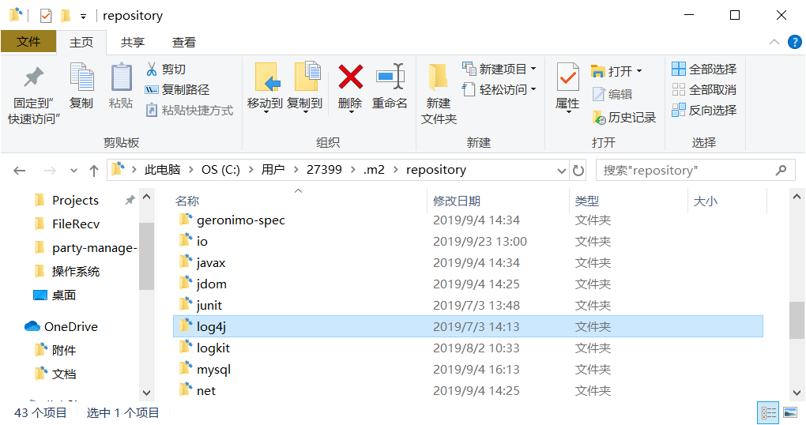
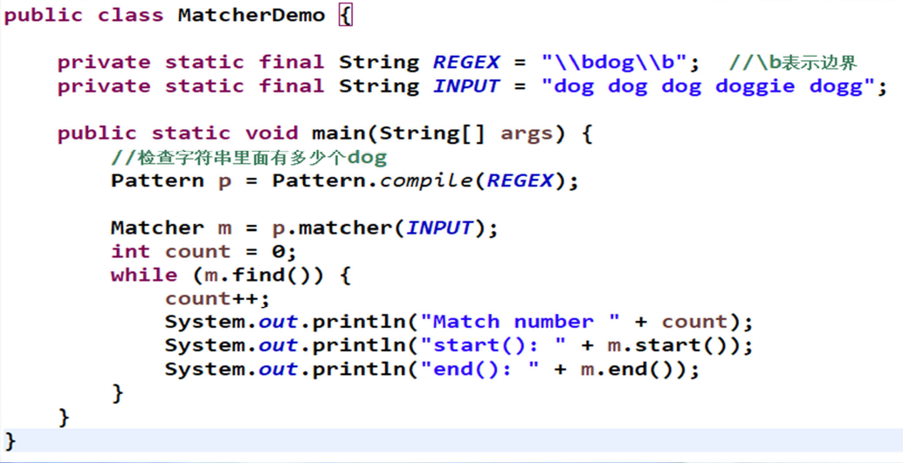
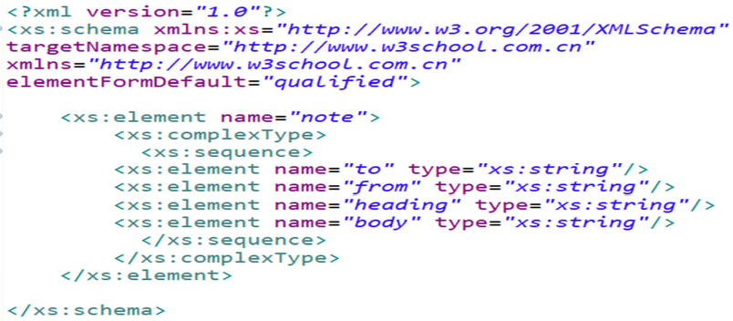
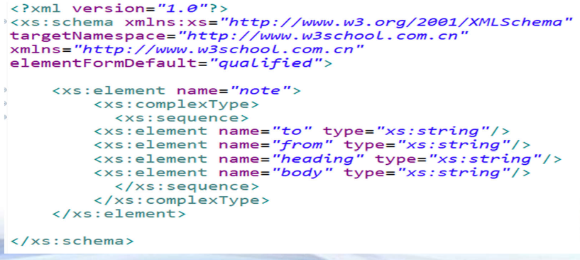

[TOC]


# Java学习笔记

## Chapter 1. Maven

### POM(Project Object Model)

* XML格式
* 包含了项目信息、依赖信息、构建信息
* dependency构件信息(artifact)
  * groupId：组织
  * artifactId：产品名称
  * version：版本

### Maven repository(仓库)

Maven仓库存放和管理各种构件

* 本地仓库(本地用户的.m2文件夹)

  * 

* 远程仓库

  * 中央仓库
  * 阿里云仓库
  * 谷歌仓库
  * ...

  

### 同类工具

- Gradle
- Ivy
- Buildr
- Ant


## Chapter 2. JUnit

### 简介

Java语言的单元测试框架

* 在测试函数上加上@Test注释
* ```Assert```类包含测试方法，如```assertEquals```


## Chapter 3. 高级文本处理

### 1. 字符编码

#### 字符乱码

* 打油诗
  * 手持两把锟斤拷，口中疾呼烫烫烫。
  * 脚踏千朵屯屯屯，笑看万物锘锘锘。

#### 字符编码

* ASCII码(American Standard Code for Information Interchange)
  * 美国信息交换标准代码，奠定计算机编码基础
  * 用一个字节(1 Byte=8 bits) 来存储a_z,A_Z,0_9和一些常用符号
  * 用于显示英语及西欧语言
  * ASCII无法适应其他地方，如汉字数量有十几万
* 扩展编码(加字节)
  * ISO8859(1_15) **->** 西欧语言
  * **GB2312， GBK，GB18030 -> ASCII+中文**
  * Big5 **->** ASCII + 繁体中文
  * Shift_JIS **->** ASCII+日文
  * **Unicode  -> 全世界所有文字字符集**
* 中文编码
  * GB2312，1980年发布，7445个字符(6763个简体字)，包括拉丁字
    母、希腊字母、日文平假名及片假名字母、俄语西里尔字母等
    682个符号
  * GBK，1995年发布，21886 个汉字和符号，包括GB2312和Big 5
  * GB18030(2000, 2005两个版本)，70244个汉字和符号，包括GBK和
    GB2312
  * Big 5，繁体中文
  * **GB18030 > GBK > GB2312**
* Unicode(字符集)
  * 目标：不断扩充，存储全世界所有的字符
  * 编码方案
    * UTF_8，**兼容ASCII**，变长(1_4个字节存储字符)，经济，方便传输
    * UTF_16，用变长(2_4个字节)来存储所有字符
    * UTF_32，用32bits(4个字节)存储所有字符
  * **和外界(文本文件)的输入输出尽量采用UTF_8编码**
  * 程序内部采用UTF_16编码存储所有字符(不是程序员控制)
* ANSI编码
  * Windows上非Unicode的默认编码(Windows code pages)
  * 在**简体中文**Windows操作系统中，ANSI 编码代表GBK 编码
  * 在**繁体中文**Windows操作系统中，ANSI编码代表Big5


### 2.  Java国际化编程

#### 简介

Internationalization, 缩写为i18n.

* **java.util.ResourceBundle 用于加载一个语言__国家语言包_**
* **_java.util.Locale 定义一个语言_国家**
* java.text.MessageFormat 用于格式化带占位符的字符串
* java.text.NumberFormat 用于格式化数字/金额
* java.text.DateFormat用于格式化日期时间
* java.time.format.DateTimeFormatter用于格式化日期时间

#### Locale类

* Locale(zh_CN, en_US,…)
  * 语言，zh，en等
  * 国家/地区，CN，US等
  * 构造函数，如Locale("en", "US")
  * static final 变量，如Locale.CHINA, Locale.en_US等
  * 其他变量(variant)(几乎不用)
* Locale方法
  * **getAvailableLocales()**返回所有的可用Locale
  * **getDefault()**返回默认的Locale

#### 语言文件

* 一个Properties文件
* 包含K_V对，每行一个K_V，例如：age=20
* 命名规则
  * ```
    包名+语言+国家地区.properties, (语言和国家地区可选)
    message.properties
    message_zh.properties
    message_zh_CN.properties
    ```
* 存储文件必须是ASCII码文件
* 如果是ASCII以外的文字，必须用Unicode表示(\uxxxx)
* 可以采用native2ascii.exe (%JAVA_HOME%\bin目录下)进行转码

#### ResourceBundle类

- 根据Locale要求，加载语言文件(Properties文件)

- 存储语言集合中所有的K_V对

- ResourceBundle.getBundle("msg", locale)获取bundle，msg为包名，locale为Locale对象

- getString(String key) 返回所对应的value

- ResourceBundle 根据key找value的查找路径
  ```
  包名_当前Locale语言_当前Locale国家地区_当前Locale变量(variant)
  包名_当前Locale语言_当前Locale国家地区
  包名_当前Locale语言
  包名_默认Locale语言_默认Locale国家地区_默认Locale变量(variant)
  包名_默认Locale语言_默认Locale国家地区
  包名_默认Locale语言
  包名
  ```

  

#### 其他国际化

* 日期/时间国际化
  * DateTimeFormatter和Locale的结合
* 数字/金额国际化
  * NumberFormat和Locale结合


### 3. 高级文本处理

* **正则表达式**
  * java.util.regex包
    * Pattern 正则表达式的编译表示
      * compile 编译一个正则表达式为Pattern对象
      * matcher 用Pattern对象匹配一个字符串，返回匹配结果
    * Matcher
      * Index Methods(位置方法)
        * start() 当前组的开始下标
        * start(int group) 第group组的开始下标
        * end() 当前组的结束下标
        * end(int group) 第group组的结束下标
      * Study Methods(查找方法)
        * lookingAt()  部分匹配，返回布尔值
        * find() 查找下一个匹配子串
        * find(int start) 从下标start开始找下一个匹配子串
        * matches() 完全匹配，返回布尔值
      * Replacement Methods(替换方法)
        * replaceAll(String replacement) 把所有匹配子串替换成replacement
  * Demo
    * 
* 其他字符串操作
  * 字符串转义 commons-text StringEscapeUtils
  * 字符串合并 commons-lang3 StringUtils、guava Splitter
  * 从字符串到输入流 commons-io IOUtils


## Chapter 4. 高级文件处理

### 1. XML(eXtensible Markup Language)

* 数据+含义，适用于传输数据，而不是显示数据(HTML)
* 标签可自行定义，具有自我描述性
* 纯文本表示，跨系统/平台/语言
* W3C标准(1998年，W3C发布了XML1.0，包括几乎所有的Unicode字符)

#### 常规语法

* 任何的起始标签都必须有一个结束标签。
* 简化写法，例如，```<name></name>```可以写为```<name/>```。
* 大小写敏感，如```<name>```和```<Name>```不一样。
* 每个文件都要有一个根元素。
* 标签必须按合适的顺序进行嵌套，不可错位。
* 所有的特性都必须有值，且在值的周围加上引号。
* 需要转义字符，如“<”需要用```&lt;```代替。
* 注释：```<!-- 注释内容-->```

#### XML扩展

* DTD(Document Type Definition)
  * 定义XML 文档的结构
  * 使用一系列合法的元素来定义文档结构
  * 可嵌套在xml文档中，或者在xml中引用
  * 
* XML Schema(XSD，XML Schema Definition)
  * 定义XML 文档的结构, DTD的继任者
  * 支持数据类型，可扩展，功能更完善、强大
  * 采用xml编写
  * 

#### XML解析

* XML解析方法
  * 树结构
    * DOM: Document Object Model 文档对象模型，擅长(小规模)读/写
  * 流结构
    * SAX: Simple API for XML 流机制解释器(推模式)，擅长读
    * Stax: The Streaming API for XML 流机制解释器(拉模式)，擅长读，JDK 6 引入
  * 第三方库
    * JDOM
    * DOM4J
    * 第三方库一般都包含DOM,SAX等多种方式解析，是对Java解析进行封装。

##### DOM方法

DOM 是W3C 处理XML 的标准API

* 优点
  * 直观易用。
  * 其处理方式是将XML 整个作为类似树结构的方式读入内存中以便操作及解析，方便修改。
* 缺点
  * 解析大数据量的XML 文件，会遇到内存泄露及程序崩溃的风险。

###### DomReader.java

```java
package xml.dom;

import javax.xml.parsers.DocumentBuilder;
import javax.xml.parsers.DocumentBuilderFactory;

import org.w3c.dom.Document;
import org.w3c.dom.Element;
import org.w3c.dom.Node;
import org.w3c.dom.NodeList;


public class DomReader 
{
	public static void main(String[] a)
	{
		recursiveTraverse(); //自上而下进行访问
		System.out.println("========华丽丽的分割线==========");
		traverseBySearch();    //根据名称进行搜索		
	}
    public static void recursiveTraverse()
    {
    	try 
    	{
    		//采用Dom解析xml文件
            DocumentBuilderFactory dbf = DocumentBuilderFactory.newInstance();
            DocumentBuilder db = dbf.newDocumentBuilder();
            Document document = db.parse("users.xml");
            
            //获取所有的一级子节点
            NodeList usersList = document.getChildNodes();
            System.out.println(usersList.getLength());  //1  
            
            for (int i = 0; i < usersList.getLength(); i++) 
            {
                Node users = usersList.item(i);         //1  users 
                
                NodeList userList = users.getChildNodes(); //获取二级子节点user的列表
                System.out.println("==" + userList.getLength()); //9, DOM方法解析，标签与标签之间的空格也会被上级父节点视为子元素。
                
                for (int j = 0; j < userList.getLength(); j++) //9
                {
                    Node user = userList.item(j);
                    if (user.getNodeType() == Node.ELEMENT_NODE)
                    {
                    	 NodeList metaList = user.getChildNodes();
                         System.out.println("====" + metaList.getLength()); //7
                         
                         for (int k = 0; k < metaList.getLength(); k++) //7
                         {
                         	//到最后一级文本
                        	Node meta = metaList.item(k);
                        	if (meta.getNodeType() == Node.ELEMENT_NODE)
                        	{
                        		System.out.println(metaList.item(k).getNodeName() 
                        				+ ":" + metaList.item(k).getTextContent());
                        	}                                                              
                         }                  
                         System.out.println();
                    }                   
                }
            }            
        } catch (Exception e) {
            e.printStackTrace();
        } 
    }   
    
    public static void traverseBySearch()
    {
    	try 
    	{
    		//采用Dom解析xml文件
            DocumentBuilderFactory dbf = DocumentBuilderFactory.newInstance();
            DocumentBuilder db = dbf.newDocumentBuilder();
            Document document = db.parse("users.xml");
            
            Element rootElement = document.getDocumentElement();         

            NodeList nodeList = rootElement.getElementsByTagName("name"); 
            if(nodeList != null) 
            { 
               for (int i = 0 ; i < nodeList.getLength(); i++) 
               { 
                  Element element = (Element)nodeList.item(i);                  
                  System.out.println(element.getNodeName() + " = " + element.getTextContent());
               } 
            }             
        } catch (Exception e) {
            e.printStackTrace();
        } 	
    }       
}
```

###### DOMWriter.java

```java
package xml.dom;

import java.io.File;
import javax.xml.parsers.DocumentBuilder;
import javax.xml.parsers.DocumentBuilderFactory;
import javax.xml.transform.Transformer;
import javax.xml.transform.TransformerFactory;
import javax.xml.transform.dom.DOMSource;
import javax.xml.transform.stream.StreamResult;

import org.w3c.dom.Document;
import org.w3c.dom.Element;

public class DomWriter {

	public static void main(String[] args) {
		
		
		try {
			DocumentBuilderFactory dbFactory = DocumentBuilderFactory.newInstance();
			DocumentBuilder dbBuilder = dbFactory.newDocumentBuilder();
			
			//新创建一个Document节点
			Document document = dbBuilder.newDocument();
			if (document != null) 
			{
				Element docx = document.createElement("document");	//都是采用Document创建元素		
				Element element = document.createElement("element");
				element.setAttribute("type", "paragraph"); 
				element.setAttribute("alignment", "left"); //element增加2个属性
				
				Element object = document.createElement("object");
				object.setAttribute("type", "text");
				
				Element text = document.createElement("text");
				text.appendChild(document.createTextNode("abcdefg")); //给text节点赋值
				Element bold = document.createElement("bold");
				bold.appendChild(document.createTextNode("true"));    //给bold节点赋值
				
				object.appendChild(text);      //把text节点挂在object下
				object.appendChild(bold);      //把bold节点挂在object下
				element.appendChild(object);   //把object节点挂在element下
				docx.appendChild(element);	   //把element节点挂在docx下		
				document.appendChild(docx);    //把docx挂在document下
				
				TransformerFactory transformerFactory = TransformerFactory.newInstance();
				Transformer transformer = transformerFactory.newTransformer();
				DOMSource source = new DOMSource(document);
				
				//定义目标文件
				File file = new File("dom_result.xml");
				StreamResult result = new StreamResult(file);
		 	 
				//将xml内容写入到文件中
				transformer.transform(source, result);
				
				System.out.println("write xml file successfully");
			}
		} catch (Exception e) {
			e.printStackTrace();
		}		
	}	
}

```


##### SAX方法

* 采用事件/流模型来解析XML 文档，更快速、更轻量。
* 有选择的解析和访问，不像DOM 加载整个文档，**内存要求较低**。
* SAX 对XML 文档的解析为**一次性读取**，不创建/不存储文档对象，**很难同时访问文档中的多处数据**。
* **推模型**。当它每发现一个节点就引发一个事件，而我们需要编写这些事件的处理程序。

###### SAXReader.java

```java
package xml.sax;

import java.io.IOException;
import java.util.ArrayList;
import java.util.List;

import org.xml.sax.Attributes;
import org.xml.sax.SAXException;
import org.xml.sax.XMLReader;
import org.xml.sax.helpers.DefaultHandler;
import org.xml.sax.helpers.XMLReaderFactory;

public class SAXReader {
	public static void main(String[] args) throws SAXException, IOException {
		XMLReader parser = XMLReaderFactory.createXMLReader();
		BookHandler bookHandler = new BookHandler();
		parser.setContentHandler(bookHandler);
		parser.parse("books.xml");
		System.out.println(bookHandler.getNameList());
	}
}

class BookHandler extends DefaultHandler {
	private List<String> nameList;
	private boolean title = false;

	public List<String> getNameList() {
		return nameList;
	}

	// xml文档加载时
	public void startDocument() throws SAXException {
		System.out.println("Start parsing document...");
		nameList = new ArrayList<String>();
	}

	// 文档解析结束
	public void endDocument() throws SAXException {
		System.out.println("End");
	}

	// 访问某一个元素
	public void startElement(String uri, String localName, String qName, Attributes atts) throws SAXException {

		if (qName.equals("title")) {
			title = true;
		}
	}

	// 结束访问元素
	public void endElement(String namespaceURI, String localName, String qName) throws SAXException {
		// End of processing current element
		if (title) {
			title = false;
		}
	}

	// 访问元素正文
	public void characters(char[] ch, int start, int length) {
		
		if (title) {
			String bookTitle = new String(ch, start, length);
			System.out.println("Book title: " + bookTitle);
			nameList.add(bookTitle);
		}
	}

}
```


##### Stax方法

* Streaming API for XML
  * 流模型中的拉模型
  * 在遍历文档时，会把感兴趣的部分从读取器中拉出，不需要引发事件，允许我们选择性地处理节点。这大大提高了灵活性，以及整体效率。
  * 两套处理API
    * 基于指针的API， XMLStreamReader
    * 基于迭代器的API，XMLEventReader

###### StaxReader.java

```java
package xml.stax;

import java.io.FileNotFoundException;
import java.io.FileReader;
import java.util.Iterator;

import javax.xml.stream.XMLEventReader;
import javax.xml.stream.XMLInputFactory;
import javax.xml.stream.XMLStreamConstants;
import javax.xml.stream.XMLStreamException;
import javax.xml.stream.XMLStreamReader;
import javax.xml.stream.events.Attribute;
import javax.xml.stream.events.EndElement;
import javax.xml.stream.events.StartElement;
import javax.xml.stream.events.XMLEvent;


public class StaxReader {
	
	public static void main(String[] args) {
		StaxReader.readByStream();
		System.out.println("========华丽丽的分割线==========");
		StaxReader.readByEvent();
	}

	//流模式
	public static void readByStream() {
		String xmlFile = "books.xml";
		XMLInputFactory factory = XMLInputFactory.newFactory();
		XMLStreamReader streamReader = null;
		try {
			streamReader = factory.createXMLStreamReader(new FileReader(xmlFile));			
		} catch (FileNotFoundException e) {
			e.printStackTrace();
		} catch (XMLStreamException e) {
			e.printStackTrace();
		}
		
		// 基于指针遍历
		try {
			while (streamReader.hasNext()) {
				int event = streamReader.next();
				// 如果是元素的开始
				if (event == XMLStreamConstants.START_ELEMENT) {
					// 列出所有书籍名称
					if ("title".equalsIgnoreCase(streamReader.getLocalName())) {
						System.out.println("title:" + streamReader.getElementText());
					}
				}
			}
			streamReader.close();
		} catch (XMLStreamException e) {
			e.printStackTrace();
		}
	}
	

	

		
	// 事件模式
	public static void readByEvent() {
		String xmlFile = "books.xml";
		XMLInputFactory factory = XMLInputFactory.newInstance();
		boolean titleFlag = false;
		try {
			// 创建基于迭代器的事件读取器对象
			XMLEventReader eventReader = factory.createXMLEventReader(new FileReader(xmlFile));
			// 遍历Event迭代器
			while (eventReader.hasNext()) {
				XMLEvent event = eventReader.nextEvent();
				// 如果事件对象是元素的开始
				if (event.isStartElement()) {
					// 转换成开始元素事件对象
					StartElement start = event.asStartElement();
					// 打印元素标签的本地名称
					
					String name = start.getName().getLocalPart();
					//System.out.print(start.getName().getLocalPart());	
					if(name.equals("title"))
					{
						titleFlag = true;
						System.out.print("title:");
					}
					
					// 取得所有属性
					Iterator attrs = start.getAttributes();
					while (attrs.hasNext()) {
						// 打印所有属性信息
						Attribute attr = (Attribute) attrs.next();
						//System.out.print(":" + attr.getName().getLocalPart() + "=" + attr.getValue());
					}
					//System.out.println();
				}
				//如果是正文
				if(event.isCharacters())
				{
					String s = event.asCharacters().getData();
					if(null != s && s.trim().length()>0 && titleFlag)
					{
						System.out.println(s.trim());
					}					
				}
				//如果事件对象是元素的结束
				if(event.isEndElement())
				{
					EndElement end = event.asEndElement();
					String name = end.getName().getLocalPart();
					if(name.equals("title"))
					{
						titleFlag = false;
					}
				}
			}
			eventReader.close();
		} catch (FileNotFoundException e) {
			e.printStackTrace();
		} catch (XMLStreamException e) {
			e.printStackTrace();
		}
	}
}
```


### 2. JSON(JavaScript Object Notation)

* JS 对象表示法
* 是一种轻量级的数据交换格式
* 类似XML，**更小、更快、更易解析**
* 最早用于Javascript中，容易解析，最后推广到全语言
* 尽管使用Javascript语法，但是**独立于编程语言**

#### JSONObject和JSONArray

* JSONObject
  * eg. {“name":"Jo","email":"a@b.com"}
* JSONArray
  * eg. [{“name":"Jo","email":"a@b.com"}, {“name":"Jo","email":"a@b.com"}]

#### JSON库

* org.json：JSON官方推荐的解析类
  * **简单易用，通用性强**
  * 复杂功能欠缺
* GSON：Google出品
  * 基于反射，可以实现JSON对象、JSON字符串和Java对象互转
* Jackson：号称最快的JSON处理器
  * **简单易用**，社区更新和发布速度比较快

#### JSON和XML比较

* 都是数据交换格式，**可读性强，可扩展性高**
* 大部分的情况下，**JSON**更具优势（编码简单，转换方便），而且JSON字符长度一般小于XML，**传输效率更高**
* XML更加注重标签和顺序
* JSON会丢失顺序性

##### OrgJsonTest.java

```java
String s = String.valueOf(chars);
JSONObject jsonObject = new JSONObject(s);

//开始解析JSONObject对象
JSONArray books = jsonObject.getJSONArray("books");
List<Book> bookList = new ArrayList<>();
for (Object book : books) {
    //获取单个JSONObject对象
    JSONObject bookObject = (JSONObject) book;
    Book book1 = new Book();
    book1.setAuthor(bookObject.getString("author"));
    book1.setYear(bookObject.getString("year"));
    book1.setTitle(bookObject.getString("title"));
    book1.setPrice(bookObject.getInt("price"));
    book1.setCategory(bookObject.getString("category"));
    bookList.add(book1);
}

//构造JSONObject对象
JSONObject obj = new JSONObject(); 	
obj.put("name", "Tom");
obj.put("age", 20);
obj.put("scores", Arrays.asList(60,70,80));
obj.put("null", JSONObject.NULL);
System.out.println(obj);
```
##### JacksonTest.java

```java
ObjectMapper om = new ObjectMapper();

//构造对象
Person p = new Person();
p.setName("Tom");
p.setAge(20);
p.setScores(Arrays.asList(60,70,80));

//将对象解析为json字符串
String jsonStr = om.writeValueAsString(p);
System.out.println(jsonStr);

//从json字符串重构对象
Person p2 = om.readValue(jsonStr, Person.class);
System.out.println(p2.getName());
System.out.println(p2.getAge());
System.out.println(p2.getScores());

//从json字符串重构为JsonNode对象
JsonNode node = om.readTree(jsonStr);
System.out.println(node.get("name").asText());
System.out.println(node.get("age").asText());
System.out.println(node.get("scores"));


/*从json文件中加载，并重构为java对象*/
File json2 = new File("books2.json");
List<Book> books = om.readValue(json2, new TypeReference<List<Book>>(){});
```

##### GsonTest.java

```java
//从Java对象到JSON字符串
Gson gson = new Gson();
String s = gson.toJson(p);
System.out.println(s); //{"name":"Tom","age":20,"scores":[60,70,80]}

//从JSON字符串到Java对象
Person p2 = gson.fromJson(s, Person.class);
System.out.println(p2.getName());  //Tom
System.out.println(p2.getAge());   //20
System.out.println(p2.getScores());//[60, 70, 80]

//调用GSON的JsonObject
JsonObject json = gson.toJsonTree(p).getAsJsonObject(); //将整个json解析为一颗树
System.out.println(json.get("name"));  //"Tom"
System.out.println(json.get("age"));   //20
System.out.println(json.get("scores"));//[60,70,80]


/*从json文件中加载，并重构为java对象*/
List<Book> books = gson.fromJson(reader, new TypeToken<List<Book>>(){}.getType());
```


### 3. 图形图像解析

#### 基础概念

* 图形：Graph
  * 矢量图，根据几何特性来画的，比如点、直线、弧线等
* 图像：Image
  * 由像素点组成
  * 格式：jpg, png, bmp, svg, wmf, gif, tiff 等
  * 颜色：RGB(Red, Green, Blue)

#### Java图形图像关键类

* 图形：Graph
  * java.awt 包
  * Java 2D库: Graphics2D, Line2D, Rectangle2D, Ellipse2D,Arc2D
  * Color, Stroke
* 图像：Image
  * javax.imageio包
  * ImageIO, BufferedImage, ImageReader, ImageWriter

#### Java图像关键类描述

* Java原生支持**jpg, png**, bmp, wbmp, gif
* javax.imageio.ImageIO 基础的图像读写和剪辑
  * 自动封装多种ImageReader和ImageWriter，读写图像文件
  * read 读取图片write 写图片
* java.awt.image.BufferedImage,图像在内存中的表示类
  * getHeight 获取高度
  * getWidth 获取宽度
* 图像文件读写/截取/合并

```java
public static void readComparison() throws Exception {
    System.out.println("===========加载速度测试==============");

    // ImageIO需要测试图片的类型，加载合适的ImageReader来读取图片，耗时更长
    long startTime = System.nanoTime();
    BufferedImage image = ImageIO.read(new File("c:/temp/ecnu.jpg"));
    System.out.println("Height: " + image.getHeight()); // 高度像素
    System.out.println("Width: " + image.getWidth()); // 宽度像素
    long endTime = System.nanoTime();
    System.out.println((endTime - startTime) / 1000000.0 + "毫秒");

    // 指定用jpg Reader来加载，速度会加快
    startTime = System.nanoTime();
    Iterator<ImageReader> readers = ImageIO.getImageReadersByFormatName("jpg");
    ImageReader reader = (ImageReader) readers.next();
    System.out.println(reader.getClass().getName());
    ImageInputStream iis = ImageIO.createImageInputStream(new File("c:/temp/ecnu.jpg"));
    reader.setInput(iis, true);
    System.out.println("Height:" + reader.getHeight(0));
    System.out.println("Width:" + reader.getWidth(0));
    endTime = System.nanoTime();
    System.out.println((endTime - startTime) / 1000000.0 + "毫秒");
}

/**
* cropImage 将原始图片文件切割一个矩形，并输出到目标图片文件
* @param fromPath 原始图片
* @param toPath  目标图片
* @param x       坐标起点x
* @param y       坐标起点y
* @param width   矩形宽度
* @param height  矩形高度
* @param readImageFormat  原始文件格式
* @param writeImageFormat 目标文件格式
* @throws Exception
*/
public static void cropImage(String fromPath, String toPath, int x, int y, int width, int height, String readImageFormat,
                             String writeImageFormat) throws Exception {
    FileInputStream fis = null;
    ImageInputStream iis = null;
    try {
        // 读取原始图片文件
        fis = new FileInputStream(fromPath);
        Iterator<ImageReader> it = ImageIO.getImageReadersByFormatName(readImageFormat);
        ImageReader reader = it.next();			
        iis = ImageIO.createImageInputStream(fis);
        reader.setInput(iis, true);

        // 定义一个矩形 并放入切割参数中
        ImageReadParam param = reader.getDefaultReadParam();			
        Rectangle rect = new Rectangle(x, y, width, height);			
        param.setSourceRegion(rect);

        //从源文件读取一个矩形大小的图像
        BufferedImage bi = reader.read(0, param);

        //写入到目标文件
        ImageIO.write(bi, writeImageFormat, new File(toPath));
    } finally {
        fis.close();
        iis.close();
    }
}

/**
* 横向拼接两张图片，并写入到目标文件
* 拼接的本质，就是申请一个大的新空间，然后将原始的图片像素点拷贝到新空间，最后保存
* @param firstPath 第一张图片的路径
* @param secondPath    第二张图片的路径
* @param imageFormat   拼接生成图片的格式
* @param toPath    目标图片的路径
*/
public static void combineImagesHorizontally(String firstPath, String secondPath,String imageFormat, String toPath){  
    try {  
        //读取第一张图片    
        File  first  =  new  File(firstPath);    
        BufferedImage  imageOne = ImageIO.read(first);    
        int  width1  =  imageOne.getWidth();//图片宽度    
        int  height1  =  imageOne.getHeight();//图片高度    
        //从第一张图片中读取RGB    
        int[]  firstRGB  =  new  int[width1*height1];    
        firstRGB  =  imageOne.getRGB(0,0,width1,height1,firstRGB,0,width1);    

        //对第二张图片做同样的处理    
        File  second  =  new  File(secondPath);    
        BufferedImage  imageTwo  =  ImageIO.read(second); 
        int width2 = imageTwo.getWidth();
        int height2 = imageTwo.getHeight();
        int[]   secondRGB  =  new  int[width2*height2];    
        secondRGB  =  imageTwo.getRGB(0,0,width2,height2,secondRGB,0,width2);   


        //生成新图片
        int height3 = (height1>height2)?height1:height2; //挑选高度大的，作为目标文件的高度
        int width3  = width1 + width2;                   //宽度，两张图片相加
        BufferedImage  imageNew  =  new  BufferedImage(width3,height3,BufferedImage.TYPE_INT_RGB);    

        //设置左半部分的RGB 从(0,0) 开始 
        imageNew.setRGB(0,0,width1,height1,firstRGB,0,width1); 
        //设置右半部分的RGB 从(width1, 0) 开始 
        imageNew.setRGB(width1,0,width2,height2,secondRGB,0,width2);

        //保存图片
        ImageIO.write(imageNew,  imageFormat,  new  File(toPath));
    } catch (Exception e) {  
        e.printStackTrace();  
    }  
}

// Graph操作
public static void generateCode(String filePath) throws IOException {
    // 首先定义验证码图片框  
    int width = 80; // 验证码图片的宽度
    int height = 32; // 验证码图片的高度
    BufferedImage buffImg = new BufferedImage(width, height, BufferedImage.TYPE_INT_RGB); 


    //定义图片上的图形和干扰线
    Graphics2D gd = buffImg.createGraphics();   
    gd.setColor(Color.LIGHT_GRAY);   // 将图像填充为浅灰色   
    gd.fillRect(0, 0, width, height);   
    gd.setColor(Color.BLACK);        // 画边框。   
    gd.drawRect(0, 0, width - 1, height - 1);   
    // 随机产生16条灰色干扰线，使图像中的认证码不易识别  
    gd.setColor(Color.gray); 
    // 创建一个随机数生成器类   用于随机产生干扰线
    Random random = new Random();   
    for (int i = 0; i < 16; i++) {   
        int x = random.nextInt(width);   
        int y = random.nextInt(height);   
        int xl = random.nextInt(12);   
        int yl = random.nextInt(12);   
        gd.drawLine(x, y, x + xl, y + yl);   
    }   


    //计算字的位置坐标
    int codeCount = 4; // 字符个数
    int fontHeight; // 字体高度
    int codeX; // 第一个字符的x坐标，因为后面的字符坐标依次递增，所以它们的x轴值是codeX的倍数
    int codeY; // 验证字符的y坐标，因为并排所以值一样
    // width-4 除去左右多余的位置，使验证码更加集中显示，减得越多越集中。
    // codeCount+1 //等比分配显示的宽度，包括左右两边的空格
    codeX = (width - 4) / (codeCount + 1); //第一个字母的起始位置    	
    fontHeight = height - 10;  // height - 10 高度中间区域显示验证码
    codeY = height - 7;


    // 创建字体，字体的大小应该根据图片的高度来定。   
    Font font = new Font("Fixedsys", Font.PLAIN, fontHeight);           
    gd.setFont(font);   

    // 随机产生codeCount数字的验证码。   
    for (int i = 0; i < codeCount; i++) {   
        // 每次随机拿一个字母，赋予随机的颜色  
        String strRand = String.valueOf(codeSequence[random.nextInt(charNum)]);   
        int red = random.nextInt(255);   
        int green = random.nextInt(255);   
        int blue = random.nextInt(255);   
        gd.setColor(new Color(red,green,blue));   
        //把字放到图片上!!!
        gd.drawString(strRand, (i + 1) * codeX, codeY);              
    }   

    ImageIO.write(buffImg, "jpg", new File(filePath));             
}
```


#### 统计图生成

* 统计图
  * 柱状图/饼图/折线图
  * Java原生的Graphics 2D可以画，比较繁琐
  * 基于**jFreeChart**(www.jfree.org/jfreechart)可以快速实现统计图生成
    * 设定数据集
    * 调用ChartFactory生成图形

```java
public static StandardChartTheme getChineseTheme()
{
    StandardChartTheme chineseTheme = new StandardChartTheme("CN");
    chineseTheme.setExtraLargeFont(new Font("隶书", Font.BOLD, 20));
    chineseTheme.setRegularFont(new Font("宋书", Font.PLAIN, 15));
    chineseTheme.setLargeFont(new Font("宋书", Font.PLAIN, 15));
    return chineseTheme;
}

public static void writeBar(String fileName) {
    DefaultCategoryDataset dataset = new DefaultCategoryDataset();
    dataset.addValue(11, "", "第一季度");
    dataset.addValue(41, "", "第二季度");
    dataset.addValue(51, "", "第三季度");
    dataset.addValue(4, "", "第四季度");

    // PlotOrientation.HORIZONTAL横向 PlotOrientation.VERTICAL 竖向
    // 引入中文主题样式
    ChartFactory.setChartTheme(getChineseTheme());
    JFreeChart chart = ChartFactory.createBarChart3D("柱状图", "2018年", "产品总量", dataset, PlotOrientation.VERTICAL,
                                                     false, false, false);

    try {
        ChartUtilities.saveChartAsJPEG(new File(fileName), chart, 600, 300);
    } catch (IOException e) {
        e.printStackTrace();
    }

}

public static void writePie(String fileName) {
    DefaultPieDataset pds = new DefaultPieDataset();
    pds.setValue("C人数", 100);
    pds.setValue("C++人数", 200);
    pds.setValue("Java人数", 300);
    try {
        ChartFactory.setChartTheme(getChineseTheme());
        JFreeChart chart = ChartFactory.createPieChart("饼图", pds);

        ChartUtilities.saveChartAsJPEG(new File(fileName), chart, 600, 300);
    } catch (Exception e) {
        e.printStackTrace();
    }
}

public static void writeLine(String fileName) {
    DefaultCategoryDataset lines = new DefaultCategoryDataset();
    //第一条线
    lines.addValue(100, "Java核心技术", "1月");
    lines.addValue(200, "Java核心技术", "2月");
    lines.addValue(400, "Java核心技术", "3月");
    lines.addValue(500, "Java核心技术", "4月");

    //第二条线
    lines.addValue(100, "Java核心技术(进阶)", "1月");
    lines.addValue(400, "Java核心技术(进阶)", "2月");
    lines.addValue(900, "Java核心技术(进阶)", "3月");
    try {
        ChartFactory.setChartTheme(getChineseTheme());
        JFreeChart chart = ChartFactory.createLineChart("折线图", "时间", "人数", lines);
        ChartUtilities.saveChartAsJPEG(new File(fileName), chart, 600, 300);
    } catch (Exception e) {
        e.printStackTrace();
    }
}


```


### 4. 条形码和二维码

#### 条形码

* 将宽度不等的多个**黑条和空白**，按照一定的编码规则排列，用以表达一组信息的图形标识符
* 上个世纪40年代发明的通常代表一串数字/字母，每一位有特殊含义
* **一般数据容量30个数字/字母**
* 专门机构管理：中国物品编码中心


#### 二维码

* 用某种特定的几何图形按一定规律在平面（二维方向上）分布的黑白相间的图形记录数据符号信息
* 比一维条形码能存更多信息，表示更多数据类型
* 能够存储数字/字母/汉字/图片等信息
* 字符集**128个字符**
* **可存储几百到几十KB字符**
* **抗损坏**


#### 第三方库

##### Zxing(Zebra Crossing)

* Google 出品
* **支持1D和2D的Barcode**
* 主要类
  * BitMatrix 位图矩阵
  * MultiFormatWriter 位图编写器
  * MatrixToImageWriter 写入图片

```java
// generate barcode
matrix = writer.encode(code,BarcodeFormat.CODE_128, width, height, null);
MatrixToImageWriter.toBufferedImage(matrix);

// read barcode
LuminanceSource source = new BufferedImageLuminanceSource(image);
BinaryBitmap bitmap = new BinaryBitmap(new HybridBinarizer(source));
Map<DecodeHintType, Object> hints = new HashMap<>();
hints.put(DecodeHintType.CHARACTER_SET, "GBK");
hints.put(DecodeHintType.PURE_BARCODE, Boolean.TRUE);
hints.put(DecodeHintType.TRY_HARDER, Boolean.TRUE);
Result result = new MultiFormatReader().decode(bitmap, hints);
System.out.println("条形码内容: "+result.getText());

// generate QRCode
Map<EncodeHintType, Object> hints = new HashMap<>();
hints.put(EncodeHintType.CHARACTER_SET, "utf-8");//设置编码
hints.put(EncodeHintType.ERROR_CORRECTION, ErrorCorrectionLevel.M);//设置容错等级
hints.put(EncodeHintType.MARGIN, 2);//设置边距默认是5
BitMatrix bitMatrix = new MultiFormatWriter().encode(content, BarcodeFormat.QR_CODE, WIDTH, HEIGHT, hints);
MatrixToImageWriter.writeToPath(bitMatrix, FORMAT, file.toPath());//写到指定路径下

// read QRCode
BufferedImage image = ImageIO.read(file);
BinaryBitmap binaryBitmap = new BinaryBitmap(new HybridBinarizer(new BufferedImageLuminanceSource(image)));
Map<DecodeHintType, Object> hints = new HashMap<>();
hints.put(DecodeHintType.CHARACTER_SET, "utf-8");//设置编码
Result result = reader.decode(binaryBitmap, hints);
```


##### Barcode4J

* 纯Java实现的**条形码**生成
* **只负责生成，不负责解析**
* 主要类
  * BarcodeUtil
  * BarcodeGenerator
  * DefaultConfiguration


```java
// generate 1D barcode
public static void generateFile(String msg, String path) {
    File file = new File(path);
    try {
        Code39Bean bean = new Code39Bean();
        //EAN13Bean bean = new EAN13Bean();

        // dpi精度
        final int dpi = 150;
        // module宽度
        //bean.setModuleWidth(0.2);
        final double width = UnitConv.in2mm(2.0f / dpi);
        bean.setWideFactor(3);
        bean.setModuleWidth(width);
        bean.doQuietZone(false);

        String format = "image/png";
        // 输出到流
        BitmapCanvasProvider canvas = new BitmapCanvasProvider(new FileOutputStream(file), format, dpi,
                                                               BufferedImage.TYPE_BYTE_BINARY, false, 0);

        // 生成条形码
        bean.generateBarcode(canvas, msg);

        // 结束绘制
        canvas.finish();

    } catch (Exception e) {
        e.printStackTrace();
    }
}


// generate 2D barcode
public static void main(String[] args) throws Exception {

    BarcodeUtil util = BarcodeUtil.getInstance();
    BarcodeGenerator gen = util.createBarcodeGenerator(buildCfg("datamatrix"));

    OutputStream fout = new FileOutputStream("2dcode.png");
    int resolution = 300;
    BitmapCanvasProvider canvas = new BitmapCanvasProvider(fout, "image/png", resolution, BufferedImage.TYPE_BYTE_BINARY, false, 0);
    gen.generateBarcode(canvas, "be the coder");
    canvas.finish();
}

private static Configuration buildCfg(String type) {
    DefaultConfiguration cfg = new DefaultConfiguration("barcode");

    // Bar code type
    DefaultConfiguration child = new DefaultConfiguration(type);
    cfg.addChild(child);

    // Human readable text position
    DefaultConfiguration attr = new DefaultConfiguration("human-readable");
    //		DefaultConfiguration subAttr = new DefaultConfiguration("placement");
    //		subAttr.setValue("bottom");
    //		attr.addChild(subAttr);
    //		child.addChild(attr);
    //		datamatrix code has no human-readable part
    //		see http://barcode4j.sourceforge.net/2.1/symbol-datamatrix.html

    attr = new DefaultConfiguration("height");
    attr.setValue(50);
    child.addChild(attr);
    attr = new DefaultConfiguration("module-width");
    attr.setValue("0.6");
    child.addChild(attr);
    return cfg;
}
```


### 5. Docx解析

#### Docx

* 以Microsoft Office的doc/docx为主要处理对象。
* Word2003（包括）之前都是doc，文档格式不公开。
* Word2007（包括）之后都是docx，遵循XML路线，文档格式公开。
* 常见功能
  * docx解析
  * docx生成（完全生成，模板加部分生成：套打）
* 处理的第三方库
  * Jacob, COM4J (Windows 平台)
  * **POI**, docx4j, OpenOffice/Libre Office SDK (免费)
  * Aspose (收费)
  * 一些开源的OpenXML的包。

#### Apache POI

* 可处理docx, xlsx, pptx, visio等office套件
* 纯Java工具包，无需第三方依赖
* 主要类
  * XWPFDocument 整个文档对象
  * XWPFParagraph 段落
  * XWPFRun 一个片段(字体样式相同的一段)
  * XWPFPicture 图片
  * XWPFTable 表格
* 不同的Office工具，产生出来的**docx文件格式不兼容**
* 不同的第三方包，**能够解析和生成的内容也不同**，使用的类也不同
* doc/docx功能非常非常多，第三方包不是万能的，**也存在无法解析的情况**

```java
public static void TableRead() throws Exception {
    InputStream is = new FileInputStream("simple2.docx");
    XWPFDocument xwpf = new XWPFDocument(is);
    List<XWPFParagraph> paras = xwpf.getParagraphs();
    //List<POIXMLDocumentPart> pdps = xwpf.getRelations();

    List<IBodyElement> ibs= xwpf.getBodyElements();
    for(IBodyElement ib:ibs)
    {
        BodyElementType bet = ib.getElementType();
        if(bet== BodyElementType.TABLE)
        {
            //表格
            System.out.println("table" + ib.getPart());
            XWPFTable table = (XWPFTable) ib;
            List<XWPFTableRow> rows=table.getRows(); 
            //读取每一行数据
            for (int i = 0; i < rows.size(); i++) {
                XWPFTableRow  row = rows.get(i);
                //读取每一列数据
                List<XWPFTableCell> cells = row.getTableCells(); 
                for (int j = 0; j < cells.size(); j++) {
                    XWPFTableCell cell=cells.get(j);
                    System.out.println(cell.getText());
                    List<XWPFParagraph> cps = cell.getParagraphs();
                    System.out.println(cps.size());
                }
            }
        }
        else
        {				
            //段落
            XWPFParagraph para = (XWPFParagraph) ib;
            System.out.println("It is a new paragraph....The indention is " 
                               + para.getFirstLineIndent() + "," + para.getIndentationFirstLine() + "," 
                               + para.getIndentationHanging()+"," + para.getIndentationLeft() + "," 
                               + para.getIndentationRight() + "," + para.getIndentFromLeft() + ","
                               + para.getIndentFromRight()+"," + para.getAlignment().getValue());

            //System.out.println(para.getAlignment());
            //System.out.println(para.getRuns().size());

            List<XWPFRun> res = para.getRuns();
            System.out.println("run");
            if(res.size()<=0)
            {
                System.out.println("empty line");
            }
            for(XWPFRun re: res)
            {					
                if(null == re.text()||re.text().length()<=0)
                {
                    if(re.getEmbeddedPictures().size()>0)
                    {
                        System.out.println("image***" + re.getEmbeddedPictures().size());

                    }
                    else
                    {
                        System.out.println("objects:" + re.getCTR().getObjectList().size());
                        System.out.println(re.getCTR().xmlText());

                    }
                }
                else
                {
                    System.out.println("===" + re.text());
                }
            }

        }
    }		
    is.close();
}


 public static void createTable() throws Exception {
     XWPFDocument doc = new XWPFDocument();

     try {
         XWPFTable table = doc.createTable(3, 3);

         table.getRow(1).getCell(1).setText("表格示例");

         XWPFParagraph p1 = table.getRow(0).getCell(0).getParagraphs().get(0);

         XWPFRun r1 = p1.createRun();
         r1.setBold(true);
         r1.setText("The quick brown fox");
         r1.setItalic(true);
         r1.setFontFamily("Courier");
         r1.setUnderline(UnderlinePatterns.DOT_DOT_DASH);
         r1.setTextPosition(100);

         table.getRow(2).getCell(2).setText("only text");

         OutputStream out = new FileOutputStream("simpleTable.docx");
         try {
             doc.write(out);
         } finally {
             out.close();
         }
     } finally {
         doc.close();
     }
 } 


/**
* 写入image
* @param run
* @param imgFile
* @param doc
* @throws InvalidFormatException
* @throws FileNotFoundException
* @throws IOException
*/
public static void replacePic(XWPFRun run,  String imgFile) throws Exception {
    int format;
    if (imgFile.endsWith(".emf"))
        format = Document.PICTURE_TYPE_EMF;
    else if (imgFile.endsWith(".wmf"))
        format = Document.PICTURE_TYPE_WMF;
    else if (imgFile.endsWith(".pict"))
        format = Document.PICTURE_TYPE_PICT;
    else if (imgFile.endsWith(".jpeg") || imgFile.endsWith(".jpg"))
        format = Document.PICTURE_TYPE_JPEG;
    else if (imgFile.endsWith(".png"))
        format = Document.PICTURE_TYPE_PNG;
    else if (imgFile.endsWith(".dib"))
        format = Document.PICTURE_TYPE_DIB;
    else if (imgFile.endsWith(".gif"))
        format = Document.PICTURE_TYPE_GIF;
    else if (imgFile.endsWith(".tiff"))
        format = Document.PICTURE_TYPE_TIFF;
    else if (imgFile.endsWith(".eps"))
        format = Document.PICTURE_TYPE_EPS;
    else if (imgFile.endsWith(".bmp"))
        format = Document.PICTURE_TYPE_BMP;
    else if (imgFile.endsWith(".wpg"))
        format = Document.PICTURE_TYPE_WPG;
    else {
        System.err.println(
            "Unsupported picture: " + imgFile + ". Expected emf|wmf|pict|jpeg|png|dib|gif|tiff|eps|bmp|wpg");
        return;
    }
    if(imgFile.startsWith("http")||imgFile.startsWith("https")){
        run.addPicture(new URL(imgFile).openConnection().getInputStream(), format, "rpic",Units.toEMU(100),Units.toEMU(100));
    }else{
        run.addPicture(new FileInputStream(imgFile), format, "rpic",Units.toEMU(100),Units.toEMU(100));
    }
}
```


### 6. Xlsx/CSV解析

#### xlsx(Excel)
* 与word类似，也分成xls和xlsx。
* xlsx以XML为标准，为主要研究对象
* 数据
  * sheet
    * 行
    * 列
      * 单元格

##### 第三方的包
* **POI**，JXL (免费)
* COM4J (Windows平台)
* Aspose等(收费)

##### Apache POI

* 可处理docx, xlsx, pptx, visio等office套件
* 纯Java工具包，无需第三方依赖
* 主要类
  * XSSFWorkbook 整个文档对象
  * XSSFSheet 单个sheet对象
  * XSSFRow 一行对象
  * XSSFCell 一个单元格对象

```java
  public static void readXLSFile() throws IOException
  {
    InputStream ExcelFileToRead = new FileInputStream("C:/Test.xls");
    HSSFWorkbook wb = new HSSFWorkbook(ExcelFileToRead);

    HSSFSheet sheet = wb.getSheetAt(0);
    HSSFRow row;
    HSSFCell cell;

    Iterator rows = sheet.rowIterator();

    while (rows.hasNext())
    {
      row = (HSSFRow) rows.next();
      Iterator cells = row.cellIterator();

      while (cells.hasNext())
      {
        cell = (HSSFCell) cells.next();

        if (cell.getCellType() == HSSFCell.CELL_TYPE_STRING)
        {
          System.out.print(cell.getStringCellValue() + " ");
        }
        else if (cell.getCellType() == HSSFCell.CELL_TYPE_NUMERIC)
        {
          System.out.print(cell.getNumericCellValue() + " ");
        }
        else
        {
          // U Can Handel Boolean, Formula, Errors
        }
      }
      System.out.println();
    }
  }

  public static void writeXLSFile() throws IOException
  {

    String excelFileName = "C:/Test.xls";// name of excel file

    String sheetName = "Sheet1";// name of sheet

    HSSFWorkbook wb = new HSSFWorkbook();
    HSSFSheet sheet = wb.createSheet(sheetName);

    // iterating r number of rows
    for (int r = 0; r < 5; r++)
    {
      HSSFRow row = sheet.createRow(r);

      // iterating c number of columns
      for (int c = 0; c < 5; c++)
      {
        HSSFCell cell = row.createCell(c);

        cell.setCellValue("Cell " + r + " " + c);
      }
    }

    FileOutputStream fileOut = new FileOutputStream(excelFileName);

    // write this workbook to an Outputstream.
    wb.write(fileOut);
    fileOut.flush();
    fileOut.close();
  }

  public static void readXLSXFile() throws IOException
  {
    InputStream ExcelFileToRead = new FileInputStream("Test.xlsx");
    XSSFWorkbook wb = new XSSFWorkbook(ExcelFileToRead);

    XSSFSheet sheet = wb.getSheetAt(0);
    XSSFRow row;
    XSSFCell cell;

    Iterator rows = sheet.rowIterator();

    while (rows.hasNext())
    {
      row = (XSSFRow) rows.next();
      Iterator cells = row.cellIterator();
      while (cells.hasNext())
      {
        cell = (XSSFCell) cells.next();

        if (cell.getCellType() == XSSFCell.CELL_TYPE_STRING)
        {
          System.out.print(cell.getStringCellValue() + " ");
        }
        else if (cell.getCellType() == XSSFCell.CELL_TYPE_NUMERIC)
        {
          System.out.print(cell.getNumericCellValue() + " ");
        }
        else
        {
          // U Can Handel Boolean, Formula, Errors
        }
      }
      System.out.println();
    }

  }

  public static void writeXLSXFile() throws IOException
  {

    String excelFileName = "Test.xlsx";// name of excel file

    String sheetName = "Sheet1";// name of sheet

    XSSFWorkbook wb = new XSSFWorkbook();
    XSSFSheet sheet = wb.createSheet(sheetName);

    // iterating r number of rows
    for (int r = 0; r < 5; r++)
    {
      XSSFRow row = sheet.createRow(r);

      // iterating c number of columns
      for (int c = 0; c < 5; c++)
      {
        XSSFCell cell = row.createCell(c);

        cell.setCellValue("Cell " + r + " " + c);
      }
    }

    FileOutputStream fileOut = new FileOutputStream(excelFileName);

    // write this workbook to an Outputstream.
    wb.write(fileOut);
    fileOut.flush();
    fileOut.close();
  }
```


#### CSV文件

* 全称： Comma-Seperated Values文件(逗号分隔)
* 广义CSV文件，可以由空格/Tab键/分号/…/完成字段分隔
* 第三方包：**Apache Commons CSV**
  * CSVFormat 文档格式
  * CSVParser 解析文档
  * CSVRecord 一行记录
  * CSVPrinter 写入文档

```java
public static void readCSVWithIndex() throws Exception {
    Reader in = new FileReader("c:/temp/score.csv");
    Iterable<CSVRecord> records = CSVFormat.EXCEL.parse(in);
    for (CSVRecord record : records) {
        System.out.println(record.get(0)); //0 代表第一列
    }
}

public static void readCSVWithName() throws Exception {
    Reader in = new FileReader("c:/temp/score.csv");
    Iterable<CSVRecord> records = CSVFormat.RFC4180.withHeader("Name", "Subject", "Score").parse(in);
    for (CSVRecord record : records) {
        System.out.println(record.get("Subject")); 
    }
}

public static void writeCSV() throws Exception {
    try (CSVPrinter printer = new CSVPrinter(new FileWriter("person.csv"), CSVFormat.EXCEL)) {
        printer.printRecord("id", "userName", "firstName", "lastName", "birthday");
        printer.printRecord(1, "john73", "John", "Doe", LocalDate.of(1973, 9, 15));
        printer.println();  //空白行
        printer.printRecord(2, "mary", "Mary", "Meyer", LocalDate.of(1985, 3, 29));
    } catch (IOException ex) {
        ex.printStackTrace();
    }
}
```


### 7. PDF解析

#### PDF

* Portable Document Format的简称，意为“便携式文档格式”。
* Adobe公司发明的。
* PostScript，**用以生成和输出图形**，在任何打印机上都可保证精确的颜色和准确的打印效果。
* **字型嵌入系统，可使字型随文件一起传输。**
* 结构化的存储系统，绑定元素和任何相关内容到单个文件，**带有适当的数据压缩系统**。
* **产生pdf和修改pdf，建议先生成docx，再进行转化**

#### 第三方包
* Apache PDFBox (免费)
* iText (收费)
* XDocReport (将docx转化为pdf)

#### Apache PDFBox

* 纯Java类库
* 主要功能：创建，提取文本，分割/合并/删除，…
* 主要类
  * PDDocument pdf文档对象
  * PDFTextStripper pdf文本对象
  * PDFMergerUtility 合并工具

#### XDocReport
* 将docx文档合并输出为其他数据格式(pdf/html/…)
* PdfConverter
* 基于poi和iText完成


```java
	public static void docxToPdf() throws Exception {
		XWPFDocument doc = new XWPFDocument(new FileInputStream("template.docx"));// docx
		PdfOptions options = PdfOptions.create();
		options.fontProvider(new IFontProvider() {
			// 设置中文字体
			public Font getFont(String familyName, String encoding, float size, int style, Color color) {
				try {
					BaseFont bfChinese = BaseFont.createFont(
							"C:\\Program Files (x86)\\Microsoft Office\\root\\VFS\\Fonts\\private\\STSONG.TTF",
							BaseFont.IDENTITY_H, BaseFont.EMBEDDED);
					Font fontChinese = new Font(bfChinese, size, style, color);
					if (familyName != null)
						fontChinese.setFamily(familyName);
					return fontChinese;
				} catch (Throwable e) {
					e.printStackTrace();
					return ITextFontRegistry.getRegistry().getFont(familyName, encoding, size, style, color);
				}
			}
		});
		PdfConverter.getInstance().convert(doc, new FileOutputStream("template.pdf"), options);// pdf
	}
```


## Chapter 5. Java多线程和并发编程

### 1. 多线程创建

* java.lang.Thread
  * 线程继承Thread类，实现run方法
* java.lang.Runnable接口
  * 线程实现Runnable接口，实现run方法
* 注意点
  * **start方法，会自动以新进程调用run方法**
  * **直接调用run方法，将变成串行执行**
  * 同一个线程，多次start会报错，只执行第一次start方法
  * 多个线程启动，其启动的先后顺序是随机的
  * 线程无需关闭，只要其run方法执行结束后，自动关闭
  * main函数(线程)可能早于新线程结束，整个程序并不终止
  * 整个程序终止是等所有的线程都终止(包括main函数线程)
* Thread vs Runnable
  * **Thread占据了父类的名额，不如Runnable方便**
  * Thread 类实现Runnable
  * Runnable启动时需要Thread类的支持
  * Runnable 更容易实现多线程中资源共享
  * 结论：**建议实现Runnable接口来完成多线程**

### 2. 多线程管理

* 粗粒度：子线程与子线程之间、和main线程之间缺乏同步
* 细粒度：线程之间有同步协作
  * 等待
  * 通知/唤醒
  * 终止

#### 线程状态

* NEW 刚创建(new)
* RUNNABLE 就绪态(start)
* RUNNING 运行中(run)
* BLOCK 阻塞(sleep)
* TERMINATED 结束
* Thread的**部分API已经废弃**
  * 暂停和恢复suspend/resume
  * 消亡stop/destroy

#### 线程阻塞/和唤醒

* sleep，时间一到，自己会醒来
* wait/notify/notifyAll，等待，需要别人来唤醒
* join，等待另外一个线程结束
* interrupt，向另外一个线程发送中断信号，该线程收到信号，会触发InterruptedException(可解除阻塞)，并进行下一步处理
* 线程**被动**地暂停和终止**(wait/notify/notifyAll)**
  * 依靠别的线程来拯救自己
  * 没有及时释放资源
* 线程**主动**暂停和终止**(sleep)**
  * 定期监测共享变量
  * 如果需要暂停或者终止，先释放资源，再主动动作
  * 暂停：Thread.sleep()，休眠
  * 终止：run方法结束，线程终止

#### 多线程死锁

* 每个线程互相持有别人需要的锁(哲学家吃面问题)
* **预防死锁，对资源进行等级排序**

#### 守护(后台)线程

* 普通线程的结束，是run方法运行结束
* 守护线程的结束，是run方法运行结束，或main函数结束
* **守护线程永远不要访问资源，如文件或数据库等**

#### 总结

* 线程协作尽量简单化，采用粗粒度协作


### 3. Java并发框架

#### 并行计算

* 业务：任务多，数据量大
* 串行vs 并行
  * 串行编程简单，并行编程困难
  * 单个计算核频率下降，计算核数增多，整体性能变高
* 并行困难(任务分配和执行过程**高度耦合**)
  * 如何控制粒度，切割任务
  * 如何分配任务给线程，监督线程执行过程
* 并行模式
  * 主从模式(Master-Slave)
  * Worker模式(Worker-Worker) 平等关系
* Java并发编程
  * Thread/Runnable/ThreadGroup管理
  * Executor
  * Fork-Join框架

#### ThreadGroup

* 线程的集合
* 树形结构，大线程组可以包括小线程组
* 可以通过enumerate方法遍历组内的线程，执行操作
* 能够有效管理多个线程，但是**管理效率低**
* 任务分配和执行过程**高度耦合**
* 重复创建线程、关闭线程操作，**无法重用线程**

```java
ThreadGroup threadGroup = new ThreadGroup("Searcher");
Thread thread=new Thread(threadGroup, searchTask);
thread.start();
threadGroup.activeCount();
threadGroup.list();
Thread[] threads=new Thread[threadGroup.activeCount()];
threadGroup.enumerate(threads);
// Interrupt all the Thread objects assigned to the ThreadGroup
threadGroup.interrupt();
```


#### Executor并发框架(共享线程池)

* 优点
  * 分离任务的创建和执行者的创建
  * 线程重复利用(new线程代价很大)
* 理解共享线程池的概念
  * 预设好的多个Thread，**可弹性增加**
  * 多次执行很多很小的任务
  * **任务创建和执行过程解耦**
  * 程序员无需关心线程池执行任务过程
* 主要类：ExecutorService, ThreadPoolExecutor，Future
  * Executors.newCachedThreadPool/newFixedThreadPool 创建线程池
  * ExecutorService 线程池服务
  * Callable 具体的逻辑对象(线程类)
  * Future 返回结果

```java
// 执行线程池
ThreadPoolExecutor executor=(ThreadPoolExecutor)Executors.newFixedThreadPool(4);

List<Future<Integer>> resultList=new ArrayList<>();

//统计1-1000总和，分成10个任务计算，提交任务
for (int i=0; i<10; i++){
    SumTask calculator=new SumTask(i*100+1, (i+1)*100);
    Future<Integer> result=executor.submit(calculator);
    resultList.add(result);
}

// 每隔50毫秒，轮询等待10个任务结束
do {
    System.out.printf("Main: 已经完成多少个任务: %d\n",executor.getCompletedTaskCount());
    for (int i=0; i<resultList.size(); i++) {
        Future<Integer> result=resultList.get(i);
        System.out.printf("Main: Task %d: %s\n",i,result.isDone());
    }
    try {
        Thread.sleep(50);
    } catch (InterruptedException e) {
        e.printStackTrace();
    }
} while (executor.getCompletedTaskCount()<resultList.size());


public class SumTask implements Callable<Integer> {
	//定义每个线程计算的区间
	private int startNumber;
	private int endNumber;
	
	public SumTask(int startNumber, int endNumber){
		this.startNumber=startNumber;
		this.endNumber=endNumber;
	}
	
	@Override
	public Integer call() throws Exception {
		int sum = 0;
		for(int i=startNumber; i<=endNumber; i++)
		{
			sum = sum + i;
		}
		
		Thread.sleep(new Random().nextInt(1000));
		
		System.out.printf("%s: %d\n",Thread.currentThread().getName(),sum);
		return sum;
	}
}
```


#### Fork-Join并发框架

* 分解、治理、合并**(分治编程)**
* 适合用于整体任务量不好确定的场合(最小任务可确定)
* 关键类
  * ForkJoinPool 任务池
  * RecursiveAction
  * RecursiveTask

```java
ForkJoinPool pool = new ForkJoinPool();
//ForkJoinPool pool = new ForkJoinPool(4);

//创建任务
SumTask task = new SumTask(1, 10000000);

//提交任务
ForkJoinTask<Long> result = pool.submit(task);

//等待结果
do {
    System.out.printf("Main: Thread Count: %d\n",pool.getActiveThreadCount());
    System.out.printf("Main: Paralelism: %d\n",pool.getParallelism());
    try {
        Thread.sleep(50);
    } catch (InterruptedException e) {
        e.printStackTrace();
    }
} while (!task.isDone());

//输出结果
System.out.println(result.get().toString());


public class SumTask extends RecursiveTask<Long> {
	
	private int start;
	private int end;

	public SumTask(int start, int end) {
		this.start = start;
		this.end = end;
	}

	public static final int threadhold = 5;

	@Override
	protected Long compute() {
		Long sum = 0L;
		
		// 如果任务足够小, 就直接执行
		boolean canCompute = (end - start) <= threadhold;
		if (canCompute) {
			for (int i = start; i <= end; i++) {
				sum = sum + i;				
			}
		} else {
			// 任务大于阈值, 分裂为2个任务
			int middle = (start + end) / 2;
			SumTask subTask1 = new SumTask(start, middle);
			SumTask subTask2 = new SumTask(middle + 1, end);

			invokeAll(subTask1, subTask2);

			Long sum1 = subTask1.join();
			Long sum2 = subTask2.join();

			// 结果合并
			sum = sum1 + sum2;
		}
		return sum;
	}
}
```


### 4. 并发数据结构

* 常用的数据结构是线程不安全的
  * **ArrayList, HashMap, HashSet 非同步的**
  * 多个线程同时读写，可能会抛出异常或数据错误
* **传统Vector，Hashtable等同步集合性能过差**
* 并发数据结构：数据添加和删除
  * **阻塞式集合**：当集合为空或者满时，等待
  * **非阻塞式集合**：当集合为空或者满时，不等待，返回null或异常
* List
  * Vector 同步安全，写多读少
  * ArrayList 不安全
  * Collections.synchronizedList(List list) 基于synchronized，效率差
  * **CopyOnWriteArrayList** **读多写少，基于复制机制，非阻塞**
* Set
  * HashSet 不安全
  * Collections.synchronizedSet(Set set) 基于synchronized，效率差
  * **CopyOnWriteArraySet** (基于CopyOnWriteArrayList实现) **读多写少，非阻塞**
* Map
  * Hashtable 同步安全，写多读少
  * HashMap 不安全
  * Collections.synchronizedMap(Map map) 基于synchronized，效率差
  * **ConcurrentHashMap 读多写少，非阻塞**
* Queue & Deque (队列，JDK 1.5 提出)
  * ConcurrentLinkedQueue 非阻塞
  * ArrayBlockingQueue/LinkedBlockingQueue 阻塞

### 5. Java并发协作控制

#### synchronized 同步

* 限定只有一个线程才能进入关键区
* **简单粗暴，性能损失大**

```java
public synchronized void push(Product product){
    
}
synchronized (variable){
    
}
```


#### ReentrantLock

* Lock也可以实现同步的效果
  * 实现**更复杂的临界区**结构
  * **tryLock**方法可以**预判锁是否空闲**
  * **允许分离读写的操作，多个读，一个写**
  * **性能比synchronized好**
* ReentrantLock类，**可重入的互斥锁**
* ReentrantReadWriteLock类，**可重入的读写锁**
* lock和unlock函数

```java
private static final ReentrantLock queueLock = new ReentrantLock(); //可重入锁
private static final ReentrantReadWriteLock orderLock = new ReentrantReadWriteLock(); //可重入读写锁


if (queueLock.tryLock()) {
    //queueLock.lock();
    long thinkingTime = (long) (Math.random() * 500);
    Thread.sleep(thinkingTime);
    System.out.println(Thread.currentThread().getName() + "： 来一杯珍珠奶茶，不要珍珠");
    flag = false;
    queueLock.unlock();
} else {
    //System.out.println(Thread.currentThread().getName() + "：" + queueLock.getQueueLength() + "人在排队");
    System.out.println(Thread.currentThread().getName() + "： 再等等");
}


orderLock.writeLock().lock();
orderLock.writeLock().unlock();
orderLock.readLock().lock();
orderLock.readLock().unlock();
```

#### Semaphore

* 信号量，由1965年Dijkstra提出的
* 信号量：本质上是一个计数器
* 计数器大于0，可以使用，等于0不能使用
* 可以设置多个并发量，例如限制10个访问
* Semaphore
  * acquire获取
  * release释放
* 比Lock更进一步，**可以控制多个同时访问关键区**

```java
private final Semaphore placeSemaphore = new Semaphore(5);
placeSemaphore.tryAcquire()
placeSemaphore.release();
```


#### CountDownLatch

* 等待锁，是一个同步辅助类
* **用来同步执行任务的一个或者多个线程**
* 不是用来保护临界区或者共享资源
* CountDownLatch
  * countDown() 计数减1
  * await() 等待latch变成0

```java
CountDownLatch startSignal = new CountDownLatch(1);
startSignal.countDown();
startSignal.await();
```


#### CyclicBarrier

* 集合点，也是一个同步辅助类
* 允许多个线程在某一个点上进行同步
* CyclicBarrier
  * 构造函数是需要同步的线程数量
  * **await等待其他线程，到达数量后，就放行**

```java
//当有3个线程在barrier上await，就执行finalResultCalculator
CyclicBarrier barrier = new CyclicBarrier(3, finalResultCalculator);
barrier.await();
```


#### Phaser

* 允许执行并发多阶段任务，同步辅助类
* 在每一个阶段结束的位置对线程进行同步，当所有的线程都到达这步，再进行下一步
* Phaser
  * arrive()
  * arriveAndAwaitAdvance()

```java
Phaser phaser = new Phaser(studentsCnt);

//class Student implements Runnable
@Override
public void run() {
    try {
        doTesting(1);
        phaser.arriveAndAwaitAdvance(); //等到5个线程都到了，才放行
        doTesting(2);
        phaser.arriveAndAwaitAdvance();
        doTesting(3);
        phaser.arriveAndAwaitAdvance();
    } catch (InterruptedException e) {
        e.printStackTrace();
    }
}
```


#### Exchanger

* 允许在并发线程中互相交换消息
* 允许在2个线程中**定义同步点，当两个线程都到达同步点，它们交换数据结构**
* Exchanger
  * exchange(), 线程双方互相交互数据
  * 交换数据是**双向的**

```java
Exchanger<String> exchanger = new Exchanger<String>();
exchanger.exchange(input);
exchanger.exchange(null);
```


### 6. 定时任务

* 简单定时器机制
  * 设置计划任务，也就是在指定的时间开始执行某一个任务。
  * **TimerTask 封装任务**
  * **Timer类定时器**

```java
Timer timer = new Timer();
MyTask task = new MyTask();
//当前时间1秒后，每2秒执行一次
timer.schedule(task, 1000, 2000);
timer.scheduleAtFixedRate(task2,runDate,3000); //固定速率
task.cancel();  //取消当前的任务

class MyTask extends TimerTask{
    public void run() {}
}
```


* Executor +定时器机制
* ScheduledExecutorService
  * 定时任务
  * 周期任务

```java
/**
* 周期任务 固定速率 是以上一个任务开始的时间计时，period时间过去后，检测上一个任务是否执行完毕，
* 如果上一个任务执行完毕，则当前任务立即执行，如果上一个任务没有执行完毕，则需要等上一个任务执行完毕后立即执行。
*/
ScheduledExecutorService executor = Executors.newScheduledThreadPool(1);
executor.schedule(new MyTask(), 1, TimeUnit.SECONDS);
executor.scheduleAtFixedRate(new MyTask(), 1, 3000, TimeUnit.MILLISECONDS);
executor.scheduleWithFixedDelay(new MyTask(), 1, 3000, TimeUnit.MILLISECONDS);
executor.shutdown();
```

* Quartz
  * Quartz是一个较为完善的任务调度框架
  * 解决程序中Timer零散管理的问题
  * 功能更加强大
    * Timer执行周期任务，如果中间某一次有异常，整个任务终止执行
    * Quartz执行周期任务，如果中间某一次有异常，不影响下次任务执行
    * ……

```java
//创建scheduler
Scheduler scheduler = StdSchedulerFactory.getDefaultScheduler();

//定义一个Trigger
Trigger trigger = newTrigger().withIdentity("trigger1", "group1") //定义name/group
    .startNow()//一旦加入scheduler，立即生效
    .withSchedule(simpleSchedule() //使用SimpleTrigger
                  .withIntervalInSeconds(2) //每隔2秒执行一次
                  .repeatForever()) //一直执行
    .build();

//定义一个JobDetail
JobDetail job = newJob(HelloJob.class) //定义Job类为HelloJob类
    .withIdentity("job1", "group1") //定义name/group
    .usingJobData("name", "quartz") //定义属性
    .build();

//加入这个调度
scheduler.scheduleJob(job, trigger);

//启动
scheduler.start();

//运行一段时间后关闭
Thread.sleep(10000);
scheduler.shutdown(true);


public class HelloJob implements Job {
    public void execute(JobExecutionContext context) throws JobExecutionException {
        JobDetail detail = context.getJobDetail();
        String name = detail.getJobDataMap().getString("name");
        System.out.println("hello from " + name + " at " + new Date());
    }
}
```


