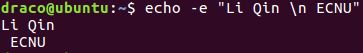
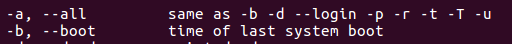
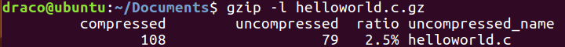
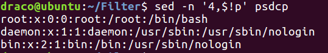
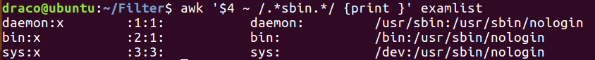

[TOC]


# Linux编程

## Ch.1 Linux系统概述

### 自由的操作系统和软件

#### GNU: 目标是创建一套完全自由的操作系统

- 包含了可自由使用的**软件**，如Emacs，GCC，Tex，X Window
- 制定了3个**自由软件协议**：GPL，LGPL，GFDL

#### GPL（General Public License）

- 软件以源代码形式发布
- 只要软件中使用了被GPL协议保护的部分，该软件本身也必须遵守GPL协议
- 不排斥对自由软件进行商业包装和发行

#### POSIX (Portable Operating System Interface)

- 定义了操作系统为应用程序提供的**接口标准**
- 一个兼容POSIX的程序，可以在**任何**符合POSIX标准的操作系统上编译执行

### Linux 发行版本

- RedHat Linux

- CentOS
- Debian
- Fedora
- Ubuntu
- Gentoo
- FreeBSD

### Linux 发展时间线


### Linux 操作系统

#### 操作系统：连接应用软件与计算机硬件的桥梁

- **管理**计算机的**硬件资源**
- 为程序运行**提供环境**
- 多任务**运行与调度**
- **文件存储**管理

#### Linux操作系统特点

- C语言设计与编写，**可移植性强**
- **多用户**同时访问，适合工作站和服务器环境
- 通过**shell**与操作系统互动

### Linux 体系结构

#### Linux内核

- 内核是操作系统**核心**，**在启动时加载进内存**
- 内核**直接与计算机硬件交互**
- **管理**系统内存，**调度**任务进程，**执行**系统调用

#### Shell

- 用户与操作系统内核的**交互接口**
- 用户指令的**解释器**
- **每个登录用户**都有一个shell为其工作


### Linux Shell终端

- Shell终端是**用户**与Linux系统**交互**的主要平台
- 使用**命令行解释方式**执行用户指令
- 常见的shell**种类**
  - **bash**
  - TC shell
  - Korn shell

### Linux 常用shell命令

- 命令结构

  

- **不同命令有不同的功能**

- 同一命令的**不同参数具有不同功能**

- 每条命令有**固定的选项集合**

- 查看命令的**帮助信息**，了解参数的功能

  - **man** 命令名
  - 命令名 **--help**
  - **info** 命令名

#### echo

- 命令格式：


- 功能：显示变量、字符串

- 转义字符：（选项 -e）\a, \c, \n, \t （使用**-e**才能使用转义字符）

- 示例：

  

  

  

  

#### uname

- 命令格式：

  

- 功能：**显示操作系统**信息

- 主要选项：

  

- 示例：


#### who

- 命令格式：

  

- 功能：**查看**当前登录用户信息

- 主要选项：

  

- 示例：


#### date

- 命令格式：

  

- 功能：**显示**系统日期

- 主要选项：

  

- 示例：

  

  - date命令将时间戳转化成格式化时间:


## Ch.2 Linux文件系统

### Linux 文件

- 在Linux中，一切都是文件
  - 内核、shell都是文件
- 文件**分类**
  - **普通文件**：仅包含字符流的**数据文件**（文本文件、二进制文件）
  - **目录文件**：文件夹和子目录的详细信息（**文件名和inode号**）
  - **设备文件**：代表设备，完成**对设备的读取和写入操作**
- 文件**命名规则**
  - 字母和数字
  - 符号：.  -  _  
  - 可以有扩展名，也可以没有
  - 区分大小写

### Linux文件系统层次结构


### 系统目录

- /: **根目录**（之后的/都是**目录分隔符**）
- /home：**用户目录**
- /bin: **Unix常用命令**，如bash, date, cat, tar等
- /sbin: **管理员命令**，如fdisk, mkfs等
- /etc: **系统配置文件**目录，如passwd, shadow（登录名和密码）等
- /dev: **设备**文件目录，如硬盘等
- /lib: **库**文件目录
- /var: **可变文件**目录，如打印和邮件等
- /tmp: **临时文件**目录

### 路径

- **绝对**路径名：从根目录开始
- **相对**路径名：从当前目录开始
- **根目录**: /
- 当前用户**主目录**: **~**或者环境变量**$HOME**
- **当前**目录：**.**
- **父**目录：**..**

### 文件系统相关命令

#### ls （list）

- 命令**功能**：列出文件
- 命令**格式**：


- 主要选项：

  - -a 显示以.开头的文件（显示.和..和隐藏文件）
  - -F **用*标记可执行文件，用/标记目录，用@标记符号链接**
  - -l  以列表形式显示**文件属性**
  - -t  按最后**修改**时间排序（**降序**）
  - -u 按最后**访问**时间排序
  - -r  **逆序**排序
  - -R **递推显示**子目录和文件
- 示例：  


#### cd (change directory)

- 命令功能：改变当前工作目录

- 命令格式：cd [dir]

- 示例：

  - **绝对**路径：

    

  - **相对**路径：

    

  - **上级**目录：

    

  - 无参**默认~目录**：


#### mkdir (make directory)

- 命令功能：**创建**目录（文件夹）

- 命令格式：

  

- 示例：


#### rmdir (remove directory)

- 命令功能：删除**空**目录
- 命令格式：


- 常用选项：**-p** 删除**空目录树**
- 示例：


#### cp (copy)

- 命令功能：**复制**文件
- 命令格式：


- 常用选项：
  - -b 为已存在目标文件创建备份(bak)
  - -n 不覆盖已有目标文件(no)
  - -i  覆盖时询问(interactive)
  - -R **递推**复制子目录和文件
- 示例：


#### rm (remove)

- 命令功能：**删除**文件
- 命令格式：


- 常用选项：

  - -f **强制**删除
  - -i 删除时**询问**
  - -R **递推**删除子目录和文件

- 示例：

  

  

  - **危险**操作：

    

#### cat (concatenation)

- 命令功能：在shell中显示**多个文件**内容, 类似strcpy
- 命令格式：


- 示例：


#### tar (tape archiver)

- 命令功能：存档管理
- 命令格式：


- 常用选项：

  - -c, --create **创建**存档
  - -x, --extract **提取**存档
  - -t  显示存档中的文件
  - -f  **指定存档名称**
  - -v 显示执行过程
  - -z 同时**使用gzip压缩**文档

- 因为文件名是选项-f的参数，因此归档文件名要在选项后面。

  

- 示例：

  - 压缩解压tar文档：

  

  

  - 压缩解压tar.gz文档：


#### gzip

- 命令功能：压缩文件，解压缩文件
- 命令格式：


- 常用选项：
  - -d 解压缩
  - -k **保留原文件**
  - -l  显示**压缩文件**内容
  - -r  递推压缩子目录和文件
- 示例：





### Linux用户管理

#### sudo

- 命令功能：暂时以root权限执行命令
- 命令格式：sudo 想要执行的命令
- 命令说明：使用时会**要求输入当前用户的密码**，在shell内sudo输入密码后**五分钟**内不需要输入密码。
- 示例：


#### adduser

- 命令功能：添加新用户

- 命令格式：adduser 用户名

- 命令说明：

  - 以交互方式简单方便的**添加用户**
  - 为用户**设定密码**
  - 为用户**创建同名用户组和主目录**

- 示例：

  ```shell
  adduser kk //添加用户kk
  adduser -g root kk //添加用户kk，并指定用户所在的组为root用户组
  adduser -r kk //创建一个系统用户kk
  adduser -d /home/myf kk //新添加用户kk，其home目录为/home/myf
  adduser kk -p passwd
  ```

#### passwd

- 命令功能：**修改**用户密码
- 命令格式：


- 常用选项：
  - -d  删除用户密码
  - -l   锁定用户，阻止登录
  - -u  解锁用户

#### usermod

- 命令功能：**编辑**用户信息
- 命令格式：


- 常用选项：
  - -c  账号说明
  - -d  修改主目录
  - -s  修改默认shell
  - -g  修改主群组
  - -G 修改附加群组
  - -L  锁定用户，阻止登录
  - -U  解锁用户

#### deluser

- 命令功能：**删除**用户
- 命令格式：


- 常用选项：
  - --group 删除**用户组**
  - --remove-home  **删除**用户**主目录**
  - --remove-all-files  **删除**系统中owner是**该用户的所有文件**

#### su

- 命令功能：**切换**用户
- 命令格式：


- 常见选项：
  - 复制当前环境变量
  - -c 以该用户身份**执行一条命令，不切换用户**

### 文件属性

- 文件类型
- 文件权限
- 文件链接
- 改变文件权限

#### 文件类型属性


- -表示**普通文件**
- d 表示**目录**
- l 表示**符号**链接（实测**硬链接和普通文件一致**）

#### 文件权限属性


- **权限**
  - r 可读，w 可写，x 可执行，- 无权限
- 权限字符串：9位字符串
  - 前三位表示**所有者**权限
  - 中三位表示**用户组**权限
  - 后三位表示**其他用户**权限

#### 文件所有权


- **文件所有者**可以**修改文件权限**
- **文件所有者**对文件的操作权限显示在权限字符串的**前三位**
- **用户组所有者**对文件的操作权限显示在权限字符串的**中三位**

#### 文件大小


- **ls**显示的是**文件的字符数**，与实际占用空间不同；**du**显示的是**磁盘占用空间**
- **目录的大小**取决于所包含的文件名，显示的是**预期值** 

#### 文件最后修改时间


- 文件**最后修改的时间戳**

#### chmod

- 命令功能：改变文件权限
- 命令格式：


- 常用选项：-R 递推改变所有子目录和文件权限
- mode：

| **类别**     | **操作**         | **权限**     |
| ------------ | ---------------- | ------------ |
| u   用户     | + 增加权限       | r   读权限   |
| g   用户组   | -   删除权限     | w 写权限     |
| o   其他用户 | =   指定绝对权限 | x   执行权限 |
| a   全部     |                  |              |

- 示例：

```shell
chmod  u-w , g+r  hello     //对hello文件设置本人没有写入的权限，设置所在群组有读取的权限
chmod  g+x , o+w  hello     //对hello文件设置群组有执行的权限，设置其他用户有写入的权限
```

#### 八进制权限表示

| **权限** | **二进制** | **八进制** |
| -------- | ---------- | ---------- |
| ---      | 000        | 0          |
| --x      | 001        | 1          |
| -w-      | 010        | 2          |
| -wx      | 011        | 3          |
| r--      | 100        | 4          |
| r-x      | 101        | 5          |
| rw-      | 110        | 6          |
| rwx      | 111        | 7          |

- 绝对权限指定
  - 读权限：4 （100）
  - 写权限：2 （010）
  - 执行权限：1 （001）
- **默认普通文件权限**：
  - **666**   rw-rw-rw-
- 示例：


```shell
chmod  777  hello       //对hello文件所有的用户都有读取，写入，执行的权限
chmod  751  hello       //对hello文件群组中的人没有写入的权限，其他的用户没有读取和写入的权限
```

#### 目录权限

- r 读权限：是否可以**访问**文件名列表
- w 写权限：是否可以**创建或删除**文件
- x 执行权限：是否可以在路径中**使用**
- **默认目录权限**：
  - **777**  rwxrwxrwx
- 示例：


#### umask

- 命令功能：设定**默认权限**
- 命令格式：umask [八进制**权限掩码**]
- 作用：最终权限 = 默认权限码 - **权限掩码**
- 示例：
  - 文件默认权限码为6 6 6, 6 6 6 - 0 2 2 为 6 0 0 即 rw- r-- r--。


#### chown (change owner)

- 命令功能：改变文件所有者
- 命令格式：


- 需要**superuser**权限才能执行

- 示例：


#### chgrp (change group)

- 命令功能：改变文件用户组所有权
- 命令格式：


- 需要**superuser**权限
- 示例：


#### 文件与inode

- Linux支持**多个文件系统**
- 每个文件都使用**inode编号**与一个**inode表格**相关联
- inode表格包含了文件的**属性**：
  - 类型，权限，链接数，所有者，用户组，文件大小，修改时间
  - 一个指向文件存储**磁盘区块**的**指针数组**
- 文件在一个文件系统中有**唯一的inode编号**
- 使用 **ls –i** 命令查看文件inode编号
- 示例：


#### 文件链接

- 一个文件可以有**多个文件名**，称为一个文件有**多个链接**
- 可以通过任意一个链接访问该文件

##### ln

- 命令功能：创建一个**链接**
- 硬链接：创建一个具有**相同inode编号**的文件名
- 符号链接：创建一个拥有**独立inode**的文件**指向**链接的文件
- 命令格式：


- 常用选项：
  - **-s** 创建**符号**链接
  - **-f** **强制创建**链接（当链接名已被使用时）
- 示例：


##### 硬链接的作用

- 可以在文件实际位置发生变化时使用链接访问文件
  - 假设程序中引用了如下位置的文件：file/data.txt
  - 之后该文件被移动到了新目录：newfile/data.txt
  - 为了避免修改程序，可以在file目录中创建一个newfile/data.txt的硬链接


- 可以防止意外删除：**使用rm命令只是删除了一个链接**

##### 符号链接的作用

- 符号链接类似于windows系统中的**快捷方式**
- 创建一个指向该文件的**指针文件**
- 支持**跨文件系统**建立链接


#### stat

- 命令功能：查看文件属性
- 命令格式：


- 常用选项：-f  查看文件系统属性
- 示例：


#### touch

- 命令功能：**修改文件时间戳**，创建空文件
- 命令格式：


- 常用选项：
  - -a **只改变访问时间**
  - -c 不创建文件
  - **-m** 只改变**修改时间**
  - **-t**   使用**YYMMDDhhmm**更新时间
- 示例：


#### wc (word count)

- 命令功能：计算行数、字数和字符数
- 命令格式：


- 常用选项：
  - -c 计算字符数
  - -l  计算行数
  - -w 计算字数
- 示例：


#### find

- 命令功能：查找文件
- 命令格式：find path –option expression
- 常用选项：
  - **-name** 按文件名查找
  - -perm  XXX 按权限查找
  - -type   **f, d, l** 按类型查找
  - -user   按所有者查找
  - -group 按用户组所有者查找
  - -ctime  -x +x 按创建时间查找
- 示例：


## Ch3. Linux Shell编程入门

### Shell


#### Shell的工作原理

- **当用户登录到系统时，有一个shell进程随之启动，并在用户注销时终止**


-  用户输入的命令是shell的输入
-  shell处理命令的步骤：
   - **查找**命令中的**元字符**
   - 把这些**元字符替换**成对应的实际操作参数
   - 将重新生成的指令**传给内核**执行
   - **等待命令完成**，提示符重新出现，等待下一条命令

#### Shell种类

- Bourne系列
  - Bourne Shell  (/bin/sh)
  - Korn Shell  (/bin/ksh)
  - **Bash  (/bin/bash)**
- C Shell系列
  - C Shell  (/bin/csh)
  - Tcsh  (/bin/tcsh)
- 可以用命令 echo $SHELL 查看当前使用的shell种类

### 元字符

#### 通配符

- 用来表示文件名的某种模式
- 在解释时被**替换**成其他字符

| **通配符** | **匹配内容**                    |
| ---------- | ------------------------------- |
| *          | 任意数量的任意字符              |
| ？         | 单个任意字符                    |
| [abc]      | a, b,  c中的任一个字符          |
| [a-z]      | ASCII码值在a与z中间的任一个字符 |
| [!a-z]     | 不在a-z范围内的任一个字符       |
| !(fname)   | 除fname之外的所有文件名         |
| !(f1\|f2)  | 除f1和f2之外的所有文件名        |

- 示例：
  - `ls .??*`
  - `rm *.c`
  - `rm * .c`
  - `ls c*[!0-9]`
  - `cp file f[1-3]`
  - `cp f[1-3] file`

#### 转义符

- 在处理文件名中出现通配符的文件时，常常需要用转义符来防止通配符起作用
- **在通配符前使用一个**`\`
  - `\*`
  - `\?`
  - `\[ \]`
  - `\[Enter]` 换行继续输入
- 使用引号
  - 双引号：**允许**通配符替换、变量名和命令替换
  - 单引号：**禁止**通配符、变量名和命令替换，所见即所得。

#### 命令替换

- 反引号 \`命令\`：**使用命令的结果来替换命令**
  - ```echo –e "The user list is \n `who`" ```
  - ```echo The current time is `date` ```
- $(命令）：整个**替换成括号中命令的结果**
  - echo The current time is $(date)
- 区别：
  - 反引号中：若要使用转自字符需要`\\`
  - $()中：若要使用转义字符用`\`

#### 命令的输入输出流

- 输入和输出终端

  - 键盘、显示器

- 命令的输入和输出字符流

  - 标准输入流：连接到键盘的**输入**
  - 标准输出流：连接到显示器的**输出**
  - 标准错误流：连接到显示器的**错误消息输出**

- 三种标准输入输出源

  - 终端
  - 文件
  - 管道

  

#### 输入输出重定向到文件

| **文件描述符** | **含义** |
| -------------- | -------- |
| 0              | 标准输入 |
| 1              | 标准输出 |
| 2              | 标准错误 |
| 3…             | 其他文件 |

- 标准输入
  - `cat - foo`
- \> **输出**重定向
  - `echo content > file`
- \>\> **追加输出**重定向
  - `echo content >> file`
- \< **输入重定向**
  - `wc < file`
- 2\> **标准错误**输出重定向
  - `cat foo 2> errorfile`
- **相互重定向**
  - `1>&2`
  - `2>&1`

#### 过滤器

- **同时用到输入和输出流**的命令
- 对于过滤器来说，输入输出流的顺序是不重要的

  - `wc < infile > outfile`
  - `wc > outfile < infile`
  - `> outfile < infile wc`
- 示例：
  - `cat – f2 < f1 > f3 2> f4 `

#### 命令组合

- 使用**圆括号( )和花括号{ }**将多个命令组合起来
- 组合命令由一个**子shell**执行，共享输入和输出源
- 组合命令能够**共享同一个重定向符号**
- 示例：
  - `( ls –l *.txt; wc *.txt ) > all`

#### 管道

- 将一条命令的输出作为另一条命令的输入
- 格式：命令1 | 命令2
- `| `**左边**的命令使用**标准输出**，`| `**右边**的命令使用**标准输入**
- 示例：
  -  who –a | cat > userlist
  -  (cat f1; echo var2) | wc –l 
  -  ls | cat – file | wc 
- 优点：
  - **处理速度快**
  - **不产生中间文件结果**

### Shell 变量

- **环境变量**：shell已经定义的变量，如HOME，SHELL，PATH
- 用户**自定义**变量：
  - 变量名：**必须以字母开头**，其他可以是数字和_，区分大小写
  - 变量类型：shell变量都是**字符串类型**
  - 变量不需要提前声明
  - 变量赋**值**：variable**=**value
  - 变量**引用**：**$**var_name （可使用转义符 `\ `和单引号来避免替换）
- 示例：


#### 环境变量

- **设置**环境变量：**export** 变量名=变量值
- **引用**环境变量：**$变量名**
- **查看**环境变量：**env**命令
- 常用环境变量：
  - HOME  用户目录
  - PATH    命令执行路径，用冒号分隔，Shell会按PATH中给出的顺序搜索目录
  - PWD     当前工作目录的绝对路径名
  - UID        当前用户的识别号
  - RANDOM   一个随机数

#### 设置和修改环境变量

- **在shell中直接修改**，在shell中生效
- 在启动配置文件中修改，在**每次登录后生效**
  - **系统**配置文件：/**etc**/profile
  - **用户**配置文件：~/.profile，~/.bashrc
- **设置**路径变量PATH
  - **export** PATH=“$PATH:newpath”

#### 用户自定义变量的引用和赋值

| **变量引用**   | **变量替换**   |
| -------------- | -------------- |
| $变量名        | 变量值         |
| ${变量名}      | 变量值         |
| ${**#**变量名} | 变量值**长度** |

| **变量赋值** | **赋值语义**                                |
| ------------ | ------------------------------------------- |
| y=${x-value} | 若x有值，则y=x，否则y=value                 |
| y=${x=value} | 若x没有值，则y=x=value，否则y=x             |
| y=${x+value} | 若x有值，则y=value，否则**不操作**          |
| y=${x?value} | 若x有值，则y=x，否则在**标准错误**输出value |

#### 变量操作命令${var}

- 给定变量名x，${x}返回变量的值（与$x相同）
- 字符串截断和提取

| **操作**     | **返回值**                        | **示例**: **var**=~/my/file.txt |
| ------------ | --------------------------------- | ------------------------------- |
| `${var#s}`   | 去掉从左边开始第一个匹配s的子串   | `${var#*/}=my/file.txt`         |
| `${var##s}`  | 去掉从左边开始最后一个匹配s的子串 | `${var##*/}=file.txt`           |
| `${var%s}`   | 去掉从右边开始第一个匹配s的子串   | `${var%/*}=~/my`                |
| `${var%%s}`  | 去掉从右边开始最后一个匹配s的子串 | `${var%%/*}=~`                  |
| `${var:m:n}` | 提取从m位置开始往后的n个连续字符  | `${var:2:5}=my/fi`              |

- 字符串替换

| **操作**      | **返回值**                     | **示例****:** **var****=~/my/file.txt** |
| ------------- | ------------------------------ | --------------------------------------- |
| `${var/s/t}`  | 把**第一个**匹配s的串替换成t   | `${var/t/e}=~/my/file.ext`              |
| `${var//s/t}` | 把**所有**的匹配s的串都替换成t | `${var//t/e}=~/my/file.exe`             |

### 运算符

- 数值运算
  - let 命令（shell内部命令）
  - **$(( 表达式 ))  （shell扩展命令）**
  - expr 命令
  - bc **浮点数**计算器
- 示例：


#### bc 命令

- 一个支持浮点数运算的计算器
- 通常采用**管道**的方式接受输入并返回计算结果
- 常用参数
  - scale=n  保留小数点后n位 (整型数运算中无效)
  - ibase=k  指定输入为k进制 
  - obase=k  指定输出为k进制
- 常用运算符：+, -, *, /, ^, % 
- 示例：


#### 数组

- 数组的声明
  - **declare –a** 数组变量名
- 数组赋值
  - array[0]=value0
  - array=(0 1 2 3)
  - array=(0 [3]=1 2)
  - 使用循环语句赋值
- 数组引用
  - ${array[i]}  访问数组array的第i个元素
  - ${array[\*]}或${array[@]}  访问数组array的所有元素*
  - ${#array[\*]}或${#array[@]}  数组array的元素个数
- 数组销毁
  - **unset** array   销毁数组array
  - unset array[i]  销毁数组array中的第i个元素

### shell 脚本

- 将一组命令保存在文件中，然后逐条执行，类似于Windows的批处理文件
- 可以使用各种文件编辑软件来编写shell脚本


- 创建文件后使用chmod命令使其具有执行权限
- 执行该文件：


#### 解释器行

- #!/bin/bash
- 在shell脚本的第一行
- 用来指定运行该脚本的shell种类


#### 命令行位置参数

- 运行脚本时给定的用户输入参数
- 可以通过特定的形式在脚本中引用这些参数

| **位置参数** | **说明**                        |
| ------------ | ------------------------------- |
| $0           | 所执行命令的名字                |
| $1-$9        | 命令行参数1到9的名字            |
| $*           | 所有命令行参数组合成的字符串    |
| $#           | 命令行参数的个数                |
| **$$**       | **当前**shell的进程**ID号**     |
| $?           | 最近一次命令的退出状态（正常0） |
| **$!**       | **最近一次后台进程**的**ID号**  |

- **超过9个参数时**，可使用**shift**命令**将参数移位**

#### 读取用户输入

- read  变量表
- 从标准输入读取用户的输入，存入变量表中的变量
- 选项：
  - -p  提示字符串(prompt)
  - -n  指定数量读取(number)
  - -t   指定时间读取(time)
  - -s   隐藏显示输入字符(secret)
- 示例：
  - read –n 2 –t 10 –p “Input your name and age: ” name age

#### 命令退出状态

- 所有命令和程序都会返回一个退出状态值
- 可以通过exit命令显示指定脚本的退出状态值
  - 正常退出 exit 0
  - 出错退出 exit 1
- 使用exit命令是一种好的编程习惯
- 可以使用参数$?查看上一条命令的退出状态
- 示例：


#### Shell控制结构语句

- 顺序执行：在同一行内**使用;分隔**命令
- 条件执行：使用**逻辑运算符`&&`和`||`分隔命令**
  - cmd1 && cmd2   若cmd1成功，则执行cmd2
  - cmd1 || cmd2      若cmd1失败，则执行cmd2
- 命令的成功与否取决于**命令的退出状态值**
- 示例：


#### 条件选择语句 if

- 格式1：

```shell
if 条件测试命令 then
	条件为真时的命令串
else
    条件为假时的命令串
fi
```

- 格式2：

```shell
if 条件测试命令 then
	条件为真时的命令串
elif  条件测试命令 then
	条件为真时的命令串
else
    条件为假时的命令串
fi
```

- 示例：

```shell
#!/bin/sh
if [ -z "$*" ] then 
	echo "No argument is given"
	exit 1
else
	echo "The argument list is $@"
fi
exit
```

```shell
#!/bin/sh

[ $# -ne 1 ] && { echo "Usage: $0 file"; exit 1; }

if [ -f $1 ] then
	if [ ! -r $1 ] then 
		echo "File $1 exists but is not readable"; exit 3
	else
		echo "File $1 is readable"
		cat $1
	fi
else
	echo "File $1 does not exist"; exit 2
fi
exit 0
```

#### 条件测试命令

| **数值比较运算符** | **意义** |
| ------------------ | -------- |
| -eq                | 等于     |
| -ne                | 不等于   |
| -gt                | 大于     |
| -ge                | 大于等于 |
| -lt                | 小于     |
| -le                | 小于等于 |

| **字符串比较运算符** | **意义**          |
| -------------------- | ----------------- |
| =                    | 等于              |
| !=                   | 不等于            |
| -n str               | str不为空         |
| -z str               | str为空           |
| str                  | str被赋值且不为空 |

- test命令 （缩写[ ]）
  - 比较两个数值
  - 比较两个字符串，或与null进行比较
  - 查看文件特性
- test**没有任何输入**，只记录**退出状态值$？**
- 示例：


#### 文件特性检查

- test命令检查文件特性

| **命令**        | **意义**                 |
| --------------- | ------------------------ |
| [ -e file ]     | file存在                 |
| [ -f  file ]    | file存在并是一个常规文件 |
| [ -d  file ]    | file存在并是一个目录     |
| [ -L  file ]    | file存在并是一个符号链接 |
| [ -rwx file ]   | file存在且可读可写可执行 |
| [ -s file ]     | file存在且大小大于0      |
| [ f1 –nt f2 ]   | f1比f2更新               |
| [ f1  –ot f2  ] | f1比f2更旧               |
| [ f1 –ef f2 ]   | f1被链接到f2             |

#### 复合条件

- 可以在if中使用复合条件运算符
  - && 和 ||  
    - if [ “$0”=“cmd” ] || [ “$0”=“./cmd” ]
  - **-a 和 –o**
    - if [ “$0”=“cmd” –o “$0”=“./cmd” ]

#### case语句

- 格式：

  - case 表达式 in

    模式1) 命令串1 **;;**

    模式2) 命令串2 ;;

    …

    模式 *) 命令串n

    esac

- 按照**从上到下**的顺序匹配表达式的值，如匹配成功则执行相应的命令串

- 最后一个模式匹配**任何未与之前匹配的表达式**

- case语句也**支持通配符**

- 示例：

```shell
#!/bin/sh

echo "Menu
A. List of files
B. Processes of User
C. Today's date
D. User list of system
Enter your choice: \c"
read choice
case "$choice" in 
A|a) ls -l --color ;;
B|b) ps -f ;;
C|c) date ;;
D|d) who ;;
*) echo "Invalid choice"
esac
exit
```

#### 循环语句 for

- 格式：

  ​	for 变量 in 列表

  ​	do

  ​		命令串

  ​	done

- 每次迭代中列表中的值被依次赋给变量，并执行循环体

- 当列表结束时，循环结束

- 示例：

```shell
#!/bin/sh

if [ $# -eq 0 ]
then 
	echo "Usage: ${0#./} filelist"; exit 1
fi
for file in "$@"
do
	cp $file ${file}.bak
	echo "copy $file to $file.bak"
done
exit
```

#### 循环语句while

- 格式：

  ```shell
while 条件测试命令
  do
	命令串
  done
  ```
```
  
- 当条件测试命令**返回真时，执行循环体**

- 当条件测试命令**返回假时，循环结束**

- 示例：

​```sh
#!/bin/sh

answer=y
while [ "$answer" = "y" ]
do
	echo "Enter name and telepone number: \c" 1>&2
	read name number
	echo "$name:$number"
	echo "Any other entries (y/n)? \c" 1>&2
	read other
	case "$other" in
	y|Y) answer="y" ;;
	*) answer="n"
	esac
done >> addressbook
echo "End"
exit
```

#### 循环语句until

- 格式：

  ```shell
  until 条件测试命令
  do
  	命令串
  done
  ```

- 当条件测试命令**返回假时，执行循环体**

- 当条件测试命令**返回真时，循环结束**

- 示例：

```shell
#!/bin/sh

yesorno() {
	echo "$1 (y/n): \c" 1>&2
	read response
	case "$response" in
	y|Y) return 0;;
	*) return 1
	esac
}

answer=0
until [ $(($answer)) -ne 0 ]
do
	echo "Enter name and telephone number: \c" 1>&2
	read name number
	echo "$name:$number"
	if yesorno "Any other entries?"
	then
		answer=0
	else
		answer=1
	fi
done >> addressbook
echo "Done"
exit
```

#### break和continue

- break语句：**跳出**循环体，执行done之后的语句
- continue语句：**跳到done**的位置，重新执行循环

#### shell函数

- 函数声明：

  ​	function() {

  ​		statements

  ​		return value

  ​	}

- 函数调用：**使用函数名进行调用**，并可在名称后面**给出命令行参数**

- 函数支持对命令行位置参数的引用

- 函数的退出状态由return返回

- 函数可通过标准输出向调用者返回输出字符串

- 示例：

```shell
#!/bin/sh

yesorno() {
	echo "$1 (y/n): \c" 1>&2
	read response
	case "$response" in
	y|Y) return 0;;
	*) return 1
	esac
}

answer=0
until [ $(($answer)) -ne 0 ]
do
	echo "Enter name and telephone number: \c" 1>&2
	read name number
	echo "$name:$number"
	if yesorno "Any other entries?"
	then
		answer=0
	else
		answer=1
	fi
done >> addressbook
echo "Done"
exit
```


## Ch.4 Linux Shell编程进阶

### 简单过滤器

- 处理文件中的数据
- 编辑页面格式
- 截取文件内容
- 比较文件内容
- 字段和排序

#### pr

- 命令功能：改变文件**打印格式**
- 命令格式：


- 常用选项：
  - -l n 设定页面长度为n行，默认为66
  - -w n 设定页面宽度为n字符，默认为72，仅分列显示时有效
  - -h str 设定页眉为str
  - -n 对行进行编号
  - -k 分k列输出
  - -t 不显示页眉、页脚和边距
- 示例：


#### head和tail

- head命令：显示**文件的开头**
  - 命令格式：
  
  
  
  - 常用选项：
    - -n k 指定显示文件**前k行**的内容
- tail命令：显示文件的结尾
  - 命令格式：
  
  
  
  - 常用选项：
    - -n k 指定显示文件**后k行**的内容
    - -f     **监控**文件内容的增长

#### cut

- 命令功能：垂直划分文件
- 命令格式：


- 常用选项：
  - -c  按**字符**剪切(character)
  - -f   按**字段**剪切，字段分隔符由-d选项指定，默认为制表符(fragment)
  - -d   指定字段**分隔符**(devide)
- 示例：


#### paste

- 命令功能：垂直粘贴文件
- 命令格式：


- 常用选项：
  - -d  指定分隔符
  - -s  合并行
- 示例：


#### sort

- 命令功能：对文件内容**排序**
- sort 命令将以**默认的方式**将文本文件的第一列以ASCII 码的次序排列，并将结果输出到标准输出。
- 命令格式：


- 常用选项：
  - -tchar  用char作为分隔符识别字段
  - -k m,n   对第m个**字段**开始到第n个字段结束进行排序
  - -k m.n  对**第m个字段的第n个字符**进行排序
  - -u   删除**重复**行(unique)
  - -n   **数值**排序(number)
  - -r   **反转**顺序排序
  - -f   **不区分大小写**
  - -c   查看文件是否有序
  - -o file   将输出存入文件file中，**可以和源文件同名**(output)
- 示例：

```shell
# cat seq 
banana
apple
pear
orange
apple
pear
# sort -u seq 
apple
banana
orange
pear
```

#### uniq (unique)

- 命令功能：定位文件中的重复行和非重复行
- 命令格式：


- 常用选项：
  - -d		选择并显示输入中的重复行(duplicate)
  - -u		选择并显示输入中的非重复行(unique)
  - -c		显示每行出现的次数(count)
- 示例：


#### tr (translate)

- 命令功能：字符替换将SET1中的**字符替换**为SET2中的相应字符
- 命令格式：


- 常用选项：
  - **-d**  删除字符(delete)
  - **-s**  压缩连续字符(squeeze)
- 注意：tr命令**只接受标准输入**中的数据，不接受文件作为参数
- 示例：


#### cmp (compare)

- 命令功能：逐字对比两个文件的内容，在遇到差异时终止
- 命令格式：


- 常用选项：
  - -b, --print-bytes 输出第一个差异字节数、行数和字符
  - -l  输出所有差异字节数(list)
  - -i, --ignore-initial=SKIP  忽略文件1起始SKIP1字节和文件2起始SKIP2字节
- 示例：


#### comm (common)

- 命令功能：逐行对比文件内容，显示相同行和不同行（需要文件是有序的）
- 命令格式：


- 输出结果分三列显示：
  - 第1列显示FILE1中独有的行
  - 第2列显示FILE2中独有的行
  - 第3列显示共同行
- 常用选项
  - -1，-2，-3：  隐藏显示1,2,3列
- **注意**：比较的文件必须是**有序的**
- 示例:


#### diff (difference)

- 命令功能：显示两个文件的差别，并给出如何使其变的一样
- 命令格式：


- 常用选项：
  - -q    只在文件**不同**时显示
  - -s    只在文件**相同**时显示(same)
  - -c    NUM, 显示行数
  - -u    显示不同内容
  - -i      **忽略**大小写
  - -b     忽略**重复**空白
- 示例：


#### 实例分析

- 以从大到小的顺序列出当前目录中的文件


- 统计一个文件中每个单词出现的次数


### 正则表达式过滤器

- grep命令查找文件中的某一模式
- 使用正则表达式描述该模式
- 基本正则表达式（BRE）
- 扩展正则表达式（ERE）
- sed命令

#### 基本正则表达式

- 语法

| **模式语句** | **匹配含义**           |
| ------------ | ---------------------- |
| `  [pqr]  `  | p,q,r中的单个字符      |
| `[a-z]  `    | a到z之间的任意单个字符 |
| `  .  `      | 任意单个字符           |
| `a*  `       | 0个或任意多个a字符     |
| `a\{m,n\}  ` | a字符出现m到n次        |
| `[^pqr]  `   | 不是p,q,r的单个字符    |
| `^exp  `     | exp模式位于行首        |
| ` exp$  `    | exp模式位于行尾        |

- 示例
  - `abc`
  - `^[a-z]\{1,\}[0-9]`
  - `^[^a-zA-Z]`
  - `^.*[a-z]*\_[0-9].*$`

#### 扩展正则表达式

| **模式语句** | **匹配含义**       |
| ------------ | ------------------ |
| a+           | 1个或任意多个a字符 |
| a?           | 0个或1个a字符      |
| exp1\|exp2   | 匹配exp1或exp2     |
| (a1\|a2)a3   | 匹配a1a3或a2a3     |

- 语法
- 示例
  - `[0-9]*\.?[0-9]+`
  - `(a|b|cd)[0-9]`
  - `(a|b|c)d[0-9]`

#### grep

- 命令功能：在文件中查找指定模式
- 命令格式：


- 常用选项：
  - -G  匹配**基本**正则表达式（默认）
  - -E  匹配**扩展**正则表达式
  - -n  显示匹配行的**行号**
  - -c  显示出现**次数**
  - -e  匹配以连字符开头的表达式
  - -x  以整行匹配模式
  - -i   忽略大小写
  - -v  列出不匹配的行
  - -l   只给出匹配模式的文件名
- 示例:


- 注意:

  - 使用 -E 选项可以实现AND操作。

    - 第一个例子如下：（其中两个pattern的顺序是指定的）

    ```shell
    grep -E 'Dev.*Tech' employee.txt  
    ```

    - 第二个例子：（两个pattern的顺序不是固定的，可以是乱序的）

    ```shell
    grep -E 'Manager.*Sales|Sales.*Manager' employee.txt
    ```

  - 使用grep -e 选项，只能传递一个参数。在单条命令中使用多个 -e 选项，得到多个pattern，以此实现OR操作。

  - 使用 grep -v 可以实现 NOT 操作。

#### sed 流编辑器

- 命令功能：对数据流进行定位操作
- 命令格式：sed [option] ‘address action’ Files
- address 定位指定行
- action 执行指定的编辑操作
- 常用选项：
  - -e 使用**多条指令**
  - -f  从**文件**中获取指令
  - -n 使用p指令时**禁止默认输出方式**
- 定位方式：
  - 指定行号：k 第k行   m,n 从m到n的连续行
  - 指定模式：/pattern/ 模式匹配的行
- sed内部action

| **action**    | **功能**                           |
| ------------- | ---------------------------------- |
| i、a、c       | 插入、追加和修改文本               |
| d             | 删除行                             |
| p             | 在标准输出上打印结果               |
| q             | 读取到指定行后退出                 |
| r fname       | 将文件fname的内容放在行后          |
| w fname       | 将指定行写入文件fname              |
| =             | 打印指定行号                       |
| s/str1/str2/  | 用str2替换指定行中出现的第一个str1 |
| s/str1/str2/g | 用str2替换所有的str1               |

##### sed命令示例

- 截取文件前五行：sed ‘5q’ file 


- 替换指定模式: sed ‘/pattern/s/str1/str2/’ file 


- 打印指定模式的行: sed –n ‘/pattern/p’ file


- 打印文件行数： sed –n ‘$=’ file


- 打印文件前3行： sed –n ‘4,$!p’ file



- 截取文件后5行: 


- 将指定行写入文件： 
  - `sed -n ‘/<head>/,/<\/head>/w output.html’ input.html`
- 文本编辑：输入时每行以\结束
  - 在指定行之前插入行：sed ‘1i\ …’ file
  - 在指定行之后插入行：sed ‘1a\ …’ file
  - 修改指定行：sed ‘1c\ …’ file
- 删除注释行：sed ‘/^#/d’ file
- 删除空白行：sed ‘/^[ 	]*$/d’ file
- 将文件中的分隔符:替换为`|`


- 删除行中的指定模式：sed ‘s/pattern//g’ file


- 在**替换模式**中使用&匹配源模式
  - `sed ‘s/Professor/Associate &/g’ files`
- 查找具有**写权限**的文件
  - `ls –l | sed –n ‘/^.\{2,8\}w/p’`
- 查找通讯录contact文件中以021开头的11位电话号码
  - `sed –n ‘/021[0-9]\{8\}p’ contact`
- 将通讯录contact文件中的姓名**顺序颠倒**
  - `sed ‘s/\([a-zA-Z]*\) *\([a-zA-Z]*\)/\2, \1/’ contact`

##### sed命令用到的特殊正则表达式

-  标记正则表达式（TRE） 

| **正则表达式** | **匹配含义**                                  |
| -------------- | --------------------------------------------- |
| &              | 在目标模式中指代源模式                        |
| \(pattern\)    | 标记源模式中的pattern，在目标模式中使用\k引用 |

### awk 编程

- awk是**Perl之前**功能最强大的**文本处理**和报表制作工具
- awk合并了几个**过滤器**的功能，可以独立进行程序设计
- awk可以**识别和处理**一行中的各个**字段**
- awk能够执行**数值计算**
- awk接受**扩展的正则表达式**进行模式匹配
- awk具有**类似**C语言的程序设计构造
- awk可以使用**内置变量和函数**

#### awk 基础

- awk命令格式：
  - awk [options] ‘selection_criteria {action}’ files
- selection_criteria和action构成了一个awk程序
  - selection_criteria决定了**程序作用的对象**
  - action决定了**程序操作的行为**
- awk将每一行分成多个字段，**默认分隔符为空格和制表符，分隔符可以由-F选项自定义**
- awk**用$1,$2等来引用每个字段**，类似于shell中的命令行位置参数（$0表示整行）
- 可以对各个字段进行**正则表达式匹配、比较、条件判断、数值计算**等

##### awk 选择准则示例





##### action：print和printf

- awk使用print和printf向标准输出写入内容，不带action时默认执行print
- print生成未格式化的输出
- printf生成带格式的输出
  - %s  字符串格式
  - %d  整数格式
  - %f   浮点数格式
- printf需要在每行最后加\n输出换行符


###### printf 格式

- printf “含格式符号的字符串”, 参数
- 格式符号+类型符号

| **格式符号** | **含义**                                      |
| ------------ | --------------------------------------------- |
| %            | 格式起始符，必要                              |
| -            | 左对齐，省略为右对齐                          |
| 0            | 表示指定空位填补0                             |
| m.n          | m指输出占用的宽度，n表示数值输出精度，默认n=6 |
| l            | 长整型或双精度数                              |
| h            | Short型                                       |
| d            | 十进制整数                                    |
| o            | 八进制数                                      |
| x            | 十六进制数                                    |
| u            | 无符号十进制整数                              |
| c            | 单个字符                                      |
| s            | 字符串                                        |
| f            | 浮点数                                        |
| e            | 指数形式输出实数                              |

#### 管道和重定向

- 每个print和printf都可以用`>`和`|`进行重定向
- 每个重定向的文件名和管道命令都要加双引号” ”
- 示例
- awk ‘{ printf “%10s %6d\n”, $1, $2 | “sort” }’ file
- awk ‘{ printf “%10s %6d\n”, $1, $2 > “outputfile” }’ file

#### 数值操作

- awk命令支持的数值运算符：

  - +，-，*，/，%（取余），^（乘方）

  

- 用printf命令带格式输出浮点数

  - printf(“%2.5f\n”, $1)

  

- 赋值运算：+=，++，-=，-- ……


#### 变量和表达式

- awk中的变量

  - 不需要事先声明，第一次使用时即视为声明，**初始值为0或空字符串**
  - 变量名**区分大小写**
  - 变量类型**根据上下文解释成字符串或是数字，并自动转换**
  - **变量直接引用，不需要加$**

- awk中的表达式

  由字符串、数字、变量和运算符组合在一起

  字符串总是加**双引号**，可以使用转义符`\`，8进制字符前加`\`，16进制字符前加`\x`

  **将字符串作为操作数与数字计算时，字符串会被转换为数字0**


#### 比较与逻辑运算符

| **运算符**      | **含义**                       |
| --------------- | ------------------------------ |
| <, <=, >, >=    | 小于，小于等于，大于，大于等于 |
| ==, !=          | 等于，不等于                   |
| &&, \|\|, !     | 逻辑与，逻辑或，逻辑非         |
| **~ /rexp/**    | **匹配**正则表达式rexp         |
| **!~ /rexp/**   | **不匹配**正则表达式rexp       |
| **i in  array** | 数组元素**array[i]**是否存在   |

- 用于比较表达式的值，返回真值结果
- 示例:
  - $4 == “sales”			第4个字段是字符串”sales”
  - NR == 5, NR == 8		第5到第8行连续4行
  - $6 >= 12000			第6个字段的数值大于等于12000

#### 匹配正则表达式

- awk支持**基本正则表达式**（不包括IRE和TRE）和**扩展正则表达式**
- 示例:
  - `$2 ~ /john/`			第2个字段中包含john
  - `$0 ~ /^john/`		整行以john开头
  - `$3 !~ /^[0-9]+$/`	第3个字段不是数字
  - `/^$/`					空行

#### 将awk程序写成文件

- 将awk程序部分写在文件中
- 使用**-f选项**指定文件名，执行文件中的awk程序
- 示例：


- 注意：文件中的程序不放在引号内

#### BEGIN和END程序段

- 可以在awk文件中加入BEGIN和END程序段
- BEGIN程序段在awk程序主体之前执行
  - BEGIN {action}
- END程序段在awk程序主体之后执行
  - END {action}

#### 位置参数

- 当在shell脚本中运行awk命令时，awk程序可以**引用shell脚本的命令行参数**
- 引用时为了跟自身的字段引用相区别，**对位置参数的引用需要加引号**
- 示例：
  - awk ‘$6 > ‘$1’ {print}’ $2
  - awkexp.sh


#### 数组

- 数组**不需要事先定义**，第一次使用即时声明
- 数组元素**默认初始化为0或空字符串**
- 数组自动扩展
- **数组索引是字符串**，array[1]和array[“01”]是不一样的


#### 环境数组

- awk的内置数组
- 用于存储shell环境变量
- 示例：


#### 内置变量

- awk内部变量，会自动赋值
- 用户可根据需要对其重新赋值

| **变量名** | **功能**                 | **默认值** | **备注**                |
| ---------- | ------------------------ | ---------- | ----------------------- |
| NR         | 当前读取行的记录数       | -          |                         |
| FNR        | 当前读取的文件的行记录数 | -          |                         |
| FS         | 输入字段分隔符           | 空格       | FS的赋值放在BEGIN中     |
| OFS        | 输出字段分隔符           | 空格       | print语句中参数的分隔符 |
| OFMT       | 默认浮点数格式           | %.6f       |                         |
| RS         | 记录分隔符               | 换行符     | 可将多行合并成一条记录  |
| NF         | 当前行的字段数           | -          |                         |
| FILENAME   | 当前输入文件             | -          |                         |
| ARGC       | 命令行中的参数个数       | -          |                         |
| ARGV       | 包含参数列表的数组       | -          |                         |
| ENVIRON    | 包含所有环境变量的数组   | -          |                         |

#### 内置函数

| **函数**          | **说明**                                       |
| ----------------- | ---------------------------------------------- |
| int(x)            | 返回x的整数值                                  |
| sqrt(x)           | 返回x的平方根                                  |
| length()          | 返回整个行的长度                               |
| length(x)         | 返回x的长度                                    |
| tolower(s)        | 将字符串s变为小写                              |
| toupper(s)        | 将字符串s变为大写                              |
| substr(str,m)     | 从str的第m个位置开始截取剩余子串               |
| substr(str,m,n)   | 从str的第m个位置开始截取长度为n的子串          |
| index(s1,s2)      | 返回字符串s2在s1中的位置                       |
| split(str,arr,ch) | 以ch为分隔符，将str划分到数组arr中，返回字段数 |
| system(“cmd”)     | 运行命令cmd，并返回其退出状态                  |

- 示例
  - 查找file中长度超过255的行：
    - awk ‘length() > 255’ file
  - 查找1940-1950年之间出生的员工：
    - awk –F: ‘substr($5, 7, 2) >= 40 && substr($5, 7, 2) <=50’ lst
  - 将日期格式转换为YYYYMMDD格式：
    - awk –F: ‘{split($5,ar,”/”); print “19”ar[3]ar[1]ar[2]}’ lst
  - 在文件开头打印当前日期：
    - awk ‘BEGIN {system(“date”)}’ file

#### 控制流语句

- ```shell
  if (条件) { 语句 } 
  else { 语句 }
  ```

- ```shell
  while (条件) { 语句 }
  ```

- ```shell
  for ( i=1; i<=10; i++) { 语句 }
  ```

- ```shell
  for ( x in array) { 语句 }
  ```

#### 示例

- 为每一行薪资计算税款

```shell
awk –F: ‘{ 
	if ($6 <= 30000) 
		tax=0
    else {
    	if ($6 > 30000 && $6 <=50000) 
    		tax=($6-30000)*0.15 
         }
}’ lst
```

- 将每一行的**字段**逆向输出

```shell
awk –F: ‘{
	line=$NF
	for (i=NF-1;i>0;i--)
		line=line”:” $i
		print line
}’ lst
```

- 输出所有环境变量的值：

```shell
awk ‘BEGIN {
	for (key in ENVIRON)
		print key “=” ENVIRON[key]
}’
```

- 根据职位分组，统计每个职位的员工数量：

```shell
awk –F: ‘
{
	count[$3]++
}
END {
	for (pos in count)
		printf “%10s %4d\n”, pos, count[pos]
}’ lst
```


## Ch.5 Linux C语言编程

### C语言概述

- 是Linux中最常用的**系统编程语言**之一
- 功能极其强大的程序设计语言
- 包含**直接操作内存和硬件的底层计算语句**
- 也包含高级语言所具有的数据结构、控制语句、函数调用等功能
- 是一门**编译语言**，而不是脚本语言
- 可使用**Linux函数库和系统调用**

### 如何编写和执行C语言程序

- 使用任何文本编辑器编写C语言程序源文件.c
- 使用C语言编译器**gcc**编译源文件，生成独立可执行文件
- gcc编译格式：
  - gcc 源文件名     #生成的目标文件名为**默认文件名a.out**
  - gcc 源文件名 –o 目标文件名
  - gcc –o 目标文件名 源文件名
- 在遇到错误时，编译器会给出错误信息停止编译，不会生成目标文件

### C语言程序开发工具

#### gcc编译器

- 格式：gcc [options] filenames
- gcc命令包含预处理、编译、汇编和连接4个步骤，最终生成可执行代码
- gcc接受多种文件类型并依据用户指定的选项做相应处理

| **文件类型** | **对应程序**           | **文件类型** | **对应程序**             |
| ------------ | ---------------------- | ------------ | ------------------------ |
| .c           | C语言**源程序**        | .s           | **汇编**语言**源程序**   |
| .i           | **经过预处理**的源程序 | .h           | **预处理**文件（头文件） |
| .a           | 编译后的**库文件**     | .o           | **目标**文件             |

- 常用选项：	

| **选项** | **含义**                                             | **选项** | **含义**                          |
| -------- | ---------------------------------------------------- | -------- | --------------------------------- |
| -o file  | 将目标文件**保存到**file                             | -I dir   | 在**头文件搜索路径**中加入**dir** |
| -E       | 只做**预处理**，**生成**经过预处理的**.i文件**       | -L dir   | 在**库文件搜索路径**中加入**dir** |
| -S       | 只做**预处理和编译阶段**，**生成**汇编代码**.s文件** | -l lib   | **连接库文件lib**                 |
| -c       | **不做连接步骤**，**生成.o目标文件**                 | -O[0-3]  | 根据**指定级别**进行**编译优化**  |

##### gcc 编译过程

- 预处理
  - 预处理器将所有**预处理指令替换**为编译器可以理解的形式
- 编译
  - 编译器将C源代码**转换为汇编语言代码**
- 汇编
  - 汇编器(as)将汇编代码**转换成目标代码**，但这些代码并不完整
- 链接
  - 链接器(ld)将目标代码和系统函数库文件**和其他目标文件链接起来，生成单一可执行文件**

##### gcc编译过程控制


##### C语言程序源文件

- 头文件.h
  - 系统函数声明等 stdio.h
  - 用户自定义函数声明
- 源文件.c
  - main函数定义
  - 头文件中声明的函数的定义部分
- 库文件 .a/.so 
  - 系统函数库文件，包括静态链接库.a和动态链接库.so
  - gcc source –o target –l libfile
  - **库文件必须以lib开头**，执行**-l引用时可以省略lib和.a .so**

##### 编译多个源文件

- gcc –c file1.c file2.c …**编译多个.c文件生成相应的.o目标文件**
- gcc –o file file1.o file2.o … **链接.o文件生成可执行目标文件file**
- 示例：计算存款数额interest.c
  - 该程序包含两个外部函数arg_check和quit
  - arg_check.h  arg_check.c
  - quit.h   quit.c
  - #include “arg_check.h”
  - #include “quit.h”
  - interest.c中用到函数pow，需要链接指定函数库libm.a，使用**-lm**

##### 保留目标文件.o的意义

- 假设c文件的编译依赖于a,b文件，当a文件有更新时，只需重新编译a文件，而不需要重新编译未修改的b文件，**只需要在最后阶段链接已有的b.o文件即可**
- **可以合并一组.o文件，构成一个库，供将来使用**
- 如何发现某个文件已被更新？
  - **比较**.o文件和其源文件.c的**修改时间**
  - 如果**.c文件新于.o文件**，则需要**重新编译**该文件，**并重新编译所有依赖于该文件的文件**

#### makefile

- **指定**每个文件的**依赖关系**，并在依赖文件有更新时**执行相应的操作**

- 当一个源文件被修改时，**所有依赖于该源文件的文件都需要进行重新编译**

- 使用**make**命令来检查**依赖文件**的更新状态并执行**makefile**中设定的操作

- makefile文件格式：

  - 包含一组规则，每个规则有如下形式：

  - target: dependency_list

    ​			command_list       注意：前面是**制表符**

  - **当dependency_list中的任何文件修改时间晚于target，则执行command_list**

- 示例：

```makefile
#Makefile
interest: interest.o arg_check.o quit.o
	gcc -o interest interest.o arg_check.o quit.o -lm -g

interest.o: interest.c arg_check.h quit.h
	gcc -c interest.c -g

quit.o: quit.h quit.c
	gcc -c quit.c -g

arg_check.o: arg_check.h arg_check.c
	gcc -c arg_check.c -g
```

- **当目标文件与依赖项的基名称相同，则不需要command_list**
  - 例如：quit.o: quit.h quit.c  不需要指定 gcc –c quit.c
- **可以在依赖项中省略同名源文件本身**
  - 例如：quit.o: quit.h quit.c 中可以省略quit.c
- **make命令支持用-f选项指定makefile文件**
- make命令支持**使用target作为参数执行指定规则**

- 示例：

```makefile
#Makefile
interest: interest.o arg_check.o quit.o
	gcc -o interest interest.o arg_check.o quit.o -lm

interest.o: arg_check.h quit.h

quit.o: quit.h 

arg_check.o: arg_check.h 

clean:
	rm *.o

tar:
	tar -cvf prog.tar *.c *.h
```

- makefile支持声明和使用变量
- 变量分为环境变量、预定义变量和自动变量
- 变量的声明：
  - 在makefile开头以 **var=value** 来定义
- 变量的使用：
  - 在规则中用**$(var)**来使用
- make命令会将变量**替换**为其当前值
- 示例：

```makefile
CC=gcc

SOURCE = interest.c arg_check.c quit.c
OBJECTS = interest.o arg_check.o quit.o
HEADS = arg_check.h quit.h

interest: $(OBJECTS)
	$(CC) -o interest $(OBJECTS) -lm

interest.o: $(HEADS)

arg_check.o: arg_check.h

quit.o: quit.h

clean:
	rm $(OBJECTS)

tar:
	tar -cvf prog.tar $(SOURCE) $(HEADS)
```

##### 预定义变量和自动变量

| **变量名称** | **含义**                                       |
| ------------ | ---------------------------------------------- |
| CC           | C**编译**器名称，默认为cc                      |
| AS           | **汇编**器名称，默认为as                       |
| RM           | **文件删除**命令名称，默认为rm –f              |
| AR           | **库文件管理**命令名称，默认为ar               |
| $*           | **不包含扩展名**的目标文件名称                 |
| $+           | **所有依赖文件**，以空格分开，**可能出现重复** |
| $<           | **第一个依赖文件**名称                         |
| $?           | **所有时间戳比target文件晚的依赖文件**         |
| $@           | 目标文件的**完整名称**                         |
| $^           | **所有不重复的依赖文件**                       |

#### ar:生成静态库命令

- 将.o文件打包成一个静态库，便于管理
- 类似于tar命令
- 静态库文件命名方式：lib+name+.a
- 命令格式：ar [option] libname.a file_list
- 常用选项：
  -  -r  **添加**文件到库中，**或替换**已有文件
  -  -q  在库中**追加**文件
  -  -x   从库中**提取**某文件
  -  -d  **删除**库中的某文件
  -  -t   **显示库内容**
  -  -v  **显示**操作内容
- 示例：ar –rv libit.a quit.o arg_check.o

#### 生成动态共享库

- 动态共享库是**在程序执行时去链接的库**
- 共享库**命名规则**：**lib+name+.so**
- 生成共享库：
  - **gcc –shared** libname.so file1.o file2.o …
- 使用共享库：
  - 编译时声明：gcc –o main main.c **–lname –Ldir**
- 程序运行时动态共享库的**路径指定**：
  - 将.so文件复制到**/lib或/usr/lib**目录下**（需要root权限）**
  - 设置环境变量**LD_LIBRARY_PATH**

#### 静态库与共享库

| **静态库**               | **动态库**                   |
| ------------------------ | ---------------------------- |
| .a                       | .so                          |
| 在**链接时**插入目标文件 | 在**运行时**调用             |
| 运行时**不需要库文件**   | 运行时需要**指定库文件路径** |
| 可执行文件**占用空间大** | 可执行文件**占用空间小**     |

- 使用-l参数链接库文件
- 对于符合命名规则的库文件，可以直接使用-lname
- 默认库文件路径：/lib和/usr/lib
- gcc使用**-L选项**指定库文件**目录**
- 示例： gcc interest.c –lit –L. –lm
- **-l参数会优先选择共享库，然后是静态库**

#### 在makefile中管理库文件

- 在makefile中使用ar_name(file_name)的方式来访问库文件
- 执行make命令时，会调用ar命令对库中的文件进行更新
- 示例：

```makefile
CC=gcc
interest: interest.o libit.a(quit.o) libit.a(arg_check.o)
	$(CC) -o $@ $< libit.a -lm

interest.o: quit.h arg_check.h

libit.a(quit.o): quit.h

libit.a(arg_check.o): arg_check.h
```

#### 调试器

- 调试器是**控制另一个程序运行的程序**
- 可以**捕获任意时刻的程序状态**
- 可以指定**断点**，**暂停**程序，**观察变量**的状态
- 可以修改程序的错误，并重新运行程序
- 使用**gcc –g选项**编译程序**才能**使用调试器

##### gdb调试器

- **普及度最高**的调试器
- 支持**C, C++, Fortran, Java**
- 可以在**所有Linux系统**上运行
- 使用模式：
  - **调试**模式：运行程序，允许**监控每条语句的执行**
  - **附加**模式：将自身**附加到任意正在运行的进程**，获取该程序所用的内存信息
  - **事后**模式：当程序崩溃时，可以**查看被转储的core文件**，以判断崩溃原因

###### gdb调试器命令

- 命令格式：gdb [选项] [可执行程序[core文件|进程ID]]
- 常用选项：
  - -c corefile   检查指定的core文件
  - -q  禁止显示介绍信息
- 使用方法：
  - 用gcc -o main main.c –g **编译**程序
  - 用gdb main **启动调试器**
  - 在提示符(gdb)下输入**调试命令**
  - 用**quit退出**gdb

| **命令**          | **含义**                                               |
| ----------------- | ------------------------------------------------------ |
| list              | 显示**10行**源代码                                     |
| list m,n          | 显示**m到n行**源代码                                   |
| run               | **执行**程序，直到下一个断点                           |
| continue          | **继续**执行                                           |
| next              | 执行下一条语句，**函数体看成一条语句**                 |
| step              | 执行下一条语句，**进入函数体**                         |
| break n           | 在**第n行**设置断点                                    |
| break function    | 在**调用函数function的行**设置断点                     |
| break n condition | **condition为真时**，在第n行设定一个断点               |
| watch x           | 设定对变量或表达式x的**观察**，在每次x值**变化时暂停** |
| whatis x          | 显示变量或表达式x的**类型**                            |
| display/print x   | 显示**变量或表达式x**的值                              |
| quit              | 退出gdb调试环境                                        |

###### 示例

```shell
gcc –o parsestring parsestring.c –g
gdb parsestring
```

### C语言系统函数库

#### 数学函数

- 头文件：#include<math.h>
- 函数库：libm.a/so
- pow：乘方函数
  - double pow(double x, double y)
- sqrt：开平方根函数
  - double sqrt(double x)

#### 随机数函数

- 头文件：#include<stdlib.h>
- rand: 产生随机数
  - int rand(void)
  - 返回值：**0~RAND_MAX**之间的随机数
  - 通常使用MIN+(int)((MAX-MIN)*rand()/(RAND_MAX+1.0))来产生MIN~MAX之间的随机数
  - **需要先设置随机数种子**
- srand: 设置**随机数种子**
  - void srand(unsigned int seed)
  - 通常使用**time**函数返回当前时间作为种子

#### 字符函数

- 头文件：#include<ctype.h>

| **函数**              | **功能**                   |
| --------------------- | -------------------------- |
| bool isalnum(char c)  | 测试字符是否为字母或数字   |
| bool isalpha(char c)  | 测试字符是否为字母         |
| bool isdigit(char c)  | 测试字符是否为数字         |
| bool islower(char c)  | 测试字符是否为小写字母     |
| bool isupper(char c)  | 测试字符是否为大写字母     |
| bool isspace(char c)  | 测试字符是否为空格         |
| bool ispunct(char c)  | 测试字符是否为特殊符号     |
| bool isxdigit(char c) | 测试字符是否为十六进制数字 |

#### 系统时间和日期函数

- 头文件：#include<time.h>
- time: 返回当前时间
  - time_t time(time_t *t)
  - 返回值存储在t指针指向的地址
  - 成功则返回**1970年1月1日开始的秒数**，失败则返回-1
- localtime：取得当前时间和日期，**以本地格式返回**
  - struct tm * localtime(const time_t *timep)
  - 输入time_t类型指针，输出tm结构类型指针


#### 环境控制函数

- 头文件：#include<stdlib.h>
- getenv: 获取环境变量值
  - char* getenv(const char *name)
  - 输入环境变量名称，**输出环境变量值**，若环境变量**不存在**则返回**NULL**
- setenv: 设置环境变量值
  - int setenv(const char *name, const char *value, int overwrite)
  - name为环境变量名，value为设置值，**overwrite=1会覆盖原有值**
  - 成功返回0，不成功返回-1

#### 内存分配函数

- 头文件：#include<stdlib.h>

- malloc: 分配一个动态内存空间

  - void *malloc(size_t size)
  - 分配一段大小为size的动态内存空间
  - 成功则返回指向该内存地址的指针，失败返回NULL

- calloc: 分配多个动态内存空间

  - void *calloc(int num, size_t size)
  - 分配num个连续的大小为size的动态内存空间，并初始化为0
  - 成功则返回指向该内存地址的指针，失败返回NULL

- free: 释放动态内存空间

  - void free(void *p)
  - 释放p指针指向的内存空间，只能释放已分配的动态内存空间

#### system函数

- 执行Shell命令
- 头文件：#include<stdlib.h>
- int system(const char *string)
- 输入字符串string将**作为shell命令**由/bin/sh执行
- 执行成功**返回shell命令的返回值**

#### C语言系统调用

- 系统调用是一种例程，可以由C程序调用来**访问系统资源**
  - 文件I/O
  - 分配内存
  - 进程创建
- 系统调用的使用方式**类似于函数调用**
- 系统调用的**很多命令与shell命令同名**
- 执行时需要**切换到内核模式**，执行完毕之后切回用户模式

##### 系统调用与库函数的区别

| **系统调用**                 | **库函数**                   |
| ---------------------------- | ---------------------------- |
| 系统资源**低层**接口         | **高层**应用接口，对低层封装 |
| 操作**精细程度高**           | 操作**精细程度低**           |
| 有时**效率较低**             | **效率较高**                 |
| 执行模式需要切换，**开销大** | 开销较低                     |

- 可以使用man 2命令查看**系统调用**的文档
- 可以使用man 3命令查看**库函数**的文档

#### 错误处理

- 系统调用在发生错误时返回-1
- 全局变量errno用一个正整数记录错误的类型信息
- 通过perror命令显示与errno相关联的错误信息
  - #include<sys/errno.h>
  - void perror(const char *str)
  - 输出str: errno错误信息
- 示例：

```c
#include<fcntl.h>
#include<stdio.h>
#include<stdlib.h>
#include<sys/errno.h>

int main(int argc, char **argv)
{
	if (open(argv[1], O_RDONLY)==-1)
	{
		fprintf(stderr, "errno=%d\n",errno);
		perror("open");
	}
	exit(0);
}
```

##### errno

| **符号常量** | **errno** | **消息**                  |
| ------------ | --------- | ------------------------- |
| EPERM        | 1         | Operation not permitted   |
| ENOENT       | 2         | No such file or directory |
| ESRCH        | 3         | No such process           |
| EINTR        | 4         | Interrupted system call   |
| EIO          | 5         | I/O error                 |
| EACCES       | 13        | Permission denied         |
| EEXIST       | 17        | File exists               |
| ENOTDDIR     | 20        | Not a directory           |
| EISDIR       | 21        | Is a  directory           |
| ENOSPC       | 28        | No space left on device   |
| ESPIPE       | 29        | Illegal seek              |
| EROFS        | 30        | Read  only file system    |

#### open

- 功能：打开和创建文件
- 格式：int open(const char* path,int oflag, int smode)
- 头文件：#include<fcntl.h>
- 输入参数：
  - path 文件路径
  - oflag 打开模式  O_RDONLY, O_WRONLY, O_RDWR，中间**用 | 分隔**(位运算)
  - smode 创建文件时设定权限，可用8进制数表示，**前面加0前缀**
- 返回值：
  - 文件描述符，**通常从3开始**
  - 错误时返回-1

#### close

- 功能：关闭文件
- 格式：int close(int fd)
- 输入参数：fd 文件描述符
- 返回值：成功时返回0
- close会**释放指定的文件描述符**，供下一个open使用
- 当有多个open打开同一个文件时，**只有所有指向该文件的说明符都被释放后文件才会关闭**
- **可用使用close关闭标准输入(0)，标准输出(1)，标准错误(2)**

#### read

- 功能：读取文件
- 格式：ssize_t read(int fd, void *buf, size_t nbyte)
- 输入参数：
  - fd 文件描述符
  - buf 指向通用缓冲区的指针
  - nbyte 缓冲区本身的大小，也是读取的字符数
- 返回值：
  - **在遇到EOF之前，返回nbyte**
  - **遇到EOF时，返回所读字符数，下一次执行read时返回0**

#### write

- 功能：写入文件
- 格式：ssize_t write (int fd, const void *buf, size_t nbyte)
- 输入参数：每次调用都将buf中的nbyte个字节写入文件描述符fd中
- 返回值：
  - 返回**所写字符数**
  - 在**磁盘已满或文件大小超出限制**时返回-1
- 缓冲区大小
  - 写入设备
  - 内核缓冲区大小
- 示例：

```c
#include<fcntl.h>
#include<sys/stat.h>
#include<stdlib.h>
#include<stdio.h>
#include<unistd.h>
#define BUFSIZE 4096
#define OFLAGS O_WRONLY | O_CREAT | O_TRUNC
#define SMODES S_IRUSR | S_IWUSR | S_IRGRP | S_IWGRP | S_IROTH

int main()
{
	int fd1,fd2;
	int n;
	char buf[BUFSIZE];
	
	if ((fd1=open("/etc/passwd", O_RDONLY))==-1)
	{	
		perror("open1");
		exit(1);
	}
	if ((fd2=open("passwd.bak", OFLAGS, SMODES))==-1)
	{
		perror("open2");
		exit(2);
	}
	
	while ((n=read(fd1,buf,BUFSIZE)) > 0)
	{
		if (n!=write(fd2,buf,n))
		{
			perror("write");
			exit(3);
		}
	}
	close(fd1);
	close(fd2);
	exit(0);
}
```

#### lseek

- 功能：移动文件指针到指定位置
- 格式：off_t lseek (int fd, off_t offset, int whence)
- 输入参数：
  - whence 指针基准位置：
    - SEEK_SET 文件开头
    - SEEK_END 文件结尾
    - SEEK_CUR 当前位置
  - offset  相对于基准位置的偏移量，正整数或者负整数
- 返回值：返回指针到文件开头的距离
- 示例：

```c
#include<fcntl.h>
#include<stdlib.h>
#include<stdio.h>
#include<unistd.h>
#include"quit.h"
#include"arg_check.h"

int main(int argc, char **argv)
{
	int size, fd;
	char buf;
	
	arg_check(2,argc,"Not enough arguments!\n",1);
	
	if ((fd=open(argv[1], O_RDONLY))==-1)
		quit("open",1);
	
	lseek(fd,1,SEEK_END);
	while (lseek(fd,-2,SEEK_CUR) >= 0)
	{
		if (read(fd,&buf,1)!=1)
			quit("read",2);
		if (write(STDOUT_FILENO, &buf, 1)!=1)
			quit("write",3);
	}
	buf='\n';
	write(STDOUT_FILENO, &buf, 1);
	close(fd);
	exit(0);
}
```

## Ch.6 Linux 进程

### 进程

- **执行中的程序实例**叫做进程
- Linux是多任务系统，可以运行多个进程**并发执行**
- 进程和程序的关系
  - 进程由程序**创建**
  - 一个程序可以产生**多个**进程
- 进程**由内核管理调度**
- 每个进程有一个进程号**PID**
- 进程的层次结构，**除了第一个进程外每个进程都有一个父进程**(进程树)
  - shell进程的父进程是**init进程**
  - 子进程的**属性继承自父进程**

#### ps命令

- 功能：显示进程属性
- 格式：ps [options]
- 常用选项：
  - -e或-A   显示包含用户和系统进程的**所有进程**
  - -a  显示**所有用户进程**
  - -ax 显示**系统进程**
  - -f   显示**PPID等详细进程信息**
  - -l   显示**进程状态等相关信息**
  - -u  显示**CPU和内存**占用情况
- 示例:


#### 进程状态

- 进程在任意时刻都处于一个**特定状态**
  - **可运行**状态 R：进程创建之后，实际运行之前(Ready)
  - **运行**状态 O：进程实际运行时(Running)
  - **睡眠**状态 S：在等待输入信号时(Block)
  - **挂起**状态 T：用户按下Ctrl+z**挂起进程**时(后台运行)
  - **僵尸**状态 Z：**父进程不再等待该进程的退出状态时**
- 进程状态可用ps –l命令查看
  - 列表中的第二列
  - 僵尸进程在最后一列显示<defunct>

#### 进程的虚拟地址空间

- 一个进程在运行一个C程序时，会**在内存中开辟一块虚拟地址空间**供程序访问
- 虚拟地址空间的构成
  - 程序文本：**包含**要执行的指令
  - 数据：程序使用的**全局、静态变量**
  - 栈：**函数的参数和局部变量以及要返回的地址**
  - 堆：**动态内存分配（malloc, calloc）**
  - 命令行参数和环境变量存储在**栈的底部**
  - **动态共享库**的使用位于**栈和堆之间**


#### Init进程

- linux系统**启动**时，系统中只有一个可见进程，叫**init，其PID为1**
- 在linux创建进程的**唯一**方法是复制现有进程，所以**init进程是所有随后进程的祖先进程**
- init进程**绝不会终止**

#### 守护进程

- **没有和终端相关联的进程**
- 不能读和写终端
- 守护进程处于**睡眠状态**
- 在**接受输入信号时被唤醒**
- 在**TTY**列中用**?**表示
- 示例：
  - 打印机守护进程 lpsched
  - 邮件收发进程 sendmail

#### 任务(job)控制

- 任务是**一组进程**，如管道组合 ls | head
- 任务**后台**运行
  - 在命令行**末尾加上&**：command &
    - **父进程不会等待子进程的退出，shell会显示该命令的PGID和PID**
    - 任务的**标准输出和错误**输出到终端
    - **最后一个后台进程ID**被存储在**$!变量**中
  - **nohup**命令：
    - 格式：**nohup** command **&**
    - 任务的**标准输出和错误输出到nohup.out**
    - **在用户注销之后后台程序依然运行**
  - 每个进程都属于一个**进程组（任务）**，组中的每个进程有相同的**PGID**
  - 发送给进程**组**的**信号会发给组中每一个进程**
  - 任务控制命令
    - %PGID  任务ID
    - %str 以str开头的任务名
    - %?str 包含str的任务名
  - 示例
    - 后台任务读取终端输入时会被挂起
    - 使用stty tostop命令使任务在每次向终端输出时被挂起

| **作业控制命令** | **功能**           |
| ---------------- | ------------------ |
| fg               | 将任务移到前台运行 |
| bg               | 将任务移到后台运行 |
| [Ctril+z]        | 挂起当前的前台任务 |
| jobs             | 列出活动任务       |
| kill             | 杀死任务           |

### 在C语言中实现进程控制

- C语言提供了一系列的**系统调用**和**库函数**来实现对进程的控制
- 头文件：#include<**unistd.h**>
- 查看进程属性的系统调用

```c
int getpid();	// process ID
int getppid();	// parent process ID
int getuid();	// user ID
int getgid();	// user group ID
char *getenv(const char *name);		// get environment variable
int setenv(const char *name, const char *val, int overwrite);	// set environment variable
```

- 示例：

```c
#include<stdio.h>
#include<stdlib.h>
#include<unistd.h>

int main()
{
	printf("PID: %4d, PPID: %4d\n", getpid(),getppid());
	printf("UID: %4d, GID: %4d\n", getuid(), getgid());
	printf("SHELL=%s\n", getenv("SHELL"));
	setenv("SHELL", "/bin/sh", 1);
	printf("new SHELL=%s\n", getenv("SHELL"));
	system("ps -al");
	exit (0);
}
```

#### 进程创建

- 一个进程**只能**由另一个进程来创建
- 进程创建**机制**包含**三个部分**：
  - Fork：**创建已有进程的副本**来创建新进程，新进程是原进程的子进程
  - Exec：运行一个程序，**用新程序的代码和数据来覆盖自己的映像**
  - Wait：**父进程等待子进程执行程序**，并在子进程退出后记录其退出状态
- 例子：在shell中执行cat file命令
  - shell进程fork自己的副本，生成新的shell进程
  - 新的shell进程用cat的可执行映像覆盖自己，运行cat命令
  - 原shell进程等待cat终止，然后获取子进程的退出状态

##### 子进程继承的属性

- fork创建进程时，子进程会**继承**父进程的**大部分**属性
  - 创建进程的**用户UID和组GID**
  - 运行该进程的**当前目录**
  - 父进程中打开的**所有文件描述符**
  - **环境变量值**
- 继承的这些属性是由子进程维护的**副本**，**不影响父进程**
- **用户定义的变量**不会由子进程继承
  - 可**使用export命令**将变量导出至所有该进程创建的子进程中
  - 子进程对变量的**修改在父进程中不可见**

##### fork

- 功能：**复制当前进程**信息，生成**子进程**
- 声明：pid_t fork(void);
- fork在父进程和子进程中**都有返回值**
  - **父**进程中：子进程的PID
  - **子**进程中：**0**
- 在fork返回后，两个进程都在**fork语句之后继续**执行
- 示例：

```c
#include<stdlib.h>
#include<stdio.h>
#include<sys/types.h>
#include<unistd.h>

int main()
{
	pid_t pid;
	// Before fork
	printf("Before fork:\n");
	pid=fork();
	// After fork
	if (pid >0)			//在父进程中的操作
	{
		sleep(1);		//确保父进程不会先于子进程死亡
		printf("Parent process: PID=%4d, PPID=%4d, child PID=%4d\n", getpid(), getppid(), pid);
	}
	else 
		if (pid==0)		//在子进程中的操作
		{
			printf("Child process: PID=%4d, PPID=%4d\n", getpid(), getppid());
		}
		else 			//创建错误, pid=-1
		{
			printf("Fork error!\n");
			exit(1);
		}
	
	printf("Both processes continue from here\n");
	exit(0);
}
```

##### exec函数族

- 运行程序，用新程序的地址空间覆盖进程地址空间
- 库函数execl、execv、execlp、execvp
  - int execl(const char *path, const char *arg0,…, NULL);
  - int execv(const char *path, char *const argv[ ]);
    - path参数给出**程序的绝对或相对路径**
    - 参数列表arg0,…表示命令行中的每一个单词，最后以NULL结束
  - int execlp(const char *file, const char *arg0,…, NULL);
  - int execvp(const char *file, char *const argv[ ]);
    - file参数给出**程序文件名称**，在**环境变量PATH**指定的路径中寻找
- 一个**成功**的exec函数族中的库函数的执行**不会返回**
- 示例：

```c
#include<stdio.h>
#include<unistd.h>
#include<stdlib.h>

int main()
{
	execl("/bin/cat", "cat", "/etc/passwd", (char *) 0);
	printf("execl Error!\n");
	exit(1);
}
```

```c
#include<unistd.h>
#include<stdio.h>
#include<stdlib.h>

int main(int argc, char* argv[])
{
	execv("/bin/cat", argv);
	printf("execv Error!\n");
	exit(1);
}
```

#### 僵尸进程

- 子进程终止，但父进程还没有接收其退出状态时，该子进程处于僵尸状态
- 僵尸形成的机制：
  - 每一个进程退出时，**内核释放其占用的资源，但是仍然保留其进程号和退出状态**
  - 父进程**回收子进程的退出状态，在此之前**子进程处于**僵尸状态**
  - **若父进程退出，init进程会接管其所有子进程，回收他们的退出状态**
  - 若**父进程未退出**但**没有回收子进程状态**，则僵尸进程**一直存在**
- 僵尸进程的危害：会**占用有限的进程号资源**
- 避免僵尸进程：通过**wait或waitpid**函数
- 示例：

```c
#include<stdio.h>
#include<stdlib.h>
#include<unistd.h>
#include<sys/types.h>
#include<sys/wait.h>

int main()
{
	pid_t pc,pr;
	int status;
	switch (fork())
	{
		case -1: 
			printf("Fork Error!\n"); break;
		case 0:
			printf("This is child process %d\n",getpid()); exit(3);
		default:
			//wait(&status);
			sleep(10);
			//wait(&status);
			printf("This is parent process %d, its child process exit status is %d\n",getpid(),WEXITSTATUS(status));
			//sleep(20);
	}
	exit(0);
}
// WEXITSTATUS -> get child exit status
```

#### wait

- **等待**子进程死亡，并**收集**子进程**退出状态**
- 声明：pid_t wait(int *status)
- 参数：**保存子进程退出状态**的变量地址
- 返回值：死亡或挂起子进程的**PID**
- 调用进程在执行wait时**一直等待**，**直到**其子进程**终止**(阻塞)
- 调用进程在wait**返回后继续执行**
- 示例：

```c
#include<unistd.h>
#include<stdio.h>
#include<stdlib.h>
#include<sys/wait.h>

int main(int argc, char **argv)   
{
	int status=0;
	switch(fork())
	{
		case 0: execvp(argv[1],&argv[1]);
		default: wait(&status);
	}
	printf("Exit status of child process is %d\n", WEXITSTATUS(status));
	exit(0);
}
```

#### 进程间通信

##### 信号

- 一种**进程间通信**的简单形式
- 信号可以是**同步**的，也可以是**异步**的
- 信号来源：
  - 键盘输入：影响**前台**作业，**[Ctrl+c]**生成**SIGINT**信号，**[Ctrl+z]**生成**SIGTSTP**信号
  - **硬件异常**：**算术**异常**SIGFPE**，**非法**指令**SIGILL**，**内存访问**违规**SIGSEGV**
  - **C程序**：生成信号的函数，如**alarm**生成**SIGALRM**
  - 其他：SIGCHILD**通知父进程子进程死亡**，SIGTIN**阻止后台作业**读取终端
- 信号的**生命周期**
  - 生成→[延迟]→送达→处理

##### 常用信号

| **信号编号** | **信号符号名称** | **功能**                                     |
| ------------ | ---------------- | -------------------------------------------- |
| 2            | SIGINT           | 中断当前终端，Ctrl+c                         |
| 3            | SIGQUIT          | 退出当前终端，并生成一个核心文件,  Ctrl+\    |
| 9            | SIGKILL          | 杀死进程，不能被忽略或捕获                   |
| 15           | **SIGTERM**      | 终止进程，可能被忽略**（kill命令默认参数）** |
| 20           | SIGTSTP          | 挂起当前前台进程，Ctrl+z                     |
| 17           | SIGCHLD          | 内核通知父进程子进程终止                     |

- 信号符号名称：以SIG开头
- 使用kill命令向进程发送控制信号：kill –s 信号 进程ID
  - **默认**信号为**SIGTERM**
  - 信号选项**可不带SIG前缀**
  - 可使用kill –l**查看所有信号**

##### 信号处理

- 信号**处理机制**：
  - 信号发送给进程时，内核在进程表中**掩码字段**
  - 进程检查进程表中的该字段，然后检查相应的**信号处置表**
  - 根据信号处置表**对信号进行处理**
  - **如果处理方式是捕获信号，则挂起自身，调用信号处理器**
  - 当处理器**返回时，进程恢复执行**
- 信号处理相关的**系统调用**
  - sigaction: **指定信号处理器**
  - alarm: **设定一个计时器**，经过一定时间后生成SIGALRM信号
  - **pause**: **阻塞**程序执行，**直到接收到信号**为止
  - **kill**: 向进程**发送一个信号**

##### sigaction系统调用

- 功能：**指定**信号处理器
- 头文件：#include<**signal.h**>
- 声明：

```c
int sigaction (int sig, const struct sigaction *act, struct sigaction * oact)
```

- 用法：指定该系统调用，由act结构来处理接收到的sig信号oact不为NULL时存储之前的处理方式
- sigaction结构


- sa_handler设置信号处置方式
  - 函数名，自定义信号处理函数
  - SIG_IGN，忽略信号，不处理
  - SIG_DFL，默认信号处理

- 示例：

```c
#include<stdio.h>
#include<unistd.h>
#include<signal.h>
#include"quit.h"
#define BUFSIZE 100

char buf[BUFSIZE]="foo";

void alrm_handler(int signum)
{
	fprintf(stderr,"\nSignal %d received, default filename: %s\n",signum,buf);
}

int main()
{
	int n;
	struct sigaction act;
	act.sa_handler=alrm_handler;
	if (sigaction(SIGALRM, &act, NULL)==-1)
		quit("sigalrm",1);
	fprintf(stderr,"Enter filename: ");
	alarm(5);
	n=read(STDIN_FILENO, buf, BUFSIZE);
	if (n>0)
		fprintf(stderr,"Filename: %s\n",buf);
	return 0;
}
```

```c
#include<stdio.h>
#include<unistd.h>
#include<signal.h>
#include"quit.h"

int count=0;

void tstp_handler(int signum)
{
	fprintf(stderr,"\nCan't stop this program\n");
}

void int_handler(int signum)
{
	if (++count==1)
		fprintf(stderr, "\nPress again\n");
	else
		quit("\nQuitting\n", 1);
}

int main()
{
	struct sigaction act1, act2, act3;
	act1.sa_handler=tstp_handler;
	act2.sa_handler=int_handler;
	act3.sa_handler=SIG_IGN;
	
	sigaction(SIGTSTP, &act1, NULL);
	sigaction(SIGINT, &act2, NULL);
	sigaction(SIGQUIT, &act3, NULL);
	
	fprintf(stderr, "Press [Ctrl+z] first, then [Ctrl+c] \n");
	while (1)
		pause();
	
	return 0;
}

```

##### kill系统调用

- 功能：**向指定进程发送指定信号**
- 格式：int kill (pid_t pid, int sig);
  - pid 指定进程**PID**
  - sig 指定**信号**


- 示例：

  - ```c
    #include<stdio.h>
    #include<signal.h>
    #include<stdlib.h>
    #include<unistd.h>
    #include<sys/wait.h>
    #include<sys/types.h>
    
    pid_t pid;
    int main (int argc, char **argv)
    {
    	int i, status;
    	void death_handler(int sig);
    	
    	struct sigaction act;
    	act.sa_handler=death_handler;		//set handler
    	sigaction(SIGCHLD, &act, NULL);		//handler for SIGCHLD
    	sigaction(SIGALRM, &act, NULL);		//handler for SIGALRM
    	
    	switch (pid=fork())					//fork a process
    	{
    		case -1: 
    			fprintf(stderr, "Fork fail\n");
                 break;
    		case 0: 						//child process
    			execvp(argv[1], &argv[1]); 
             	 perror("exec"); 
                 break;
    		default: 						//parent process
    			alarm(5);
                 pause(); 
                 fprintf(stderr, "Parent dies.\n");				
    	}
    	return 0;
    }
    
    void death_handler(int sig)
    {
    	int status;
    	switch (sig)
    	{
    		case SIGCHLD: 
    			waitpid(-1, &status, 0);
    			fprintf(stderr,"Child dies. Exit status: %d.\n",WEXITSTATUS(status));break;
    		case SIGALRM: 
    			if (kill(pid, SIGTERM)==0)			//send SIGTERM to child process
    				fprintf(stderr, "Time out. Child killed.\n");
    	}
    }
    
    ```

  - kill_exp grep –R “#include<stdlib.h>” /home/

##### 无名管道通信


- pipe系统调用

- 格式：int pipe (int fd[2])

- 参数：

  - 2个整数组成的数组，分别表示管道的输入端fd[0]和输出端fd[1]
  - 可以使用write**向fd[1]写**入数据
  - 可以使用read**从fd[0]读**取数据
  - 写入fd[1]中的内容都可以由fd[0]读取

- 无名管道是双向的. 无名管道相当于打开了管道的文件读和文件写的文件描述符, 由于fork后文件描述符同样复制过去了, 所以可以进行通信. 

- 示例：

  - 用管道连接父进程和子进程：

  ```c
  #include<stdio.h>
  #include<unistd.h>
  #include"quit.h"
  
  int main()
  {
  	int n,fd[2];
  	char buf[100];
  	
  	if (pipe(fd)<0)
  		quit("pipe",1);
  	
  	switch (fork())
  	{
  		case -1: 
  			quit("fork fail",2); break;
  		case 0: 
  			close(fd[1]);
  			n=read(fd[0],buf,100);
  			write(STDOUT_FILENO,buf,n);
  			break;
  		default: 
  			close(fd[0]);
  			write(fd[1],"Parent writing to pipe\n",23);
  	}
  	return 0;
  }
  ```

  - 模拟shell中的管道通信：

```c
#include<stdio.h>
#include<unistd.h>
#include"quit.h"

int main()
{
	int fd[2];
	
	if (pipe(fd)<0)
		quit("pipe",1);
	
	switch (fork())
	{
		case -1:
			quit("Fork fail",2); break;
		case 0:
			close(fd[0]);
			dup2(fd[1],STDOUT_FILENO);	// 复制文件描述符到stdout
			close(fd[1]);
			execlp("cat", "cat","/etc/passwd",NULL);
			quit("cat",3);
			break;
		default: 
			close(fd[1]);
			dup2(fd[0],STDIN_FILENO);
			close(fd[0]);
			execlp("tr", "tr","'[a-z]'","'[A-Z]'",NULL);
			quit("tr",4);
	}
}

```

##### 命名管道通信

- **无名**管道**只能**用于**同源**进程间通信
- 命名管道FIFO是一种特殊的管道，存在文件系统中
- mkfifo库函数：
  - #include <**sys/types.h, sys/stat.h**>
  - int mkfifo(const char *fifoname, mode_t mode);
- 参数：
  - fifoname 管道文件名
  - mode 文件读写权限，三位8进制数，前加0
- 可以用open/close 打开/关闭FIFO管道，用read/write进行读/写
- **删除**命名管道：**unlink**(fifoname) 命令
- 需要在两个通信的进程中**分别打开相同的命名管道**
- 示例：
- FIFO_read.c,

```c
#include <unistd.h>  
#include <stdlib.h>  
#include <stdio.h>  
#include <fcntl.h>  
#include <sys/types.h>  
#include <sys/stat.h>  
#include <limits.h>  
#include <string.h>  
  
int main()  
{  
    const char *fifo_name = "./my_fifo";  
    int pipe_fd = -1;  
    int data_fd = -1;  
    int res = 0;  
    int open_mode = O_RDONLY;  
    char buffer[PIPE_BUF + 1];  
    int bytes_read = 0;  
    int bytes_write = 0;  
    //清空缓冲数组  
    memset(buffer, '\0', sizeof(buffer));  
    printf("Process %d opening FIFO O_RDONLY\n", getpid());  
    //以只读阻塞方式打开管道文件，注意与fifowrite.c文件中的FIFO同名  
    pipe_fd = open(fifo_name, open_mode);  
    //以只写方式创建保存数据的文件  
    data_fd = open("DataFormFIFO.txt", O_WRONLY|O_CREAT, 0644);  
    printf("Process %d result %d\n",getpid(), pipe_fd);  
  
    if(pipe_fd != -1)  
    {  
        do {  
            //读取FIFO中的数据，并把它保存在文件DataFormFIFO.txt文件中  
            res = read(pipe_fd, buffer, PIPE_BUF);  
            bytes_write = write(data_fd, buffer, res);  
            bytes_read += res;  
        } while(res > 0);  
        close(pipe_fd);  
        close(data_fd);  
    }  
    else  
        exit(EXIT_FAILURE);  
  
    printf("Process %d finished, %d bytes read\n", getpid(), bytes_read);  
    unlink(fifo_name);
    exit(EXIT_SUCCESS);  
}  
```

-  FIFO_write.c

```c
#include <unistd.h>  
#include <stdlib.h>  
#include <fcntl.h>  
#include <limits.h>  
#include <sys/types.h>  
#include <sys/stat.h>  
#include <stdio.h>  
#include <string.h>  
  
int main()  
{  
    const char *fifo_name = "./my_fifo";  
    int pipe_fd = -1;  
    int data_fd = -1;  
    int res = 0;  
    const int open_mode = O_WRONLY;  
    int bytes_sent = 0;  
    char buffer[PIPE_BUF + 1];  
  
    if(access(fifo_name, F_OK) == -1)  
    {  
        //管道文件不存在  
        //创建命名管道  
        res = mkfifo(fifo_name, 0777);  
        if(res != 0)  
        {  
            fprintf(stderr, "Could not create fifo %s\n", fifo_name);  
            exit(EXIT_FAILURE);  
        }
    }
  
    printf("Process %d opening FIFO O_WRONLY\n", getpid());  
    //以只写阻塞方式打开FIFO文件，以只读方式打开数据文件  
    pipe_fd = open(fifo_name, open_mode);  
    data_fd = open("/etc/passwd", O_RDONLY);  
    printf("Process %d result %d\n", getpid(), pipe_fd);  
  
    if(pipe_fd != -1)  
    {  
        int bytes_read = 0;  
        //向数据文件读取数据  
        bytes_read = read(data_fd, buffer, PIPE_BUF);  
        buffer[bytes_read] = '\0';  
        while(bytes_read > 0)  
        {  
            //向FIFO文件写数据  
            res = write(pipe_fd, buffer, bytes_read);  
            if(res == -1)  
            {  
                fprintf(stderr, "Write error on pipe\n");  
                exit(EXIT_FAILURE);  
            }  
            //累加写的字节数，并继续读取数据  
            bytes_sent += res;  
            bytes_read = read(data_fd, buffer, PIPE_BUF);  
            buffer[bytes_read] = '\0';  
        }  
        close(pipe_fd);  
        close(data_fd);  
    }  
    else  
        exit(EXIT_FAILURE);  
  
    printf("Process %d finished\n", getpid());  
    unlink(fifo_name);
    exit(EXIT_SUCCESS);  
}
```

###### 命名管道的阻塞问题

- 在同一个进程中**命名管道是单向**的
  - 不能以O_RDWR方式打开命名管道
- open的非阻塞选项
  - open(fifoname,O_RDONLY|**O_NONBLOCK**)
  - open(fifoname,O_WRONLY|**O_NONBLOCK**)
- 以**阻塞方式**打开的管道，只有在**管道另一端有操作时才会继续执行读/写操作**
- 以非阻塞方式打开的管道，会**立即执行读/写操作**（有**可能失败**）

##### 消息队列

- 从一个进程向另一个进程发送一个数据块
- 每个数据块都被认为含有一个类型，接收进程可以独立地接收含有不同类型的数据结构
- 使用：通过四个系统调用：
  - msgget  创建消息队列
  - msgsnd  向消息队列中发送消息
  - msgrcv  从消息队列中接收消息
  - msgctl  控制消息队列

###### 消息队列的使用

- 消息类型：结构体类型

```c
struct my_msg {
    long int msg_type;
    char text[size]
}
```

- msgget：**创建和访问**一个消息队列

  - ` int msgget(key_t, key, int msgflg);`
  - key 消息队列**名称**；msgflg 消息队列**权限**
  - 成功时返回消息队列标识符，失败时返回-1

- msgsnd：**发送消息**到消息队列

  - `int msgsnd(int msgid, const void *msg_ptr, size_t msg_sz, int msgflg);`
  - 参数:
    - msgid 消息队列标识符；
    - msg_ptr 指向待发消息的**指针**
    - msg_sz 消息的**长度**；
    - msgflg 队列是否满的**标志**
  - 成功时返回0；失败时返回-1

- msgrcv: **接收**消息

  - int msgrcv(int msgid, void *msg_ptr, size_t msg_sz, long int msgtype, int msgflg); 
  - 参数:
    - msgid 消息队列标识符；
    - msg_ptr 指向接收消息的指针；
    - msg_sz 消息长度；
    - msgtype **消息类型**
      - `=0` 接收第一个可用消息；
      - `>0` 接收相同类型消息；
      - `<0` 接收类型小于等于其绝对值的消息
    - msgflg **队列是否为空的标志**
  - **成功时返回接收的字符数**，失败时返回-1

- msgctl: 控制消息队列

  - int msgctl(int msgid, int command, struct msgid_ds *buf);  
  - 参数:
    - msgid 消息队列标识符；
    - command 控制命令
    - buf 指向消息队列模式和访问权限的结构

- 示例：

  - msg_send.c

  ```c
  #include <unistd.h>  
  #include <stdlib.h>  
  #include <stdio.h>  
  #include <string.h>  
  #include <sys/msg.h>  
  #include <errno.h>  
    
  #define MAX_TEXT 512  
  struct msg_st  
  {  
      long int msg_type;  
      char text[MAX_TEXT];  
  };  
    
  int main()  
  {  
      int running = 1;  
      struct msg_st data;  
      char buffer[BUFSIZ];  
      int msgid = -1;  
    
      //建立消息队列  
      msgid = msgget((key_t)1234, 0666 | IPC_CREAT);  
      if(msgid == -1)  
      {  
          fprintf(stderr, "msgget failed with error: %d\n", errno);  
          exit(EXIT_FAILURE);  
      }  
    
      //向消息队列中写消息，直到写入end  
      while(running)  
      {  
          //输入数据  
          printf("Enter some text: ");  
          fgets(buffer, BUFSIZ, stdin);  
          data.msg_type = 1;    //注意2  
          strcpy(data.text, buffer);  
          //向队列发送数据  
          if(msgsnd(msgid, (void*)&data, MAX_TEXT, 0) == -1)  
          {  
              fprintf(stderr, "msgsnd failed\n");  
              exit(EXIT_FAILURE);  
          }  
          //输入end结束输入  
          if(strncmp(buffer, "end", 3) == 0)  
              running = 0;  
          sleep(1);  
      }  
      exit(EXIT_SUCCESS);  
  }  
  ```

  - msg_recv.c

  ```c
  #include <unistd.h>  
  #include <stdlib.h>  
  #include <stdio.h>  
  #include <string.h>  
  #include <errno.h>  
  #include <sys/msg.h>  
    
  struct msg_st  
  {  
      long int msg_type;  
      char text[BUFSIZ];  
  };  
    
  int main()  
  {  
      int running = 1;  
      int msgid = -1;  
      struct msg_st data;  
      long int msgtype = 0; //注意1  
    
      //建立消息队列  
      msgid = msgget((key_t)1234, 0666 | IPC_CREAT);  
      if(msgid == -1)  
      {  
          fprintf(stderr, "msgget failed with error: %d\n", errno);  
          exit(EXIT_FAILURE);  
      }  
      //从队列中获取消息，直到遇到end消息为止  
      while(running)  
      {  
          if(msgrcv(msgid, (void*)&data, BUFSIZ, msgtype, 0) == -1)  
          {
              fprintf(stderr, "msgrcv failed with errno: %d\n", errno);  
              exit(EXIT_FAILURE);  
          }  
          printf("You wrote: %s\n",data.text);  
          //遇到end结束  
          if(strncmp(data.text, "end", 3) == 0)  
              running = 0;  
      }  
      //删除消息队列  
      if(msgctl(msgid, IPC_RMID, 0) == -1)  
      {  
          fprintf(stderr, "msgctl(IPC_RMID) failed\n");  
          exit(EXIT_FAILURE);  
      }  
      exit(EXIT_SUCCESS);  
  }  
  ```


##### 共享内存通信

- **共享内存**是在两个正在运行的进程之间**共享和传递数据**的一种非常有效的方式
- 进程可以将**同一段共享内存连接到它们自己的地址空间**中，**所有进程都可以访问共享内存中的地址**
- 如果某个进程向共享内存写入数据，所做的改动将**立即影响**到**可以访问**同一段共享内存的**任何其他进程**
- 注意：共享内存**并未提供同步保护机制**
- 使用：
  - shmget  **创建**共享内存
  - shmat  **连接**共享内存以**开启**访问
  - shmdt  **分离**共享内存
  - shmctl  共享内存**控制**

###### 共享内存的使用

- shmget: 创建共享内存

  - int shmget(key_t key, size_t size, int shmflg); 
  - 参数:
    - key **命名**共享内存；
    - size 共享内存**容量**；
    - shmflg 共享内存**权限**
  - 成功时**返回**共享内存**标识**，失败时返回-1

- shmat: **连接**共享内存

  - void *shmat(int shm_id, const void *shm_addr, int shmflg);  
  - 参数:
    - shm_id 共享内存**标识**符；
    - shm_addr 连接位置**地址**，通常留空
    - shmflg **标志位**，通常为0
  - 成功时返回**指向共享内存的指针**，失败时返回-1

- shmdt: **分离**共享内存

  - ```int shmdt(const void *shmaddr);  ```
  - 参数:
    - shmaddr  是shmat返回的共享内存地址
  - 成功时返回0，失败时返回-1

- shmctl: 控制共享内存

  - ```int shmctl(int shm_id, int command, struct shmid_ds *buf);  ```
  - 参数:
    - shm_id  共享内存标识符；
    - command  控制命令
    - buf  指向共享内存模式和访问权限的结构
  - 成功时返回0，失败时返回-1

- 示例：

  - shm_read.c

  ```c
  #include <unistd.h>  
  #include <stdlib.h>  
  #include <stdio.h>  
  #include <sys/shm.h>  
  #include "shmdata.h"  
    
  int main()  
  {  
      int running = 1;//程序是否继续运行的标志  
      void *shm = NULL;//分配的共享内存的原始首地址  
      struct shared_use_st *shared;//指向shm  
      int shmid;//共享内存标识符  
      //创建共享内存  
      shmid = shmget((key_t)1234, sizeof(struct shared_use_st), 0666|IPC_CREAT);  
      if(shmid == -1)  
      {  
          fprintf(stderr, "shmget failed\n");  
          exit(EXIT_FAILURE);  
      }  
      //将共享内存连接到当前进程的地址空间  
      shm = shmat(shmid, 0, 0);  
      if(shm == (void*)-1)  
      {  
          fprintf(stderr, "shmat failed\n");  
          exit(EXIT_FAILURE);  
      }  
      printf("\nMemory attached at %X\n", (int)shm);  
      //设置共享内存  
      shared = (struct shared_use_st*)shm;  
      shared->written = 0;  
      while(running)//读取共享内存中的数据  
      {  
          //有进程向共享内存定数据,有数据可读取  
          if(shared->written != 0)  
          {  
              printf("You wrote: %s", shared->text);  
              sleep(rand() % 3);  
              //读取完数据，设置written使共享内存段可写  
              shared->written = 0;  
              //输入了end，退出循环（程序）  
              if(strncmp(shared->text, "end", 3) == 0)  
                  running = 0;  
          }  
          else//有其他进程在写数据，不能读取数据  
              sleep(1);  
      }  
      //把共享内存从当前进程中分离  
      if(shmdt(shm) == -1)  
      {  
          fprintf(stderr, "shmdt failed\n");  
          exit(EXIT_FAILURE);  
      }  
      //删除共享内存  
      if(shmctl(shmid, IPC_RMID, 0) == -1)  
      {  
          fprintf(stderr, "shmctl(IPC_RMID) failed\n");  
          exit(EXIT_FAILURE);  
      }  
      exit(EXIT_SUCCESS);  
  }  
  ```

  - shm_write.c

  ```c
  #include <unistd.h>  
  #include <stdlib.h>  
  #include <stdio.h>  
  #include <string.h>  
  #include <sys/shm.h>  
  #include "shmdata.h"  
    
  int main()  
  {  
      int running = 1;  
      void *shm = NULL;  
      struct shared_use_st *shared = NULL;  
      char buffer[BUFSIZ + 1];//用于保存输入的文本  
      int shmid;  
      //创建共享内存  
      shmid = shmget((key_t)1234, sizeof(struct shared_use_st), 0666|IPC_CREAT);  
      if(shmid == -1)  
      {  
          fprintf(stderr, "shmget failed\n");  
          exit(EXIT_FAILURE);  
      }  
      //将共享内存连接到当前进程的地址空间  
      shm = shmat(shmid, (void*)0, 0);  
      if(shm == (void*)-1)  
      {  
          fprintf(stderr, "shmat failed\n");  
          exit(EXIT_FAILURE);  
      }  
      printf("Memory attached at %X\n", (int)shm);  
      //设置共享内存  
      shared = (struct shared_use_st*)shm;  
      while(running)//向共享内存中写数据  
      {  
          //数据还没有被读取，则等待数据被读取,不能向共享内存中写入文本  
          while(shared->written == 1)  
          {  
              sleep(1);  
              printf("Waiting...\n");  
          }  
          //向共享内存中写入数据  
          printf("Enter some text: ");  
          fgets(buffer, BUFSIZ, stdin);  
          strncpy(shared->text, buffer, TEXT_SZ);  
          //写完数据，设置written使共享内存段可读  
          shared->written = 1;  
          //输入了end，退出循环（程序）  
          if(strncmp(buffer, "end", 3) == 0)  
              running = 0;  
      }  
      //把共享内存从当前进程中分离  
      if(shmdt(shm) == -1)  
      {  
          fprintf(stderr, "shmdt failed\n");  
          exit(EXIT_FAILURE);  
      }  
      sleep(2);  
      exit(EXIT_SUCCESS);  
  }  
  ```

  


## 附录 Linux 版本管理工具（Git）

### Git介绍

•Git(读音为/gɪt/。)是一个开源的分布式版本控制系统，可以有效、高速地处理从很小到非常大的项目版本管理。

•Git 是 Linus Torvalds 为了帮助管理 Linux 内核开发而开发的一个开放源码的版本控制软件。

•集中式VS分布式

•和集中式版本控制系统相比，分布式版本控制系统的安全性要高很多，因为每个人电脑里都有完整的版本库，某一个人的电脑坏掉了不要紧，随便从其他人那里复制一个就可以了。而集中式版本控制系统的中央服务器要是出了问题，所有人都没法干活了。


### Git使用

- 设置git用户名和邮箱

  - git config --global user.name "myUserName“
  - git config --global user.email myName@email.com

- 创建一个文件夹，然后将它初始化为git仓库

  ```shell
  mkdir my-first-repo
  cd my-first-repo
  git init
  ls -al
  ```


- 在已使用git追踪的文件夹下创建一个文件，然后查看追踪状态。
  - echo “welcome to my first repo” >> readme.txt
  - git status(查看git追踪的文件夹下文件的变化，包括增加，修改，删除文件操作）


- 将修改的提交到版本库中

  - git add (file1 file2 file3) 标记想要提交到版本库的文件，直接**-a**表示所有修改到的文件。
  - git rm --cached file1 **撤销**想要提交到**版本库**的文件
  - git commit --m “注释”，**注释**主要描述进行了那些修改，方便自己和他人。
  - git reset--soft HEAD~ **撤销**最近一次**commit**。

- 查看版本库，以及比较**修改后的文件与最近一次提交文件**的区别

  - git log
  - git **diff** readme.txt
  - git **checkout** readme.txt 取回版本库中最近一次提交的该文件

- 忽略某些文件，如果图片，代码执行过程中产生的文件。

  ```shell
  echo “*.jpg” > .gitignore
  git add –a
  git commit –m “add gitignore file”
  ```

- 创建分支

```shell
git branch
git branch my-new-feature
git checkout my-new-feature
git branch 
git branch –d my-new-feature
git checkout –b update-readme
```

- 版本切换
  - Git reset --hard 版本号

