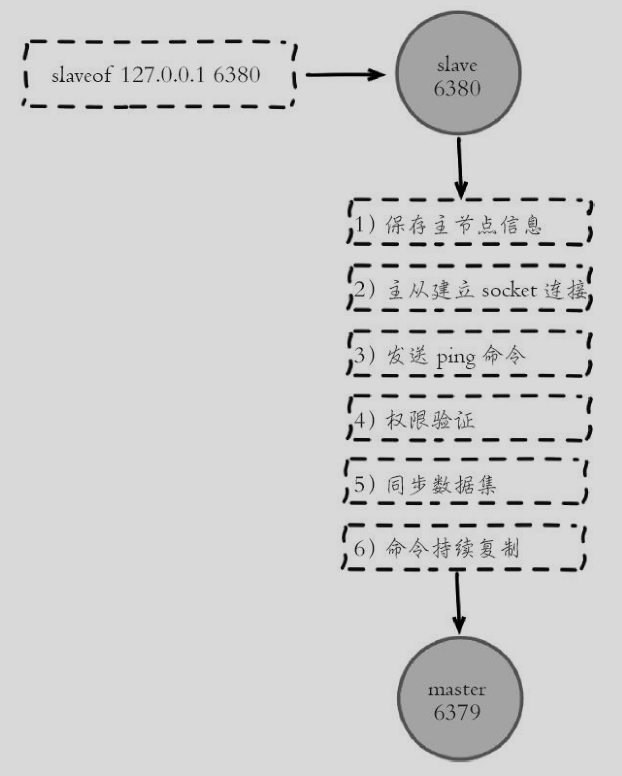
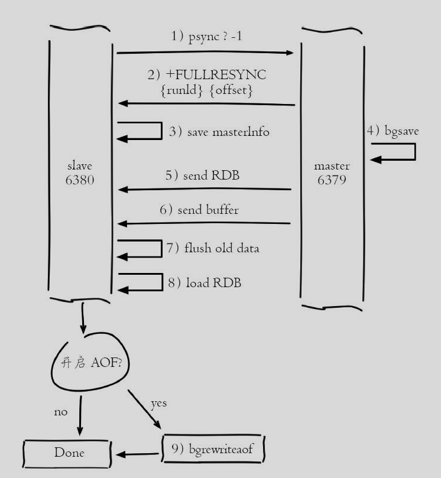
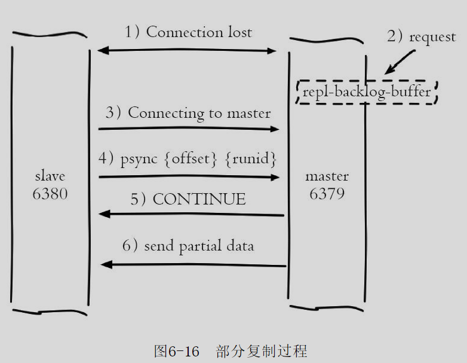
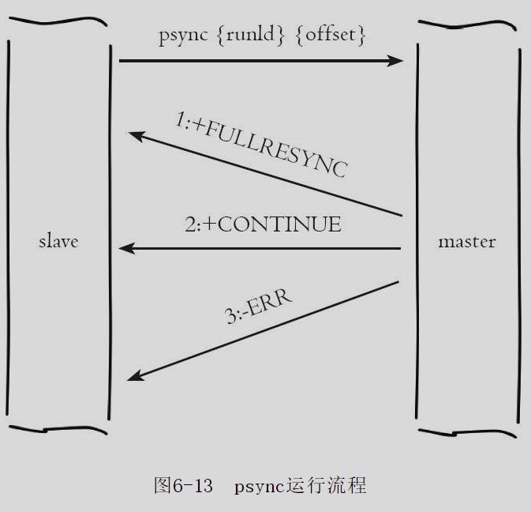
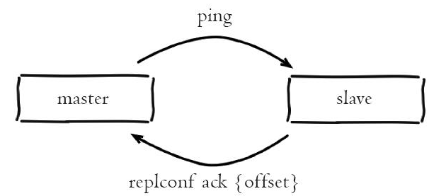
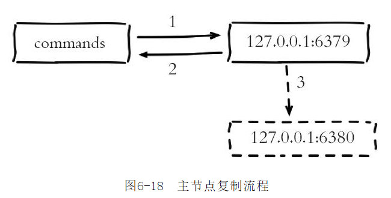

# Redis

## Redis简介

- Redis是一种基于键值对(key-value)的NoSQL数据库，具有多种数据结构，包括string、hash、list、set、zset、bitmaps、hyperloglog、geo等，使用场景丰富。
- Redis把所有数据都存放在内存中，所以它的读写性能非常好。
- Redis可以将数据利用快照(RDB)和日志(AOF)的形式保存到硬盘上，以实现持久化。
- Redis还提供了键过期、发布订阅、事务、流水线、Lua脚本等附加功能。

### Redis特性

- 速度快
  - Redis所有数据都存放在内存中
  - Redis是用C语言实现的，距离操作系统更近，执行速度相对会更快；
  - Redis使用单线程架构，预防了多线程可能产生的竞争问题；
  - 作者对Redis源代码的精打细磨；
- 基于键值对的数据结构服务器
- 功能丰富
  - 键过期功能——可用于实现缓存；
  - 发布订阅功能——可用于实现消息队列；
  - 支持Lua脚本——可以利用Lua创造出新的Redis命令；
  - 提供了简单的事务功能，能一定程度上保证事务特性；
  - 提供了流水线功能，客户端能将一批命令一次性传到Redis，减少了网络的开销；
- 简单稳定
  - Redis的源码很少；
  - Redis单线程模型，使得Redis服务器端处理模型变得简单，也使得客户端开发变得简单；
  - Redis 不需要依赖操作系统中的类库；
- 客户端语言多
  - Redis提供TCP通信协议，很多编程语言可以很方便地接入到Redis。支持Redis的客户端语言包括Java、PHP、Python、C、C++、Nodejs等，几乎涵盖了主流的编程语言。
- 持久化
  - 数据放在内存中是不安全的，一旦发生断电或者机器故障，重要的数据就可能会丢失，因此Redis提供了两种持久化方式：RDB和AOF，将内存中的数据保存到硬盘中；
- 主从复制
  - Redis提供了复制功能，实现了将多个相同数据的Redis副本；
- 高可用和分布式
  - Redis Sentinel用于保证Redis节点的故障发现和故障自动转移。
  - Redis从3.0版本正式提供了分布是实现Redis Cluster，提供了高可用、读写和容量的扩展性；

### Redis使用场景

- 缓存
- 排行榜系统
- 计数器应用
- 社交网络
- 消息队列系统

### Redis不可以做什么

- 站在数据冷热的角度看，数据分为热数据和冷数据，热数据通常是指需要频繁操作的数据，反之为冷数据。**冷数据不建议放在Redis，浪费内存。**

### 安装Redis

> https://www.runoob.com/redis/redis-install.html

## 为什么Redis单线程快

1. 纯内存访问，内存的响应时长大约为100ns；
2. 非阻塞I/O，Redis使用epoll作为I/O多路复用技术的实现，再加上Redis自身的事件处理模型将epoll的连接、读写、关闭都转换为事件，不在网络I/O上浪费过多的时间
3. 单线程避免了线程切换和竞态产生的消耗

### Redis单线程的好处

- 单线程可以简化数据结构和算法的实现；
- 单线程避免了线程切换和竞态产生的消耗；

### Redis单线程带来的问题

- 对于每个命令的执行时间是有要求的。如果某个命令执行过长，会造成其他命令的阻塞。


## 数据结构和内部编码


### string

- int
  - 8个字节的长整型；
- embstr
  - 小于等于39个字节的字符串；
- raw
  - 大于39个字节的字符串；

### hash

- ziplist
  - ziplist使用更加紧凑的结构实现多个元素的连续存储，所以在节省内存方面比hashtable更加优秀。
- hashtable
  - 当哈希类型无法满足ziplist的条件时，Redis会使用hashtable作为哈希的内部实现，因为此时ziplist的读写效率会下降，而hashtable的读写时间复杂度为O（1）。

### list

- ziplist
  - Redis会选用ziplist来作为列表的内部实现来减少内存的使用。
- linkedlist
  - 当列表类型无法满足ziplist的条件时，Redis会使用linkedlist作为列表的内部实现。
- quicklist(Redis 3.2)
  - 以ziplist为节点的linkedlist，它结合了ziplist和linkedlist两者的优势，为列表类型提供了一种更为优秀的内部编码实现；

### set

- intset
  - 当集合中的元素都是整数且元素个数小于set-max-intset-entries配置（默认512个）时，Redis会选用intset来作为集合的内部实现，从而减少内存的使用。
- hashtable
  - 当集合类型无法满足intset的条件时，Redis会使用hashtable作为集合的内部实现。

### zset

- ziplist
  - Redis会选用ziplist来作为列表的内部实现来减少内存的使用。
- skiplist
  - 当ziplist条件不满足时，有序集合会使用skiplist作为内部实现，因为此时ziplist的读写效率会下降。

## Redis存储关系型数据表记录方式

1. 原生字符串类型：每个属性一个键

   - ```
     set user:1: name tom 
     set user:1: age 23 
     set user:1: city beijing
     ```

   - 优点：简单直观，每个属性都支持更新操作；
   - 缺点：占用过多的键，内存占用量较大，同时用户信息内聚性比较差，所以此种方案一般不会在生产环境使用；

2. 序列化字符串类型：将用户信息序列化后用一个键保存。

   - ```
     set user:1 serialize(userInfo)
     ```

   - 优点：简化编程，如果合理的使用序列化可以提高内存的使用效率；

   - 缺点：序列化和反序列化有一定的开销，同时每次更新属性都需要把全部数据取出进行反序列化，更新后再序列化到Redis中；

3. 哈希类型：每个用户属性用一对field-value，但是只用一个键保存。

   - ```
     hmset user:1 name tom age 23 city beijing
     ```

   - 优点：简单直观，如果使用合理可以减少内存空间的使用；

   - 缺点：要控制哈希在ziplist和hashtable两种内部编码的转换，hashtable会消耗更多内存；


## Redis API

### 全局命令

- 查看所有键

  - ```
    keys *
    ```

- 键总数

  - ```
    dbsize
    ```

- 检查键是否存在

  - ```
    exists key
    ```

- 删除键

  - ```
    del key [key ...]
    ```

- 键过期

  - ```
    expire key seconds
    ```

- 键的数据结构类型

  - ```
    type key
    ```

### 字符串(string)

字符串类型的值实际可以是字符串（简单的字符串、复杂的字符串（例如JSON、XML））、数字（整数、浮点数），甚至是二进制（图片、音频、视频），但是值最大不能超过512MB。


#### 使用场景

- 缓存功能
  - 

- 计数
  - 许多应用都会使用Redis作为计数的基础工具，它可以实现快速计数、查询缓存的功能，同时数据可以异步落地到其他数据源。
- 共享Session
  - 分布式Web服务中将用户的Session信息在Redis中集中管理；
- 限速
  - 例如1分钟只能获取一次验证码

### 哈希(hash)


#### 使用场景

- 存储关系型数据表的记录
  - hash类型和关系型数据库的区别
    - 哈希类型是稀疏的，而关系型数据库是完全结构化的；
    - 关系型数据库可以做复杂的关系查询，而Redis去模拟关系型复杂查询开发困难，维护成本高。

### 列表(list)


#### 使用场景

- 消息队列
  - 生产者客户端使用lrpush从列表左侧插入元素，多个消费者客户端使用brpop命令阻塞式的“抢”列表尾部的元素，多个客户端保证了消费的负载均衡和高可用性。
- 文章列表
  - 尤其适用于需要分页的情况。因为列表不但有序，同时支持按照索引范围获取元素。

### 集合(set)


#### 使用场景

- 标签

  - ```
    sadd user:1:tags tag1 tag2 tag5
    ```

### 有序列表(zset)

zset保留了集合不能有重复成员的特性，但不同的是，有序集合中的元素可以排序。


#### 使用场景

- 排行榜系统

### 键管理

#### 单个键管理

- 键重命名

  - ```
    rename key newkey
    ```

    - 重命名键期间会执行del命令删除旧的键

  - ```
    renamenx key newkey
    ```

    - newkey不存在时才会被覆盖

- 随机返回一个键

  - ```
    randomkey
    ```

- 键过期

  - ```
    expire key seconds
    expireat key timestamp
    ```

- 迁移键

  - ```
    move key db
    ```

    - redis内部有多个数据库，move命令用于在redis内部进行数据迁移；

  - ```
    dump key
    restore key ttl value
    ```

    - 用于在不同的reids实例之间进行数据迁移
    - 在源Redis上，dump会将键值序列化，格式采用的是RDB格式；
    - 在目标Redis上，restore命令将上面序列化的值进行复原

  - ```
    migrate host port key|"" destination-db timeout [copy] [replace] [keys key [key ...]]
    ```

    - migrate命令也是用于在redis实例之间进行数据迁移的，实际上migrate就是将dump、restore、del三个命令进行组合，从而简化了操作流程。

##### migrate和dump+restore的区别

1. 整个过程是原子执行的，不需要在多个Redis实例上开启客户端，只要在源Redis上执行migrate命令即可；
2. migrate命令的数据传输直接在源Redis和目标Redis上完成的；
3. 目标Redis完成restore后会发送OK给源Redis，源Redis接收后会根据migrate对应的选项来决定是否在源Redis上删除对应的键。

### 遍历键

- 全量遍历键

  - ```
    keys pattern
    ```

  - pattern使用glob风格的通配符

    - *代表匹配任意字符。
    - 代表匹配一个字符。
    - []代表匹配部分字符，例如[1，3]代表匹配1，3，[1-10]代表匹配1到10的任意数字。
    - \x用来做转义，例如要匹配星号、问号需要进行转义。

- 渐进式遍历

  - ```
    scan cursor [match pattern] [count number]
    ```

### 数据库管理

- 切换数据库

  - ```
    select dbIndex
    ```

  - Redis默认配置中有16个数据库，用数字作为多个数据库的实现；Redis3.0中已经逐渐弱化这个功能，例如Redis的分布式实现RedisCluster只允许使用0号数据库，只不过为了向下兼容老版本的数据库功能，该功能没有完全废弃掉

- flushdb/flushall

  - ```
    flushdb
    ```

    - 清除当前数据库；

  - 

    ```
    flushall
    ```

    - 清除所有数据库；

  - flushdb/flushall会将所有数据清除，一旦误操作后果不堪设想；

  - 如果当前数据库的键值数量比较多，flushdb/flushall存在阻塞Redis的可能；

#### Redis废弃多数据库实例的原因

1. Redis是单线程的。如果使用多个数据库，那么这些数据库仍然是使用一个CPU，彼此之间还是会受到影响；
2. 多数据库的使用方式，数据库之间会相互影响，会让调试和运维不同业务的数据库变得困难；
3. 部分Redis的客户端根本就不支持这种方式，即使支持，在开发的时候来回切换数字形式的数据库很容易混乱。

## Redis附加功能

### 慢查询分析

慢查询日志就是系统在命令执行前后计算每条命令的执行时间，当超过预设阈值，就将这条命令的相关信息记录下来。

#### 客户端命令的生命周期


1. 发送命令
2. 命令排队
3. 命令执行
4. 返回结果

- **慢查询只统计步骤3命令执行的时间，没有慢查询不代表客户端没有超时问题。**

#### 慢查询的两个配置参数

- slowlog-log-slower-than
  - 预设阈值，单位是微秒，默认值是10000；
- slowlog-max-len
  - 慢查询日志最多存储多少条
  - Redis使用了一个咧表来存储慢查询日志，slowlog-max-len就是列表的最大长度。Redis不提供键访问该列表，只能通过命令获取。

#### 最佳实践

- slowlog-max-len配置建议
  - 线上建议调大慢查询列表，记录慢查询时Redis会对长命令做截断处理，并不会占用大量内存。增大慢查询列表可以减缓慢查询被剔除的可能。线上可设为1000以上。
- slowlog-log-slower-than配置建议
  - 默认值超过10毫秒判定为慢查询，需要根据Redis并发量调整该值。由于Redis采用单线程响应命令，如果命令执行时间在1毫秒以上，那么Redis最多可支撑OPS不到1000。对于高OPS场景的Redis建议设置为1毫秒。

- 慢查询只记录命令执行时间，不包括命令排队和网络传输时间。因此客户端执行命令的时间会大于命令实际执行时间。因此当客户端出现请求超时，需要**检查该时间点是否有对应的慢查询**，进而分析出是否为慢查询导致的命令级联阻塞。
- 慢查询日志是一个先进先出的队列，在慢查询比较多的情况下可能会丢失部分慢查询命令，可以**定期执行slow get命令将慢查询日志持久化到其他存储中**，然后可以制定可视化界面进行查询，eg. Redis私有云CacheCloud。

### Redis Shell

#### redis-cli


#### redis-server

-  ```
     redis-server --test-memory 1024
   ```
   
    - 该命令可用来检测当前操作系统能否稳定地分配制定容量的内存给Redis，有效避免因为内存问题造成Redis崩溃。

#### redis-benchmark

- redis-benchmark 会对各类数据结构的命令进行测试，并给出性能指标

  ```
  redis-benchmark -c 100 -n 20000
  ```

  - -c 代表客户端的并发数量；

  - -n代表客户端请求总量

  - eg. 

    - ```
      ====== GET ====== 
      	20000 requests completed in 0. 27 seconds 
      	100 parallel clients 
      	3 bytes payload 
      	keep alive: 1 
      99. 11% <= 1 milliseconds 
      100. 00% <= 1 milliseconds 
      73529. 41 requests per second
      ```

### Pipeline

- 发送命令和返回结果的时间称为RTT——Round Trip Time（往返时间）
- Redis提供了Pipeline机制批量执行命令，将一组Redis命令进行组装，通过一次RTT完成发送命令和返回结果。
- 模型
  - 没有Pipeline执行n次命令模型
    - 
  - 使用Pipeline执行n条命令模型
    - 

#### 使用pipeline和不使用pipeline的性能对比

- 

#### 原生批量命令(mget等)和Pipeline对比

- 原生批量命令是原子的，Pipeline是非原子的；
- 原生批量命令是一个命令对应多个key，Pipeline支持多个命令；
- 原生批量命令是**Redis服务端**支持实现的，而Pipeline**需要服务器和客户端共同实现**；

#### 最佳实践

- Pipeline组装的命令个数不能没有节制，否则一次组装Pipeline数据量过大，一方面会增加客户端的等待时间，另一方面会造成一定的网络阻塞。
- Pipeline只能操作一个Redis实例；

### 事务

- 事务表示一组动作，要么全部执行，要么全部不执行

- 

  ```
  muti
  cmd
  ...
  cmd
  exec
  ```

#### 事务错误处理

- 命令错误/语法错误
  - 整个事务无法执行；
- 运行时错误
  - 错误前的命令会执行，错误后的命令不执行。Redis不支持回滚，开发人员需要自己修复这类问题；

#### watch命令

- 用于确保事务中的key没有被其他客户端修改过才执行事务，否则不执行。(乐观锁的思想)
- 在multi之前执行watch key命令，如果在exec之前key值被修改了，则事务不执行；

### Lua

- 在Redis中执行Lua脚本有两种方法：eval和evalsha。

- eval

  - 

  ```
  eval 脚本内容 key个数 key列表 传入lua脚本的参数列表
  ```

- evalsha

  - 加载脚本
    - 

  ```
  redis-cli script load "${cat lua_get.lua}"
  ```

  - 执行脚本

    - 

      ```
      evalsha 脚本SHA1值 key个数 key列表 传入lua脚本的参数列表
      ```

#### Lua的好处

- Lua脚本在Redis中是原子执行的，执行过程中间不会插入其他命令。
- Lua脚本可以帮助开发和运维人员创造出自己定制的命令，并可以将这些命令常驻在Redis内存中，实现复用的效果。
- Lua脚本可以将多条命令一次性打包，有效地减少网络开销。

### Bitmaps

- Bitmaps本身不是一种数据结构，实际上它就是字符串，但是它可以对字符串的位进行操作。
- Bitmaps是一个以位为单位的数组，数组的每个单元只能存储0和1，数组的下标在Bitmaps中叫做偏移量；

### HyperLogLog

- 一种基数算法，通过HyperLogLog可以利用极小的内存空间完成独立总数的统计，数据集可以是IP、Email、ID等。

### 发布订阅

- 订阅”模式的消息机制，此种模式下，消息发布者和订阅者不进行直接通信，发布者客户端向指定的频道（channel）发布消息，订阅该频道的每个客户端都可以收到该消息，
- 

#### 使用场景

- 聊天室、公告牌、服务之间利用消息解耦都可以使用发布订阅模式；

### GEO

- 使用geohash算法实现地理信息位置的定位，可用于获取指定位置范围内的地理信息位置集合；
- GEO的底层实现是zset，所以可以借用zrem命令实现对地理位置信息的删除。
- 

## 客户端

### 客户端常见异常

1. 无法从连接池获取到连接；

   - ```
     redis.clients.jedis.exceptions.JedisConnectionException: Could not get a resource from the pool
     ```

   - JedisPool里的Jedis对象个数是有限的，默认是8个，当8个Jedis对象都被占用且没有归还时，此时调用者还要从JedisPool中借用Jedis就需要进行等待，如果在maxWaitMillis时间内仍然无法获取到Jedis对象就会抛出异常。
   - 连接池没有资源的原因
     - 客户端在高并发下连接池设置过小；
     - 客户端没有正确使用连接池，比如没有进行释放；
     - 客户端存在慢查询操作，这些慢查询持有的Jedis对象归还速度会比较慢，造成池子满了；
     - 服务器由于一些问题造成了客户端命令执行的阻塞；

2. 客户端读写超时

   - 

     ```
     redis.clients.jedis.exceptions.JedisConnectionException: java.net.SocketTimeoutException: Read timed out
     
     ```

   - 读写超时时间设置的过短；
   - 命令本身就比较慢；
   - 客户端与服务器网络不正常；
   - Redis自身发生阻塞；

3. 客户端连接超时

   - ```
     redis.clients.jedis.exceptions.JedisConnectionException:java.net.SocketTimeoutException:connect timed out
     ```

   - 连接超时时间设置得过短；
   - Redis发生阻塞式，造成tcp-backlog已满，造成新的连接失败；
   - 客户端与服务器网络不正常；

4. 客户端缓冲区异常

   - ```
     redis.clients.jedis.exceptions.JedisConnectionException: Unexpected end of stream.
     ```

   - 输出缓冲区满；
   - 长时间闲置连接被服务器端主动断开；
   - 不正常并发读写；

5. Lua脚本正在执行

   - ```
     redis.clients.jedis.exceptions.JedisDataException: BUSY Redis is busy running a script. You can only call SCRIPT KILL or SHUTDOWN NO SAVE.
     ```

   - 使用script kill快速将脚本杀掉；
   - 继续等待直到脚本执行完成；

6. Redis正在加载持久化文件

   - ```
     redis.clients.jedis.exceptions.JedisDataException: LOADING Redis is loading the dataset in memory
     ```

7. Redis使用的内存超过maxmemory设置

   - ```
     redis.clients.jedis.exceptions.JedisDataException: OOM command not allowed when used memory > 'maxmemory'.
     ```

   - 调整maxmemory并找到内存增长的原因；

8. 客户端连接数过大

   - ```
     redis.clients.jedis.exceptions.JedisDataException: ERR max number of clients reached
     ```

   - Redis客户端使用不当；
   - 对当前Redis服务器做故障转移；

#### 案例分析

1. Redis内存徒增
2. 客户端周期性超时

## 持久化

### RDB

- RDB持久化是把当前进程数据生成快照保存到硬盘的过程，触发RDB持久化过程分为手动触发和自动触发。
- 手动触发
  - save命令
    - 阻塞当前Redis服务器，直到RDB过程完成为止，对于内存比较大的实例会造成长时间阻塞
  - bgsave命令
    - 执行fork操作创建子进程，RDB持久化过程由子进程负责，完成后自动结束；
- 自动触发
  - 使用save相关配置，``save m n``表示m秒内数据集存在n次修改时自动触发bgsave
  - 如果从节点执行全量复制操作，主节点自动执行bgsave生成RDB文件并发送给从节点；
  - 执行debug reload命令重新加载Redis时，也会自动触发save操作；
  - 默认情况下执行shutdown命令时，如果没有开启AOF持久化功能则会自动执行bgsave；

#### bgsave

1. 执行bgsave命令，Redis父进程判断当前是否存在正在执行的子进程，如RDB/AOF子进程，如果存在bgsave命令直接返回。
2. 父进程执行fork操作创建子进程，fork操作过程中父进程会阻塞，通过infostats命令查看latest_fork_usec选项，可以获取最近一个fork操作的耗时，单位为微秒。
3. 父进程fork完成后，bgsave命令回“Background saving started”信息并不再阻塞父进程，可以继续响应其他命令。
4. 子进程创建RDB文件，根据父进程内存生成临时快照文件，完成后对原有文件进行原子替换。执行lastsave命令可以获取最后一次生成RDB的时间，对应info统计的rdb_last_save_time选项。
5. 进程发送信号给父进程表示完成，父进程更新统计信息，具体见info Persistence下的rdb_*相关选项。


#### RDB的优缺点

- RDB的优点
  - RDB是一个紧凑压缩的二进制文件，代表Redis在某个时间点上的数据快照。非常适用于备份，全量复制等场景。
  - Redis加载RDB恢复数据远远快于AOF的方式。
- RDB的缺点
  - RDB方式数据没办法做到实时持久化/秒级持久化。因为bgsave每次运行都要执行fork操作创建子进程，属于重量级操作，频繁执行成本过高。
  - RDB文件使用特定二进制格式保存，Redis版本演进过程中有多个格式的RDB版本，存在老版本Redis服务无法兼容新版RDB格式的问题。

### AOF

- AOF（append only file）持久化：以独立日志的方式记录每次写命令，重启时再重新执行AOF文件中的命令达到恢复数据的目的。AOF的主要作用是解决了数据持久化的实时性，目前已经是Redis持久化的主流方式。
- 
- 

#### AOF为什么直接采用文本协议格式

- 文本协议具有很好的兼容性；
- 开启AOF后，所有写入命令都包含追加操作，直接采用协议格式，避免了二次处理开销；
- 文本协议具有可读性，方便直接修改和处理；

#### AOF为什么把命令追加到aof_buf中？

Redis使用单线程响应命令，如果每次写AOF文件命令都直接追加到硬盘，那么性能完全取决于当前硬盘负载。先写入缓冲区aof_buf中，还有另一个好处，Redis可以提供多种缓冲区同步硬盘的策略，在性能和安全性方面做出平衡。

#### 重写AOF文件

AOF重写降低文件占用空间，并且，更小的AOF文件可以更快地被Redis加载；


### 问题定位与优化

#### fork操作

- 对大多数操作系统来说fork是个重量级操作，虽然fork创建的子进程不需要拷贝父进程的物理内存空间，但是会复制父进程的空间内存页表。

##### fork耗时问题定位

- 正常情况下fork耗时应该是每GB消耗20毫秒左右。可以在info stats统计中查lastest_fork_usec指标获取最近一次fork操作耗时，单位微秒

##### 如何改善fork操作耗时

1. 优先使用物理机或者高效支持fork操作的虚拟化技术，避免使用Xen；
2. 控制Redis实例最大可用内存，fork耗时跟内存量成正比，线上建议每个Redis实例内存控制在10GB以内；
3. 合理配置Linux内存分配策略，避免物理内存不足导致fork失败；
4. 降低fork操作的频率，如适度放宽AOF自动触发时机，避免不必要的全量复制等；

#### 子进程开销监控和优化

1. CPU
   - CPU开销分析
     - 子进程负责将进程内的数据分批写入文件，这个过程处于CPU密集操作，通常子进程对单核CPu利用率接近90%；
   - CPU消耗优化
     - Redis 是CPU密集型服务，不要做绑定单核CPU操作。由于子进程非常消耗CPU，会和父进程产生单核资源竞争。
     - 不要和其他CPU密集型服务部署在一起，造成CPU过度竞争；
     - 如果部署多个Redis实例，尽量保证同一时刻只有一个子进程执行重写工作；
2. 内存
   - 内存消耗分析
     - 子进程通过fork操作产生，占用内存大小等同于父进程，理论上需要两倍的内存来完成持久化操作。
     - Linux有写时复制机制(copy-on-write)，父子进程会共享相同的物理内存页，当父进程处理写请求时会把要修改的页创建副本，而子进程在fork操作过程中共享整个父进程内存快照；
   - 内存消耗监控
     - 日志
   - 内存消耗优化
     - 如果部署多个Redis实例，尽量保证同一时刻只有一个子进程执行重写工作；
     - 避免在大量写入时做子进程重写操作，这样将导致父进程维护大量页副本，造成内存消耗；
3. 硬盘
   - 硬盘开销分析
     - 子进程主要职责是把AOF或者RDB文件写入硬盘持久化，势必造成硬盘写入压力；
   - 硬盘开销优化
     - 不要和其他高硬盘负载的服务部署在一起；
     - AOF重写会消耗大量硬盘IO，可以开启配置no-appendfsync-on-rewrite，默认关闭。表示在AOF重写期间不做fsync操作；（可能会丢失数据）
     - 当开启AOF功能的Redis用于高流量写入场景时，如果使用普通机械硬盘，写入吞吐一般在100MB/s左右，这时Redis实例的瓶颈主要在AOF同步硬盘上；
     - 对于单机配置多个Redis实例的情况，可以配置不同实例分盘存储AOF，分摊硬盘写入压力；

#### AOF追加阻塞

- AOF常用的同步硬盘的策略是everysec，用于平衡性能和数据安全性。当系统硬盘资源繁忙时，会造成Redis主线程阻塞
  - 
- AOF阻塞问题定位
  - 日志；
  - ``info Persistence``统计中，aof_delayed_fsync指标会累加，查看这个指标方便定位AOF阻塞问题；
  - AOF同步最多运行2s的延迟，当延迟发生时说明硬盘存在高负载问题，可以通过监控工具如iotop定位消耗硬盘IO资源的进程；

## 复制

### 配置

### 建立复制

- 在配置文件中加入``slaveof {masterHost} {masterPort}``随Redis启动生效；
- 在redis-server启动命令后加入——``slaveof {masterHost} {masterPort}``生效；
- 只写使用命令：``slaveof {masterHost} {masterPort}``

### 原理

#### 复制过程



#### 数据同步

psync命令完成主从同步，分为

- 全量复制
  - 一般用于初次复制场景，当数据量较大时，会对朱从节点的网络造成很大的开销；
  - 
- 部分复制
  - 用于处理在主从复制中因网络闪断等原因造成的数据丢失场景，当从节点再次连上主节点后，如果条件允许，主节点会补发丢失数据给从节点；
  - 

##### psync命令



- 复制偏移量
  - 参与复制的主从节点都会维护自身复制偏移量。
    - 主节点（master）在处理完写入命令后，会把命令的字节长度做累加记录，统计信息在``info relication``中的master_repl_offset指标中；
    - 从节点（slave）每秒钟上报自身的复制偏移量给主节点，因此主节点也会保存从节点的复制偏移量，从节点在接收到主节点发送的命令后，也会累加记录自身的偏移量。统计信息在``info relication``中的slave_repl_offset指标中；
- 复制积压缓冲区
  - 复制积压缓冲区是保存在主节点上的一个固定长度的队列，默认大小为1MB，当主节点有连接的从节点（slave）时被创建，这时主节点（master）响应写命令时，不但会把命令发送给从节点，还会写入复制积压缓冲区；
  - 由于缓冲区本质上是先进先出的定长队列，所以能实现保存最近已复制数据的功能，用于部分复制和复制命令丢失的数据补救。复制缓冲区相关统计信息保存在主节点的``info relication``中；
- 主节点运行id
  - 每个Redis节点启动后都会动态分配一个40位的十六进制字符串作为**运行ID**。运行ID的主要作用是用来唯一识别Redis节点；
  - 如果只使用ip+port的方式识别主节点，那么主节点重启变更了整体数据集（如替换RDB/AOF文件），从节点再基于偏移量复制数据将是不安全的，因此当运行ID变化后从节点将做全量复制。

#### 心跳

- 主从节点在建立复制后，它们之间维护着长连接并彼此发送心跳命令；

- 主从心跳判断机制

  - 

  1. 主从节点彼此都有心跳检测机制，各自模拟成对方的客户端进行通信，通过client list命令查看复制相关客户端信息，主节点的连接状态为flags=M，从节点连接状态为flags=S；
  2. 主节点默认每隔10秒对从节点发送``ping``命令，判断从节点的存活性和连接状态。可通过``repl-ping-slave-period``控制发送频率。
  3. 从节点在主线程中每隔1秒发送``replconf ack {offset}``命令，给主节点上报当前的复制偏移量。

- ``replconf``命令主要作用如下：

  - 实时监测主从节点网络状态；
  - 上报自身复制偏移量，检查复制数据是否丢失，如果从节点数据丢失，再从主节点的复制缓冲区中拉取丢失数据；
  - 实现保证从节点的数量和延迟性功能，通过``min-slaves-to-write``、``min-slaves-max-lag``参数配置定义；

- 主节点根据``replconf``命令判断从节点超时时间，体现在``info replication``统计中的``lag``信息中, ``lag``表示与从节点最后一次通信延迟的秒数,正常延迟应该在0和1之间. 

- 为了降低主从延迟,一般把Redis主从节点部署在相同的机房/同城机房, 避免网络延迟和网络分区造成的心跳中断等情况. 

#### 异步复制

- 写命令的发送过程是异步完成, 也就是说主节点自身处理完写命令后直接返回给客户端, 并不等待从节点复制. 
  - 
- 由于主从复制过程是异步的, 就会造成从节点的数据相对主节点存在延迟. 

### 开发与运维中的问题

#### 读写分离

- 对于读占比较高的场景，可以通过把一部分读流量分摊到从节点（slave）来减轻主节点（master）压力，同时需要注意**永远只对主节点执行写操作**;
- 使用从节点响应读请求时, 业务端可能会遇到如下问题: 
  1. 复制数据延迟;
     - 由于异步复制特性, 无法避免, 延迟取决于网络带宽和命令阻塞情况, 需要业务场景允许短时间内的数据延迟;
  2. 读到过期数据;
     - 当主节点存储大量设置超时的数据时，如缓存数据，Redis内部需要维护过期数据删除策略，删除策略主要有两种：惰性删除和定时删除;
       - 惰性删除
         - 主节点每次处理读取命令时, 都会检查键是否超时, 如果超时则执行del命令删除键对象, 之后del命令也会异步发送给从节点, 但从节点不会主动删除超时对象
       - 定时删除
         - Redis主节点在内部定时任务会循环采样一定数量的键, 当发现采样的键过期时执行del命令, 之后再同步给从节点;
     - 当数据大量超时,主节点采样速度跟不上过期速度且主节点没有读取过期键的操作, 那么从节点将无法收到del命令,这时从节点上可以读取到已经超时的数据. (Redis 3.2已解决该问题, 从节点读取数据之前会检查键的过期时间来决定是否返回数据)
  3. 从节点故障;
     - 从节点的故障问题, 需要在客户端维护可用从节点列表, 当从节点故障时立刻切换到其他从节点或主节点上. 
- Redis做读写分离存在一定的成本. Redis本身的性能非常高,开发人员在使用额外的从节点提升读性能之前, 尽量在主节点上做充分优化, 比如解决慢查询, 持久化阻塞, 合理应用数据结构等, 当主节点优化空间不大时再考虑拓展. 
- 在做读写分离之前,可以考虑使用Redis Cluster等分布式解决方案, 既拓展读性能, 还拓展写性能和可支撑数据规模, 并且一致性和故障转移也可以得到保证, 对客户端的维护逻辑也相对容易;

### 主从配置不一致

- 当配置的maxmemory从节点小于主节点, 如果复制的数据量超过从节点maxmemory时, 它会根据maxmemory-policy策略进行内存溢出控制,此时从节点数据已经丢失, 但主从复制流程依然正常进行, 复制偏移量也正常. 修复这类问题也只能手动进行全量复制. 

### 规避全量复制

- 第一次建立复制
  - 由于是第一次建立复制, 从节点不包含任何主节点数据, 必须进行全量复制才能完成数据同步. 建议在低峰时进行操作, 或者尽量规避使用大数据量的Redis节点;
- 节点运行ID不匹配
  - 建议提供故障转移,手动提升从节点为主节点或采用支持自动故障转移的哨兵或集群方案;
- 复制积压缓冲区不足
  - 如果请求的偏移量不在主节点的积压缓冲区内, 则无法提供给从节点数据, 因此部分复制会退化为全量复制. 
  - 增大积压缓冲区,保证repl_backlog_size>net_break_time*write_size_per_minute,从而避免因复制积压缓冲区不足造成的全量复制;

### 规避复制风暴

- 复制风暴是指大量从节点对同一主节点或者对同一台机器的多个主节点短时间内发起全量复制的过程. 复制风暴对发起复制的主节点或者机器造成大量开销, 导致CPU/内存/带宽消耗. 
- 规避方式
  1. 单主节点复制风暴
     - 一个主节点挂在多个从节点的场景;
       - 解决方案
         - 减少主节点挂载从节点的数量;
         - 采用树形复制结构, 加入中间层从节点用来保护主节点;
           - 
  2. 单机器复制风暴
     - 单台机器部署多个Redis实例
       - 解决方案
         - 把主节点尽量分散在多台机器上, 避免在单台机器上部署过多的主节点;
         - 当主节点所在机器故障后提供故障转移机制, 避免机器恢复后进行密集的全量复制;

## 阻塞

- Redis是典型的单线程架构，所有的读写操作都是在一条主线程完成的。当Redis用于高并发场景，这条线程就变成了它的生命线，就可能会出现阻塞。
- 阻塞的原因
  - 内在原因
    - 不合理地使用API或数据结构、CPU饱和、持久化阻塞等；
  - 外在原因
    - CPU竞争、内存交换、网络问题等；

### 发现阻塞

- 线上应用服务应该最先感知到，此时应用方会收到大量Redis超时异常，例如Jedis客户端抛出JedisConnectionException异常。
- 常见做法
  - 在应用方加入异常统计并通过邮件、短信、微信报警
- redis调用API会分散在项目的多个地方，每个地方都监听异常并加入监控代码必然难以维护，可以借助日志系统，再对日志文件进行分析；

#### 如何决定是哪一个节点超时

- 打印ip和port信息
- 例如Jedis只需要修改Connection类下的connect、sendCOmmand、readProtocolWithCheckingBroken方法专门捕获连接，发送命令，协议读取事件的异常。
- 借助Redis监控系统发现阻塞问题，例如CacheCloud。当监控系统检测到Redis运行期的一些关键指标出现不正常时会触发报警。

### 内在原因

#### API或数据结构使用不合理

1. 慢查询
   1. 修改为低算法度的命令，如hgetall改为hmget，禁用keys、sort等命令；
   2. 调整大对象，缩减大对象数据或把大对象拆分为多个小对象，防止一次命令操作过多的数据。

##### 如何发现大对象

```shell
redis-cli -h {ip} -p {port} bigkeys
```

#### CPU饱和

- CPU饱和是指Redis把单核CPU使用率跑到接近100%。CPU饱和将导致Redis无法处理更多的命令，严重影响吞吐量和应用方的稳定性。

- 减少使用ziplist，用空间换时间。

#### 持久化阻塞

1. fork阻塞
   - 如果fork操作本身耗时过长必然会导致主线程的阻塞
2. AOF刷盘阻塞
   - AOF持久化时，文件刷盘一般每秒一次，后台线程每秒对AOF文件做fsync操作。当硬盘压力过大时，fsync操作需要等待，直到写入完成。
3. HugePage写操作阻塞
   - 子进程在执行重写期间利用Linux写时复制技术降低内存靠小，因此只有写操作时Redis才复制需要修改的内存页。开启了Transparent HugePages的操作系统，每次写命令引起的复制内存页单位由4K变为2MB放大了512倍，会拖慢写操作的执行时间，造成大量写操作慢查询。

### 外在原因

1. CPU竞争

   - 进程竞争
     - 不和其他多核CPU密集型服务部署在一起
   - 绑定CPU
     - 把Redis进程绑定到CPU上，用于降低CPU频繁上下文切换的开销。
     - 如果做了CPU绑定，RDB/AOF重写时会让父子进程共享使用一个CPU，造成父子进程的CPU竞争，因此不建议开启了持久化或参与复制的主节点绑定CPU。

2. 内存交换

   - 操作系统把Redis使用的部分内存换出到硬盘会导致Redis性能急剧下降。

   - 检查方法

     - 查Redis进程号

       - 

       ```
       redis-cli -h {host} -p {port} info server | grep process_id
       ```

     - 根据进程号查内存交换信息

       - ```
         cat /proc/4476/smaps | grep Swap
         ```

   - 预防方法

     - 保证机器充足的可用内存；
     - 确保所有Redis实例设置最大可用内存(maxmemory)，防止极端情况下Redis内存不可控的增长；
     - 降低系统使用swap优先级；

3. 网络问题

   1. 连接拒绝
      - 网络闪断
        - 宽带异常，带宽耗尽，网络割接；
      - Redis连接拒绝
        - Redis客户端连接超过Redis上限；
      - 连接溢出（超过系统上限）
        - 进程限制、backlog队列溢出
   2. 网络延迟
   3. 网卡软中断

## 内存

### 内存消耗


